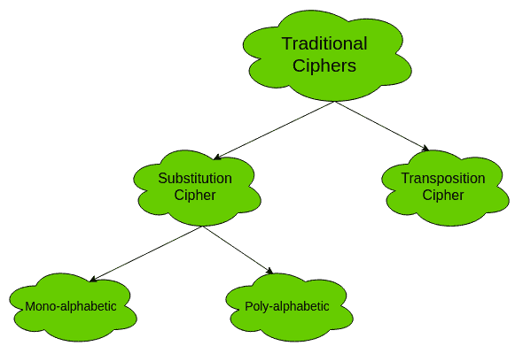
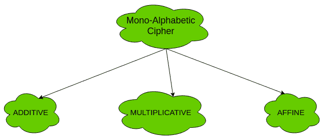
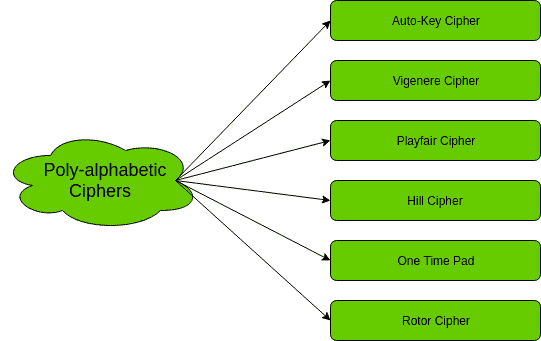
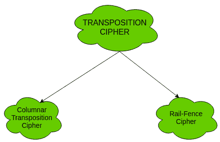

# 传统对称密码

> 原文:[https://www . geesforgeks . org/繁体-对称-密码/](https://www.geeksforgeeks.org/traditional-symmetric-ciphers/)

传统对称密码的两种类型是**替换密码**和**换位密码**。以下流程图对传统密码进行了分类:

**1。替换密码:**
替换密码又分为**单字母密码**和**多字母密码**。

首先，我们来研究一下单字母密码。

1.  **Mono-alphabetic Cipher –**
    In mono-alphabetic ciphers, each symbol in plain-text (eg; ‘o’ in ‘follow’) is mapped to one cipher-text symbol. No matter how many times a symbol occurs in the plain-text, it will correspond to the same cipher-text symbol. For example, if the plain-text is ‘follow’ and the mapping is :
    *   f -> g
    *   o -> p
    *   l -> m
    *   w -> x

    密文是“gpmmpx”。

    单字母密码的类型有:

    

    **(一)。加法密码(移位密码/凯撒密码)–**
    最简单的单字母密码是加法密码。它也被称为“移位密码”或“凯撒密码”。顾名思义，对明文执行“加法模 2”运算以获得密文。

    c =(m+k)mod n
    m =(c-k)mod n

    其中，
    C - >密文
    M - >消息/纯文本
    k - >键

    关键空格是 26。因此，它不是很安全。可以用蛮力攻击破。
    更多信息和实现见[凯撒密码](https://www.geeksforgeeks.org/caesar-cipher/)

    **(b)。乘法密码–**
    乘法密码类似于加法密码，除了在加密过程中密钥位被乘以纯文本符号。同样，密码文本乘以解密密钥的乘法逆来获得纯文本。

    c =(m * k)mod n
    m =(c * k-1mod n

    其中，
    k-1->k 的乘法逆(关键)

    乘法密码的密钥空间是 12。因此，它也不是很安全。

    **(c)。仿射密码–**
    仿射密码是加法密码和乘法密码的组合。关键空间是 26 * 12(加法的关键空间*乘法的关键空间)即 312。由于密钥空间较大，比以上两种相对安全。
    这里使用两个按键 k 1 和 k 2 。

    c =[(m * k1)+kmod n
    m =[(c–k【2】)* k-1

    更多信息和实现，参见[仿射密码](https://www.geeksforgeeks.org/implementation-affine-cipher/)

    现在，让我们研究一下多字母密码。

2.  **Poly-alphabetic Cipher –**
    In poly-alphabetic ciphers, every symbol in plain-text is mapped to a different cipher-text symbol regardless of its occurrence. Every different occurrence of a symbol has different mapping to a cipher-text. For example, in the plain-text ‘follow’, the mapping is :

    f-> q
    o->w
    l->e
    l->r
    o->t
    w->y

    因此，密文是“qwerty”。

    多字母密码的类型有:

    

**2。转置密码:**
转置密码不处理一个符号与另一个符号的替换。它着重于改变符号在纯文本中的位置。明文中第一个位置的符号可能出现在密文的第五个位置。

两个换位密码是:

1.  **柱状换位密码–**
    详见[柱状换位密码](https://www.geeksforgeeks.org/columnar-transposition-cipher/)
2.  **围栏密码–**
    详见[围栏密码](https://www.geeksforgeeks.org/rail-fence-cipher-encryption-decryption/)