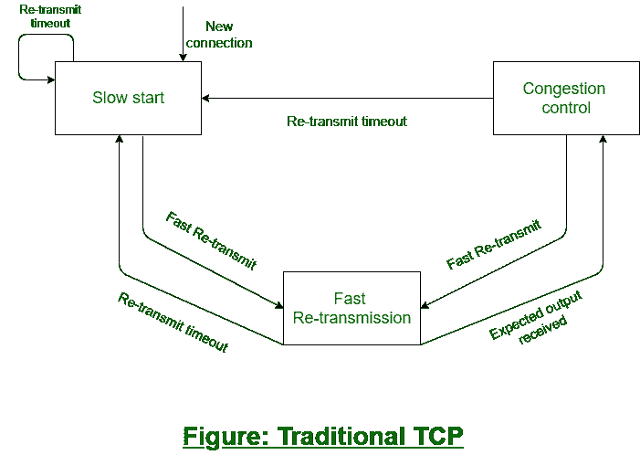

# 传统 TCP

> 原文:[https://www.geeksforgeeks.org/traditional-tcp/](https://www.geeksforgeeks.org/traditional-tcp/)

[传输控制协议(TCP)](https://www.geeksforgeeks.org/services-and-segment-structure-in-tcp/) 是[传输层协议](https://www.geeksforgeeks.org/tcp-and-udp-in-transport-layer/)，作为客户端和服务器之间的接口。TCP/IP 协议用于在传输层和网络层之间传输数据包。传输协议主要是为固定端系统和固定的有线网络设计的。简单来说，传统的 TCP 被定义为有线网络，而经典的 TCP 使用无线方式。TCP 主要是为固定网络和固定的有线网络设计的。

TCP 的主要研究活动如下。

**1。[拥塞控制](https://www.geeksforgeeks.org/tcp-congestion-control/) :**
在发送方到接收方的数据传输过程中，有时数据包可能会丢失。不是因为硬件或者软件的问题。每当确认数据包丢失时，可能的原因可能是传输路径中某个点的临时过载。这种暂时的过载也被称为拥塞。

即使网络设计完美，也经常会造成拥塞。接收方的传输速度可能不等于发送方的传输速度。如果发送方的容量大于输出链路的容量，则路由器的数据包缓冲区已满，路由器无法以足够快的速度转发数据包。在这种情况下，路由器唯一能做的就是丢弃一些数据包。

接收者感知到分组丢失，但是不向发送者发送关于分组丢失的消息。相反，接收方开始发送所有接收到的数据包的确认，发送方很快就识别出丢失的确认。发送方现在注意到一个数据包丢失，并减慢了传输过程。通过这种方式，减少了拥堵。即使在今天，TCP 的这一特性也是其需求的原因之一。

**2。**
慢启动:检测到拥塞后 TCP 显示的行为称为慢启动。发送方总是为接收方计算拥塞窗口。首先，发送方发送一个数据包并等待确认。一旦确认返回，它会将数据包大小加倍，并发送两个数据包。在收到两个确认(每个数据包一个)后，发送方再次将数据包大小加倍，此过程继续进行。这被称为指数增长。

每次将拥堵窗口扩大一倍是很危险的，因为台阶可能会变得太大。指数增长停止在拥堵阈值。当它达到拥塞阈值时，传输速率的增加变成线性的(即，仅增加 1)。线性增加一直持续到发送者注意到确认之间的间隙。在这种情况下，发送方将拥塞窗口的大小设置为其拥塞阈值的一半，并且该过程继续。

**3。快速重传:**
在 TCP 中，两件事导致拥塞阈值的降低。其中之一是发送方接收单个数据包的连续确认。通过这种方式，它可以传达两种信息。其中一个原因是接收方接收到了确认的所有数据包，另一个原因是间隙是由数据包丢失引起的。现在，发送方会在给定时间到期前立即重新发送丢失的数据包。这被称为快速重传。

**示例:**
假设发送方向接收方传输的数据包很少，发送方的速度分别为 2 Mbps 和接收方的速度分别为 1 Mbps。现在，从发送方传输到接收方的数据包在网络内部造成了交通堵塞。因此，网络可能会丢弃一些数据包。当这些数据包丢失时，接收方向发送方发送确认，发送方识别丢失的确认。这个过程被称为拥塞控制。

现在慢启动机制开始执行计划。发送方会减慢数据包传输速度，然后流量会略有减少。过一段时间后，它会请求快速重传，这样丢失的数据包就可以尽快再次发送。在所有这些机制之后，下一个数据包的过程开始了。