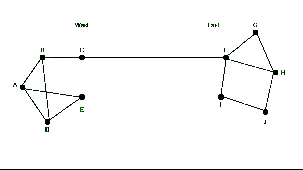

# 流量感知路由

> 原文:[https://www.geeksforgeeks.org/traffic-aware-routing/](https://www.geeksforgeeks.org/traffic-aware-routing/)

我们研究的第一种方法是流量感知路由。这些方案适应拓扑结构的变化，但不改变负载。考虑负载以充分利用现有网络容量的目标是，路由可以根据网络用户在不同区域醒来和睡眠时的流量模式进行调整。

**示例:**

可以通过改变最短路径权重来改变路线，使流量远离频繁使用的路径。一些无线电广播站有直升机在城市周围飞行，报告道路拥堵情况，以便移动服务人员可以在热点周围发送数据包。这被称为流量感知路由。在路径间划分流量很有帮助。根据这个模型，它被用在早期的互联网上。

**图表说明:**

考虑图中的网络–

*   它分为东西两部分，由两条链路 CF 和 EL 连接。
*   假设大部分流量在东西方之间使用连接 CF，导致该连接负载很重，延迟很长。
*   将排队包括在用于短路径计算的权重中会使 EL 更有吸引力。
*   新的路由表已经安装完毕，大部分东西向的流量都会经过 EL，加载这条链路 CF 看起来会是最短的路径。

因此，它可能会大幅振荡，导致不稳定的路由和许多潜在的问题。如果忽略负载，仅考虑带宽和传播延迟，则不会发生这种情况。尝试包含负载，但在一定范围内改变权重，只会减缓路由振荡。两种技术有助于成功的解决方案。在第一种多路径路由中，从源到目的地可以有多条路径。

**图示:**

**特征:**

*   这是一种拥塞技术。
*   这些根源可以根据流量模式改变，因为这些流量模式在一天中会发生变化，作为网络用户，我们可以在不同的时区睡觉。
*   因为有大量使用的路径，所以可以改变根来转移流量。
*   流量可以在多条路径上分流。