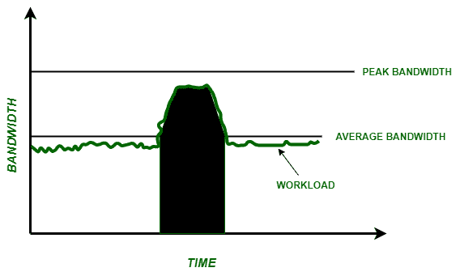

# 流量整形

> 原文:[https://www.geeksforgeeks.org/traffic-shaping/](https://www.geeksforgeeks.org/traffic-shaping/)

流量整形用于控制网络带宽，以确保关键业务应用的服务质量。可以在以下位置进行验证:

1.  端口组级别
2.  虚拟或分布式虚拟交换机

这种技术使用三个参数来形成网络流量:

```
1. Burst size
2. Average bandwidth
3. Peak bandwidth 
```

这些解释如下。

1.  **突发大小:**
    当工作负载大于平均带宽时，称为突发。突发中允许移动的最大字节数由突发大小定义。

```
Burst Size = Time*Bandwidth 
```

带宽可以增加到峰值带宽。对于特定的突发大小，可用带宽和突发停留时间彼此成反比。因此，对于特定的突发大小，更长的突发时间可以停留，更短的可用带宽可以停留，反之亦然。如果特定的突发大于配置的突发大小，则剩余的帧将被排队以供以后传输。如果队列已满，这些帧将被丢弃。

*   **平均带宽:**
    它被配置为在一段时间内跨端口组级别或虚拟/分布式虚拟交换机设置每秒允许的位数。随着时间的推移，数据传输速率是允许的。*   **Peak bandwidth :**
    It decides maximum number of bits per second permitted across a port group level or a virtual/distributed virtual switch without discarding or queuing the frames.

    ```
    Peak Bandwidth > Average Bandwidth 
    ```

    

    **流量整形:**一种网络流量管理技术。

    **示例:**
    假设突发大小= 3 Kb，平均带宽= 1 Kbps，峰值带宽= 4 Kbps。
    那么我们可以说数据速率为 3 Kbps 的突发可以保持 1 秒钟。