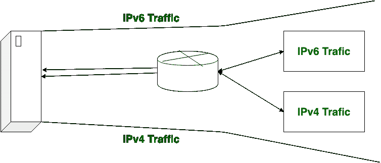
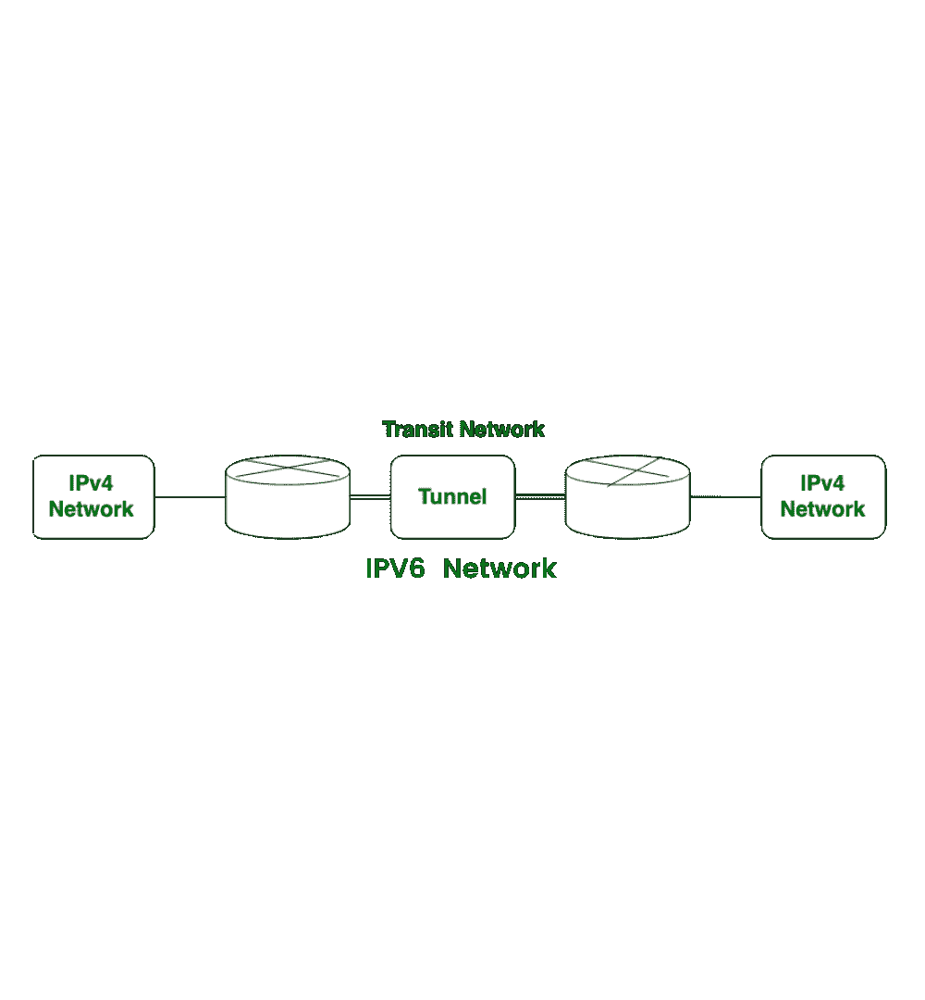
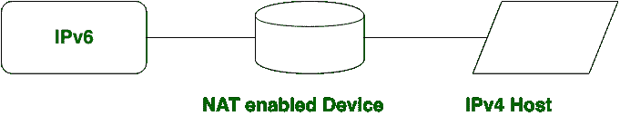

# 从 IPv4 到 IPv6 地址的转换

> 原文:[https://www . geesforgeks . org/transition-从 ipv4 到 ipv6-address/](https://www.geeksforgeeks.org/transition-from-ipv4-to-ipv6-address/)

先决条件–[IPv4 和 IPv6 的区别](https://www.geeksforgeeks.org/differences-between-ipv4-and-ipv6/)
当我们想要将请求从 IP v4 地址发送到 IPv6 地址时，但这是不可能的，因为 [IPv4](https://www.geeksforgeeks.org/network-layer-introduction-ipv4/) 和 [IPv6](https://www.geeksforgeeks.org/network-layer-introduction-ipv4/) 过渡不兼容。为了解决这个问题，我们使用了一些技术。这些技术是*双栈路由器、隧道和 NAT 协议转换*。这些解释如下。

1.  **Dual-Stack Routers:** 
    In dual-stack router, A router’s interface is attached with IPv4 and IPv6 addresses configured are used in order to transition from IPv4 to IPv6. 

在上图中，配置了 IPv4 和 IPv6 地址的给定服务器可以通过双栈路由器(DSR)与 IPv4 和 IPv6 的所有主机通信。双栈路由器(DSR)为所有主机提供了与服务器通信的路径，而无需更改它们的 IP 地址。

1.  **隧道化:**
    隧道化是作为媒介，与不同 IP 版本的中转网络进行通信。

在上图中，显示了不同的 IP 版本，如 IPv4 和 IPv6。借助隧道，IPv4 网络可以与 IPv6 上的中转或中间网络进行通信。IPv6 网络也有可能在隧道的帮助下与 IPv4 网络通信。

1.  **NAT Protocol Translation:** 
    With the help of the NAT Protocol Translation technique, the IPv4 and IPv6 networks can also communicate with each other which do not understand the address of different IP version. 

    一般来说，一个 IP 版本不理解不同 IP 版本的地址，对于这个问题的解决，我们使用 NAT-PT 设备，该设备删除第一个(发送方)IP 版本地址的报头，并添加第二个(接收方)IP 版本地址，以便接收方 IP 版本地址理解请求是由同一个 IP 版本发送的，反之亦然也是可能的。

在上图中，IPv4 地址通过 NAT-PT 设备与 IPv6 地址通信，以便于通信。在这种情况下，IPv6 地址知道请求是由同一个 IP 版本(IPv6)发送的，它会做出响应。