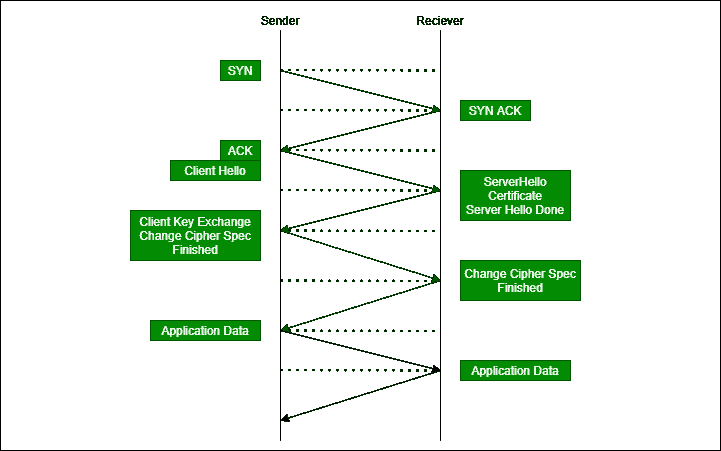

# 传输层安全性(TLS)握手

> 原文:[https://www . geesforgeks . org/transport-layer-security-TLS-handshake/](https://www.geeksforgeeks.org/transport-layer-security-tls-handshake/)

TLS 是一种数据隐私和安全协议，用于互联网上的安全通信。它通常加密服务器和客户端之间的通信。TLS 是[安全套接字层(SSL)](https://www.geeksforgeeks.org/secure-socket-layer-ssl/) 协议的继承者。SSL v3.0 和 TLS v1.0 非常相似，但都被 TLS 取代了。也可以参考[传输层安全性(TLS)](https://www.geeksforgeeks.org/transport-layer-security-tls/) 。

通过握手建立传输层安全性连接。

**动作中的 TLS 握手:**

**Figure –** TLS Handshake

1.  在启用了 TLS 服务的情况下，发送方发送一个 ClientHello(如协议中所述)。这包括有关客户端的信息。
2.  然后服务器用服务器 Hello 消息(选择客户端支持的顶级域名系统的最高版本)进行响应，然后从客户端 Hello 消息的列表中选择一个密码套件。服务器还传输其数字证书和最终的服务器登录消息。
3.  客户端验证证书。然后，客户端发送 ClientKeyExchange 消息。在这里，客户端选择密钥交换机制来安全地与服务器建立共享秘密。客户端还需要发送 ChangeCipherSpec，表示它现在正在切换到安全通信，最后是 Finished 消息，表示握手成功。
4.  一旦接收到共享的秘密，服务器就用变更密码规范和加密的完成消息进行回复。

会话密钥是 TLS 会话中使用的共享对称加密密钥，用于加密来回发送的数据。