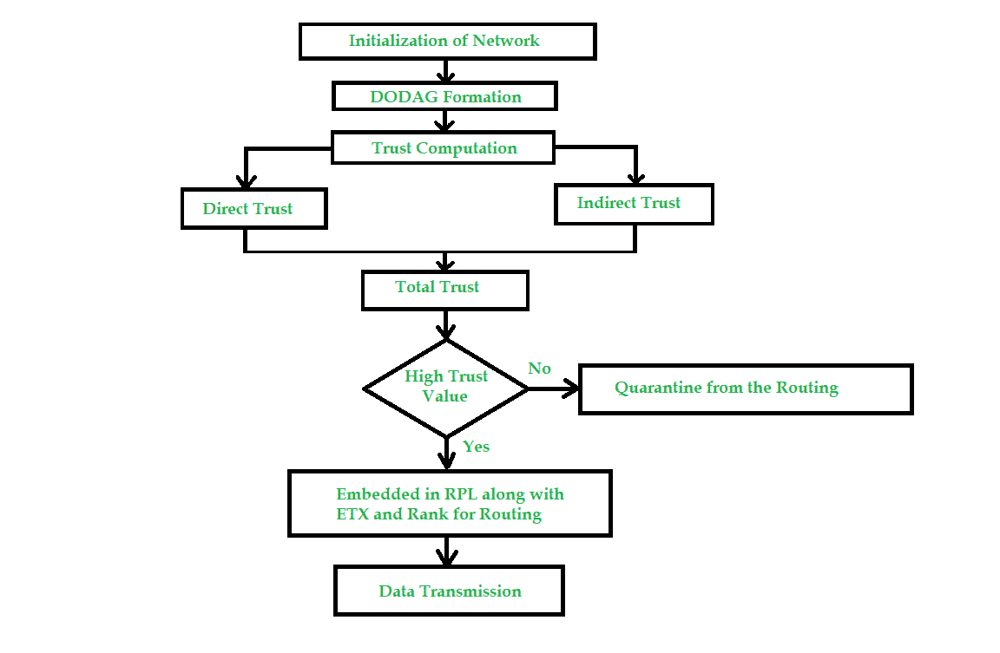
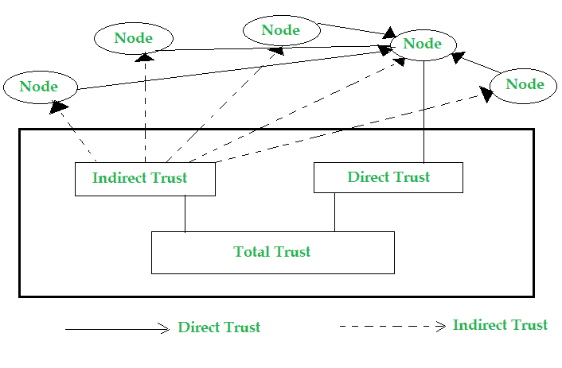
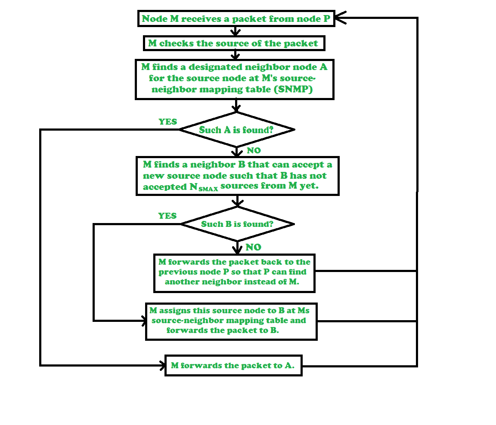
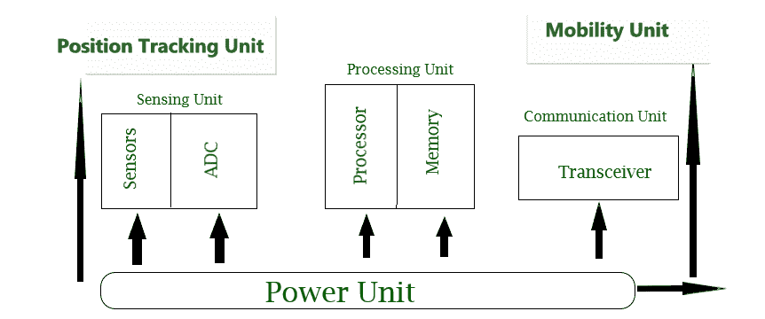
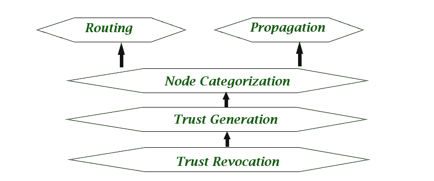

# 基于信任的物联网节能安全路由协议

> 原文:[https://www . geeksforgeeks . org/基于信任的物联网节能安全路由协议/](https://www.geeksforgeeks.org/trust-based-energy-efficient-and-secure-routing-protocols-for-iot/)

目前有很多网络设计和[物联网(IoT)](https://www.geeksforgeeks.org/introduction-to-internet-of-things-iot-set-1/) 模型(设备)在工作，但这些要么在能效方面有所欠缺，要么没有优化。

在大规模、动态的物联网环境中，将信息从源节点发送到目的节点是最重要的任务。因此，在寻找最短路径时，节点可能被重复多次，这降低了节点的寿命，并且网络变得死气沉沉，从而导致网络分割。物联网是电子设备连接到互联网上的平台，可以相互交互并向他人传输数据。

这减少了机器周期中的人为干预。这些机器持续地相互联系，适应需求并修改它们的功能。物联网允许智能小工具之间随时随地进行网络连接。

**Figure –** Proposed Trust Mechanism

[无线传感器网络(WSNs)](https://www.geeksforgeeks.org/wireless-sensor-network-wsn/) 在增加具有经济高效且易于部署的智能设备的网络的普及性方面发挥着至关重要的作用。物联网设备面临许多架构问题，如能效、网络拓扑、远程通信故障、流量增加和设备寿命缩短。

**绩效评估的附加因素:**

*   **Trust Factor –**
    The trust factor of node is how efficiently it transmits data packet to destination node using minimum amount of energy.

    

    
**Figure –** Direct and Indirect Trust

    It is factor that is determined using mathematical function which increases gradually but decreases rapidly. This helps us in optimizing and energy consumption. Thus we are able to send more data packets without losing lots of energy.

    

    
**Figure –** Flowchart of Trust-Based algorithm

*   **Energy remaining in node –**
    Nodes loose some energy while sending data packets, thus we need to select only those nodes which have maximum energy compared to other nodes.

    

    这里我们同时选择最佳路径和次佳路径，如果节点连续发送数据包，每次都会丢失能量，使其能量不足。为了避免这种情况，我们使用次优路径进行节能网络设计。

*   **生活质量指数(LQI)–**
    这表示物联网设备的寿命。具有更多 LQI 因子的设备具有长期寿命。它检测设备的质量有效性。
*   **Hop Count –**
    It refers to number of intermediate nodes between source and destination. A large number of hops in network implies lower real time performance. So, we are targeting to decrease number of hops counts as much as possible. If number of hop count decreases than IoT devices can perform for long span of time.

    

    如果我们能够以期望的方式实现该协议，那么这将是一项巨大的成就，因为它将为基于物联网的更快、更安全和更节能的网络传输打开大门。

**结论和未来范围:**
物联网设备比任何设备都更智能，但仍有很大的改进空间。由于黑客可能会入侵网络，因此安全性是值得关注的。通信速度较低，因此还有提升的空间。无线设备可能会被各种方式分散注意力，因此我们需要使其更加可靠。设备必须在很大程度上可扩展，并且具有成本效益。节点的寿命不是很高，因此未来有可能使其寿命更长。最后，在能效方面，优化物联网设备的空间很大。

在未来，我们会看到人们喜欢无线设备，这些设备让他们的生活更轻松，也更舒适。设备必须避免大量布线，并且应该灵活地通过物理分区，并且必须通过集中监控进行访问。

无线传感器网络也有许多潜在的应用。技术的进步允许创建无线传感器网络，但在无线传感器网络变得实用、安全和经济高效之前，硬件和软件都有巨大的空间。