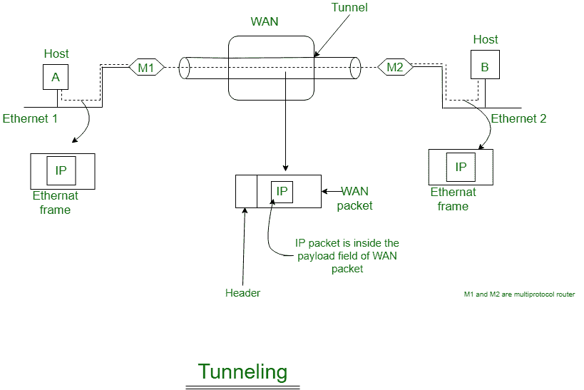

# 掘进

> 原文:[https://www.geeksforgeeks.org/tunneling/](https://www.geeksforgeeks.org/tunneling/)

当相同类型的源网络和目的网络通过不同类型的网络连接时，使用一种称为**隧道**的互联技术。例如，让我们将一个以太网通过广域网连接到另一个以太网视为:

该任务通过广域网从以太网-1 的主机 A 发送到以太网-2 的主机 B。

**事件顺序:**

1.  主机甲构造一个包含主机乙的 IP 地址的数据包
2.  然后，它将该 IP 数据包插入以太网帧，该帧将发往多协议路由器 M1
3.  然后，主机 A 将此帧放在以太网上。
4.  当 M1 收到此帧时，它会删除 IP 数据包，将其插入广域网网络层数据包的有效负载数据包中，并将广域网数据包寻址到 M2。多协议路由器 M2 删除该 IP 数据包，并将其以以太网帧的形式发送给主机 B。

**为什么这种技术被称为隧道技术？**
在这个特殊的例子中，IP 包不必处理广域网，主机 A 和 B 也不必处理广域网。M1 和 M2 的多协议路由器必须了解 IP 和广域网数据包。因此，广域网可以想象成一条在多协议路由器 M1 和 M2 之间延伸的大隧道，这项技术被称为隧道技术。

隧道使用分层协议模型，如现场视察或 TCP/IP 协议套件的模型。因此，换句话说，当数据从主机 A 移动到主机 B 时，它覆盖了指定协议的所有不同级别(OSI、TCP/IP 等)。)，而在不同级别之间移动时，为适应特定层的不同接口而进行的数据转换(封装)称为隧道。