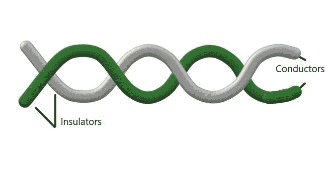
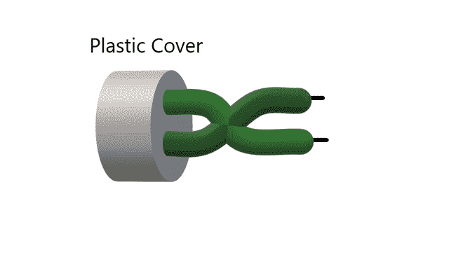
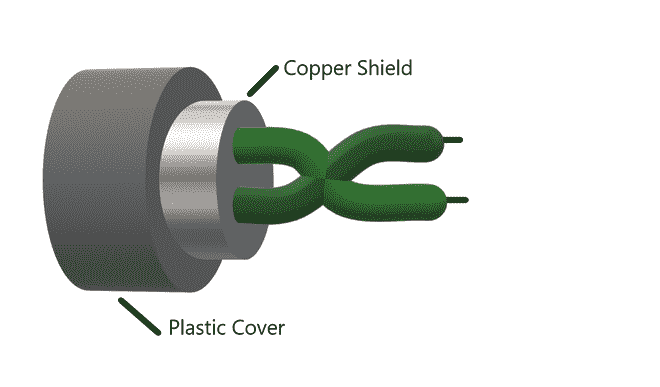

# 双绞线

> 原文:[https://www.geeksforgeeks.org/twisted-pair-cable/](https://www.geeksforgeeks.org/twisted-pair-cable/)

**先决条件:** [传输媒体类型](https://www.geeksforgeeks.org/types-transmission-media/#:~:text=(i)%20Twisted%20Pair%20Cable%20%E2%80%93,most%20widely%20used%20Transmission%20Media.)

**简介:**
传播媒介可分为引导媒介和非引导媒介两部分。在被引导的媒体中，信号包含在传输媒体的物理界限内，并与其一起被引导。

**双绞线** :
这是一种导向介质。它是亚历山大·格雷厄姆·贝尔发明的。双绞线电缆有两根导体，通常由铜制成，每根导体都有绝缘层。这两根导线绞在一起，因此得名双绞线电缆。

其中一根导线用于传输信号，另一根仅用作接地参考。接收器利用这两个导体之间的信号差异。两个平行导体中的噪声或串扰很高，但由于绞合特性，双绞线电缆中的噪声或串扰大大降低。在第一次扭转时，一根导线靠近噪声源，另一根远离噪声源，但在下一次扭转时，情况正好相反，产生的噪声非常小，因此信号质量保持平衡，接收机接收到的噪声非常小或没有。双绞线电缆中的信号质量在很大程度上取决于每单位长度电缆的绞合数量。

**双绞线电缆还有两种类型:**

**1。无屏蔽双绞线电缆(UTP) :**
这是一对没有任何其他绝缘或屏蔽的两根绝缘铜线，因此被称为无屏蔽双绞线电缆。它们减少了由于绝缘的存在而产生的外部干扰。非屏蔽双绞线电缆成对排列，因此我们可以在需要时添加新的连接。我们家里的 DSL 或电话线多了一对。当 UTP 成对排列时，每对用不同的颜色编码，如由 AT & T 公司开发的 25 对颜色编码所定义的。电子工业协会根据一些标准将 UTP 分为 7 类。类别基于电缆质量，其中 1 是最高质量，7 是最低质量。一个类别中的每根电缆根据需要有不同的用途。

**优势–**

1.  由于尺寸紧凑，这些电缆成本低廉且易于安装。
2.  它们通常用于语音和数据的短距离传输。
3.  与其他类型的电缆相比，它的成本更低。

**缺点–**

1.  使用 UTP 建立的连接不安全。
2.  它们只能在长达 100 米的距离内有效，并且必须安装在长达 100 米的地方。
3.  这些电缆的带宽有限。

非屏蔽双绞线电缆(UTP)

**2。屏蔽双绞线电缆(STP) :**
这些类型的电缆在导体上有额外的绝缘或保护覆盖层，其形式为铜编织覆盖层。这种覆盖为电缆的整体结构提供了强度。它还减少了电缆中的噪声和信号干扰。屏蔽确保感应信号可以通过接地返回到信号源，并且只在屏蔽周围循环，而不影响主传播信号。STP 电缆也像 UTP 电缆一样进行颜色编码，因为模拟和数字传输需要不同的颜色对。这些电缆成本高，安装困难。

**优势–**

1.  它们一般用于远距离通信和传输，安装在地下。
2.  保护罩防止外部电磁噪声穿透电缆。
3.  与 UTP 相比，它们的带宽更高。

屏蔽双绞线电缆

**缺点–**

1.  这些电缆很贵。
2.  它们需要大量的维护，这增加了成本。
3.  这些只能安装在地下。
4.  对于这些电缆，该段的长度类似于 UTP。

**双绞线的应用:**

*   双绞线电缆用于电话线，提供数据和语音通道。
*   DSL 线路使用这些电缆。
*   局域网也使用双绞线电缆。
*   它们可以用于模拟和数字传输。
*   RJ-45 是双绞线电缆非常常见的应用。