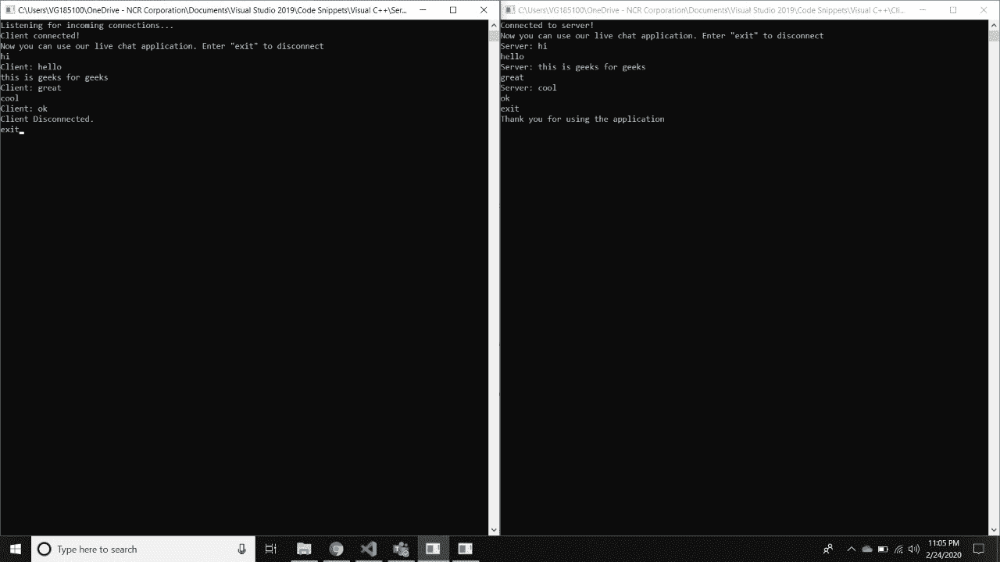

# 客户端和服务器之间使用 Win32 线程的双向通信

> 原文:[https://www . geesforgeks . org/客户端和服务器之间使用 win32 线程的双向通信/](https://www.geeksforgeeks.org/two-way-communication-between-client-and-server-using-win32-threads/)

**先决条件:**[C/c++中的 Socket Programming](https://www.geeksforgeeks.org/socket-programming-cc/)
可以从服务器发送数据，从客户端接收响应。同样，客户端也可以发送和接收数据。这里我们将讨论在 C/C++中使用 [Win32 线程](https://www.geeksforgeeks.org/threads-and-its-types-in-operating-system/)的方法。

**进场:**

1.  使用 [CreateThread](https://docs.microsoft.com/en-us/windows/win32/api/processthreadsapi/nf-processthreadsapi-createthread) 函数为一个进程创建一个新线程。
2.  [CreateThread](https://docs.microsoft.com/en-us/windows/win32/api/processthreadsapi/nf-processthreadsapi-createthread) 方法必须指定新线程要执行的代码的起始地址。以下是 CreateThread 函数的原型:

    ```
    HANDLE CreateThread( 
      LPSECURITY_ATTRIBUTES lpThreadAttributes,
      DWORD dwStackSize, 
      LPTHREAD_START_ROUTINE lpStartAddress,
      LPVOID lpParameter, DWORD dwCreationFlags,
       LPDWORD lpThreadId 
    );

    ```

3.  然后使用 [WaitForSingleObject](http://www.cs.rpi.edu/courses/fall01/os/WaitForSingleObject.html) 函数，该函数以从客户端接收到的对象的形式返回消息，以从客户端接收数据。下面是 WaitForSingleObject 函数的原型:

    ```
    DWORD WaitForSingleObject(
      HANDLE hHandle,        
      DWORD dwMilliseconds
    );

    ```

**<u>创建服务器程序</u>**
在服务器程序中，我们将使用两个线程，一个用于向客户端发送数据，另一个用于从客户端接收数据。当客户端和服务器都键入“**退出**时，通信过程停止。

下面是服务器程序的实现:

## 计算机网络服务器

```
// C++ program to create Server

#include <iostream>
#include <string.h>
#include <winsock2.h>
using namespace std;

// Function that receive data
// from client
DWORD WINAPI serverReceive(LPVOID lpParam)
{
    // Created buffer[] to
    // receive message
    char buffer[1024] = { 0 };

    // Created client socket
    SOCKET client = *(SOCKET*)lpParam;

    // Server executes continuously
    while (true) {

        // If received buffer gives
        // error then return -1
        if (recv(client, buffer, sizeof(buffer), 0)
            == SOCKET_ERROR) {
            cout << "recv function failed with error "
                 << WSAGetLastError() << endl;
            return -1;
        }

        // If Client exits
        if (strcmp(buffer, "exit") == 0) {
            cout << "Client Disconnected."
                 << endl;
            break;
        }

        // Print the message
        // given by client that
        // was stored in buffer
        cout << "Client: " << buffer << endl;

        // Clear buffer message
        memset(buffer, 0,
               sizeof(buffer));
    }
    return 1;
}

// Function that sends data to client
DWORD WINAPI serverSend(LPVOID lpParam)
{
    // Created buffer[] to
    // receive message
    char buffer[1024] = { 0 };

    // Created client socket
    SOCKET client = *(SOCKET*)lpParam;

    // Server executes continuously
    while (true) {

        // Input message server
        // wants to send to client
        gets(buffer);

        // If sending failed
        // return -1
        if (send(client,
                 buffer,
                 sizeof(buffer), 0)
            == SOCKET_ERROR) {
            cout << "send failed with error "
                 << WSAGetLastError() << endl;
            return -1;
        }

        // If server exit
        if (strcmp(buffer, "exit") == 0) {
            cout << "Thank you for using the application"
                 << endl;
            break;
        }
    }
    return 1;
}

// Driver Code
int main()
{
    // Data
    WSADATA WSAData;

    // Created socket server
    // and client
    SOCKET server, client;

    // Socket address for server
    // and client
    SOCKADDR_IN serverAddr, clientAddr;

    WSAStartup(MAKEWORD(2, 0), &WSAData);

    // Making server
    server = socket(AF_INET,
                    SOCK_STREAM, 0);

    // If invalid socket created,
    // return -1
    if (server == INVALID_SOCKET) {
        cout << "Socket creation failed with error:"
             << WSAGetLastError() << endl;
        return -1;
    }
    serverAddr.sin_addr.s_addr = INADDR_ANY;
    serverAddr.sin_family = AF_INET;
    serverAddr.sin_port = htons(5555);

    // If socket error occurred,
    // return -1
    if (bind(server,
             (SOCKADDR*)&serverAddr,
             sizeof(serverAddr))
        == SOCKET_ERROR) {
        cout << "Bind function failed with error: "
             << WSAGetLastError() << endl;
        return -1;
    }

    // Get the request from
    // server
    if (listen(server, 0)
        == SOCKET_ERROR) {
        cout << "Listen function failed with error:"
             << WSAGetLastError() << endl;
        return -1;
    }

    cout << "Listening for 
            incoming connections...." << endl;

            // Create buffer[]
            char buffer[1024];

    // Initialize client address
    int clientAddrSize = sizeof(clientAddr);

    // If connection established
    if ((client = accept(server,
                         (SOCKADDR*)&clientAddr,
                         &clientAddrSize))
        != INVALID_SOCKET) {
        cout << "Client connected!" << endl;
        cout << "Now you can use our live chat application."
             << "Enter \"exit\" to disconnect" << endl;

        // Create variable of
        // type DWORD
        DWORD tid;

        // Create Thread t1
        HANDLE t1 = CreateThread(NULL,
                                 0,
                                 serverReceive,
                                 &client,
                                 0,
                                 &tid);

        // If created thread
        // is not created
        if (t1 == NULL) {
            cout << "Thread Creation Error: "
                 << WSAGetLastError() << endl;
        }

        // Create Thread t2
        HANDLE t2 = CreateThread(NULL,
                                 0,
                                 serverSend,
                                 &client,
                                 0,
                                 &tid);

        // If created thread
        // is not created
        if (t2 == NULL) {
            cout << "Thread Creation Error: "
                 << WSAGetLastError() << endl;
        }

        // Received Objects
        // from client
        WaitForSingleObject(t1,
                            INFINITE);
        WaitForSingleObject(t2,
                            INFINITE);

        // Close the socket
        closesocket(client);

        // If socket closing
        // failed.
        if (closesocket(server)
            == SOCKET_ERROR) {
            cout << "Close socket failed with error: "
                 << WSAGetLastError() << endl;
            return -1;
        }
        WSACleanup();
    }
}
```

Run the ServerApplication.cpp file using the command:

```
g++ ServerApplication.cpp -lws2_32 

```

**<u>创建客户端程序</u>**
在客户端程序中，我们将使用两个线程，一个用于向服务器发送数据，另一个用于从服务器接收数据。当服务器和客户端都键入“**退出**时，通信过程停止。

## 客户

```
// C++ program to create client

#include <iostream>
#include <string.h>
#include <winsock2.h>
using namespace std;

// Function that receive data from server
DWORD WINAPI clientReceive(LPVOID lpParam)
{
    // Created buffer[] to
    // receive message
    char buffer[1024] = { 0 };

    // Created server socket
    SOCKET server = *(SOCKET*)lpParam;

    // Client executes continuously
    while (true) {

        // If received buffer gives
        // error then return -1
        if (recv(server, buffer,
                 sizeof(buffer), 0)
            == SOCKET_ERROR) {
            cout << "recv function failed with error: "
                 << WSAGetLastError()
                 << endl;
            return -1;
        }

        // If Server exits
        if (strcmp(buffer, "exit") == 0) {
            cout << "Server disconnected."
                 << endl;
            return 1;
        }

        // Print the message
        // given by server that
        // was stored in buffer
        cout << "Server: " << buffer << endl;

        // Clear buffer message
        memset(buffer, 0, sizeof(buffer));
    }
    return 1;
}

// Function that sends data to server
DWORD WINAPI clientSend(LPVOID lpParam)
{
    // Created buffer[] to
    // receive message
    char buffer[1024] = { 0 };

    // Created server socket
    SOCKET server = *(SOCKET*)lpParam;

    // Client executes continuously
    while (true) {

        // Input message client
        // wants to send to server
        gets(buffer);

        // If sending failed
        // return -1
        if (send(server,
                 buffer,
                 sizeof(buffer), 0)
            == SOCKET_ERROR) {
            cout << "send failed with error: "
                 << WSAGetLastError() << endl;
            return -1;
        }

        // If client exit
        if (strcmp(buffer, "exit")
            == 0) {
            cout << "Thank you for using the application"
                 << endl;
            break;
        }
    }
    return 1;
}

// Driver Code
int main()
{
    // Input data
    WSADATA WSAData;

    // Created socket server
    SOCKET server;
    SOCKADDR_IN addr;

    WSAStartup(MAKEWORD(2, 0), &WSAData);

    // If invalid socket created,
    // return -1
    if ((server = socket(AF_INET,
                         SOCK_STREAM, 0))
        == INVALID_SOCKET) {
        cout << "Socket creation failed with error: "
             << WSAGetLastError() << endl;
        return -1;
    }

    addr.sin_addr.s_addr = inet_addr("127.0.0.1");
    addr.sin_family = AF_INET;
    addr.sin_port = htons(5555);

    // If connection failed
    if (connect(server,
                (SOCKADDR*)&addr,
                sizeof(addr))
        == SOCKET_ERROR) {
        cout << "Server connection failed with error: "
             << WSAGetLastError() << endl;
        return -1;
    }

    // If connection established
    cout << "Connected to server!"
         << endl;
    cout << "Now you can use our live chat application."
         << " Enter \"exit\" to disconnect"
         << endl;
    DWORD tid;

    // Create Thread t1
    HANDLE t1 = CreateThread(NULL,
                             0,
                             clientReceive,
                             &server,
                             0, &tid);

    // If created thread
    // is not created
    if (t1 == NULL)
        cout << "Thread creation error: "
             << GetLastError();

    // Create Thread t2
    HANDLE t2 = CreateThread(NULL,
                             0,
                             clientSend,
                             &server,
                             0, &tid);

    // If created thread
    // is not created
    if (t2 == NULL)
        cout << "Thread creation error: "
             << GetLastError();

    // Received Objects
    // from client
    WaitForSingleObject(t1, INFINITE);
    WaitForSingleObject(t2, INFINITE);

    // Socket closed
    closesocket(server);
    WSACleanup();
}
```

使用以下命令运行 ClientApplication.cpp 文件:

```
g++ ClientApplication.cpp -lws2_32 

```

**<u>输出服务器与客户端通信后</u>**
[](https://media.geeksforgeeks.org/wp-content/uploads/20200224231015/output2.jpeg) 
左侧命令提示符为**服务器应用程序**，右侧命令提示符为**客户端应用程序**。