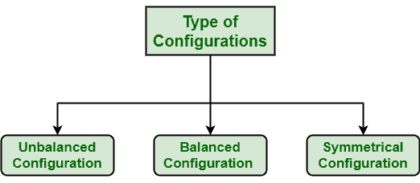
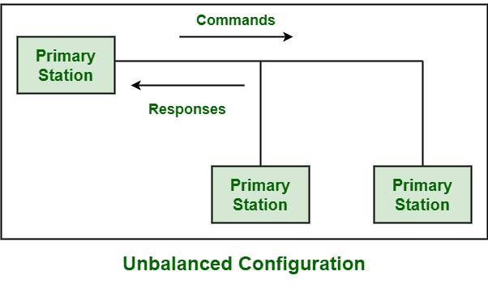
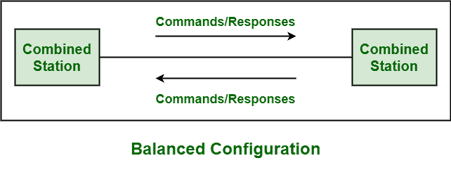
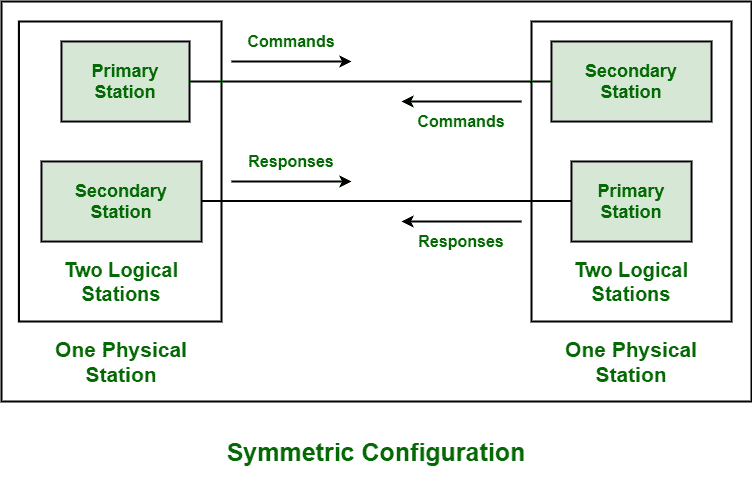

# HDLC 提供的配置类型

> 原文:[https://www . geesforgeks . org/配置类型-由 hdlc 提供/](https://www.geeksforgeeks.org/type-of-configurations-provided-by-hdlc/)

[高级数据链路控制(HDLC)](https://www.geeksforgeeks.org/difference-between-high-level-data-link-control-hdlc-and-point-to-point-protocol-ppp/) 是一种协议，通常由[国际标准化组织(ISO)](https://www.geeksforgeeks.org/iso-full-form/) 开发。HDLC 基本上是[开放系统互连(OSI)模型](https://www.geeksforgeeks.org/layers-of-osi-model/)的一组数据链路层协议，要求在点对点节点之间传输同步数据包或帧。它还提供面向连接的服务和无连接的服务。

**配置类型:**
HDLC 一般针对不同类型的站，即主站、次站、组合站，说明不同类型的配置。配置只是指链路上各种硬件设备之间的关系。下面给出了这些不同的配置:

**1。不平衡配置:**
主站一般需要不平衡配置。在这种配置中，一个站点是主要站点，所有站点都是次要站点。出现这种配置主要是因为主站基本上用作控制站，在数据链路上控制次站。它还包括两个或多个二级站。它支持以下操作:

*   两种传输模式，即全双工和半双工
*   两种网络模式，即点对点和多点网络

**示例–**

**2。平衡配置:**
联合站一般要求平衡配置。该配置由两个组合站组成，这两个组合站具有同等且互补的职责，以增强和强调彼此的工作和质量，如下图所示。它只支持下面给出的特定操作:

*   两种传输模式，即全双工和半双工，或
*   一种网络模式，即点对点

**示例–**

**3。对称配置:**
通常与主站结合的副站一般需要对称配置。这种配置正好由两个节点组成，即两个独立的点对点不平衡站配置。

有时，它也是平衡和不平衡配置的组合。这种配置在现有技术中很少使用。网络中的每个站点基本上都有两种不同的状态，一种是主要状态，另一种是次要状态。甚至每个站在逻辑上一般都被认为是两个站。

**示例–**

