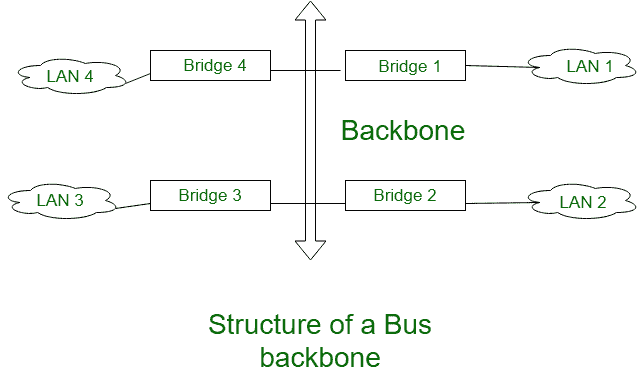
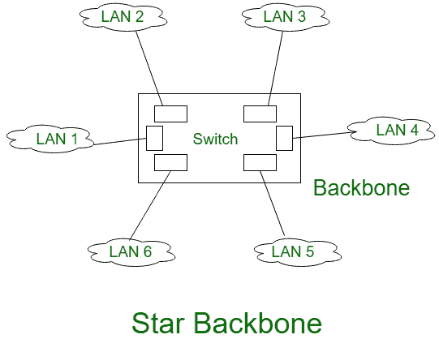
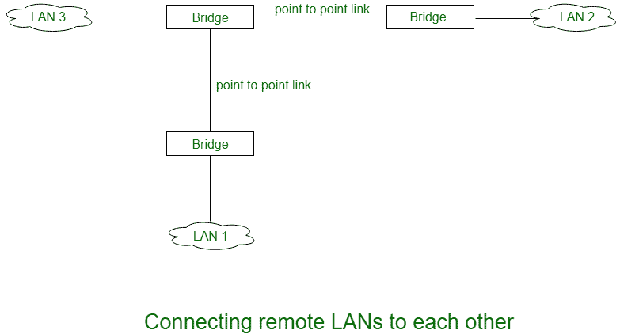

# 骨干网络的类型和用途

> 原文:[https://www . geeksforgeeks . org/主干网的类型和用途/](https://www.geeksforgeeks.org/types-and-uses-of-backbone-networks/)

**脊柱**是为休息系统提供中枢支持的系统中最重要的部分，例如平衡和保持身体所有部分的人体脊柱。类似地，在计算机网络中，**主干网络**是一个包含高容量连接基础设施的网络，该基础设施是网络不同部分的主干。

实际上，一个主干网允许多个局域网在一个主干网中连接，不是单个站点直接连接到主干网，而是站点是局域网的一部分，主干网连接这些局域网。

**骨干局域网:**
由于分布式应用和 pc 机的使用越来越多，引入了一种新的灵活的局域网策略。如果要支持楼宇范围的数据通信系统，那么我们需要一个网络系统，它可以跨越所需的距离，并且能够将单个建筑物或一组建筑物中的所有设备互连起来。

为此目的开发单个局域网是可能的，但是实际上该方案面临以下缺点:

1.  **可靠性差:**
    使用单个局域网时，可靠性会很差，因为即使是短时间的服务中断也会给用户带来重大问题。
2.  **容量:**
    由于设备数量增加超过一定数量，单个局域网可能会饱和
3.  **成本:**
    单个局域网无法针对通信和互联的不同需求给出最佳性能。

因此，使用单个局域网的替代方案是在每个建筑或部门使用低成本低容量局域网，然后将所有这些局域网与高容量局域网互连。这样的网络称为**骨干局域网**。主干网允许连接几个局域网。在骨干网中，没有一个站与骨干网直接相连，取而代之的是每一个站都是一个局域网的一部分，而这些局域网都与骨干网相连。

主干本身是一个局域网，它使用一个局域网协议，如以太网，因此主干中的每个连接本身就是另一个局域网。两种非常常用的架构是:总线主干、星型主干。这些解释如下。

1.  **Bus Backbone:**
    In Bus backbone the topology used for the backbone is bus topology.

    

    在上图中，总线主干结构用作连接组织中不同建筑物的分布主干。每栋大楼可能只有一个局域网，也可能有另一个星型主干网。该结构是一个基于网桥(网桥是连接设备)的主干，有四个局域网。

    **工作:**
    在上面的结构中，如果 LAN 2 中的一个站想要向同一 LAN 中的某个其他站发送帧，那么网桥 2 将不允许该帧传递到任何其他 LAN，因此该帧不会到达主干网。如果局域网 1 中的一个站想要向局域网 4 中的一个站发送一个帧，那么网桥 1 会将这个帧传送到主干网。该帧随后被网桥 4 接收并传送到目的地。

2.  **Star Backbone:**
    The topology of this backbone is star topology.

    

    上图显示了这种配置中的星型主干，主干只是一个用于连接各种局域网的交换机。交换机完成主干网的工作，并连接局域网。这种类型的主干网基本上用作建筑物内部的分布主干网。

    还有一类骨干网络是远程局域网互联:

3.  **Interconnection of Remote control:**
    In this type of backbone network the connection are done through the bridge called remote bridges which acts as connecting devices in connect LANs as point to point network link.

    

    点对点网络的例子是租用电话线或 ADLS 线。这样的点对点网络可以被认为相当于一个没有站点的局域网。