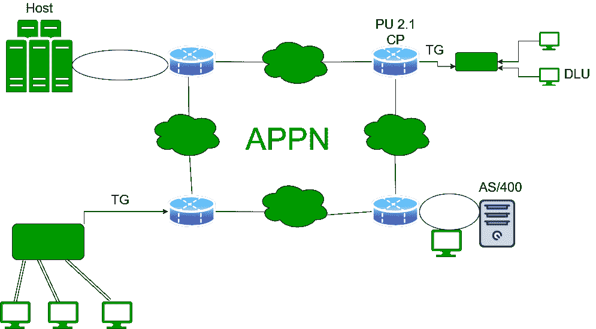

# APPN 节点类型

> 原文:[https://www.geeksforgeeks.org/types-of-appn-nodes/](https://www.geeksforgeeks.org/types-of-appn-nodes/)

**[高级对等网络(APPN)](https://www.geeksforgeeks.org/what-is-appnadvanced-peer-to-peer-networking/)** 是系统网络架构(SNA)的瞬间生成。它是由 IBM 创建的，以满足这些先决条件:

*   提供一个令人信服的指导约定，以允许系统网络体系结构活动以本机方式流动，并与其他协议同时流动。
*   允许在没有主机关联的情况下在结论客户端之间建立会话。
*   减少对资产和路径的预期。
*   保持服务过程并在国民账户体系活动中提供优先次序。

APPN 在 1986 年左右被定性，并被暗示补充 IBM 的组织设计框架。它被描述为一个解纠缠的过程，但是它本质上是复杂的，在特定的运动环境中。APPN 最初被暗示是一个“DECNET 刽子手”，但 DEC 真的踢了桶最近 APPN 完成的某个时候。APPN 在很大程度上已经被网络所取代。

### APPN 术语

*   **传输组(TG):** 在 APPN 术语和传统 SNA 中都暗指相同的事情:连接两个相邻集线器的一组线路。区别在于，目前的 APPN 工程限制了单一界面的热重，尽管事实上，多链接热重预计将在未来实现。拓扑数据库包含 NNs 和 TGs，即连接 NNs 的接口。
*   **相关逻辑单元:**0、1、2、3 等向前排序的遗留逻辑单元。没有 VTAM 的调解，他们无法开始会话，也无法有效地参与对等会话的启动。
*   **物理单元 2.1 (PU 2.1):** 对等处理的物理单元类型。
*   **控制点:**APPN 枢纽的主要组成部分。CP 注意 APPN 节点的管理。它实现与相邻节点的连接，启动与其他节点的 CP-CP 会话，查找网络资产，并收集和与其他节点共享拓扑数据。

### APPN 节点的类型

1.  **网络节点(NN):**APPN 组织中的路由器。当需要激活会话和资产位置时，其他资产将进入神经网络。
2.  **端节点(EN):** 可以认为是应用主机，通过其 NN 服务器访问网络。EN 包含 APPN 功能的子集；它不具备安排拓扑、维护和重新路由等功能。
3.  **低入口节点(LEN):**IBM 描述为 AS/400s 和 S/36s 的初始对等节点。在 VTAM 的调解下，它允许两个节点之间的通信。令人震惊的是，它并不支持快速转向，因此需要切换应用程序或协调关联。APPN 节点是添加到 LEN 节点的扩展，以提供这种包含的有用性。LEN 节点可以通过 NN 服务器到达 APPN 组织，但是资产必须是预定义的。
4.  **复合网络节点(美国有线电视新闻网):**为描绘在 VTAM 和组织控制计划(NCP)中实现的 APPN 有用性而调制。VTAM 可以是一个独立的神经网络，但全国大会党不能。因此，当他们一起工作时，他们可以和一个神经网络说话。
5.  **分支网络节点(BrNN):** 显示为上游神经网络的一个神经网络，而它为下游神经网络和焦点提供神经网络管理。BrNN 的这种支持通常被称为部门扩展(BX)。BX 的工作处理了 APPN 神经网络和 SNA 应用程序之间的 APPN 拓扑和 APPN 广播外观流，这使得 APPN 安排更具适应性。思科目前在 APPN 的用法是 SNASwitch，它取代了 12.1 版的遗赠 APPN 执行和 BX 雇佣。

**APPN 特色:**

*   分散的网络控制。
*   网络拓扑数据动态交易培育。
*   易于关联、重新配置和课程选择。组织资源动态定义。
*   自动资产登记和注册查询。