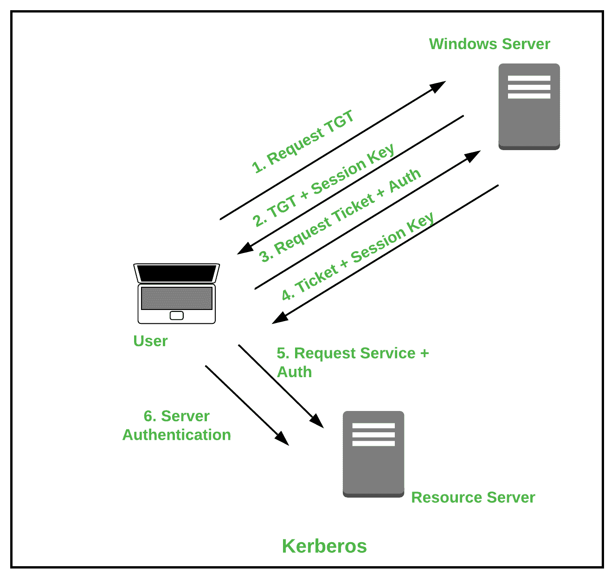
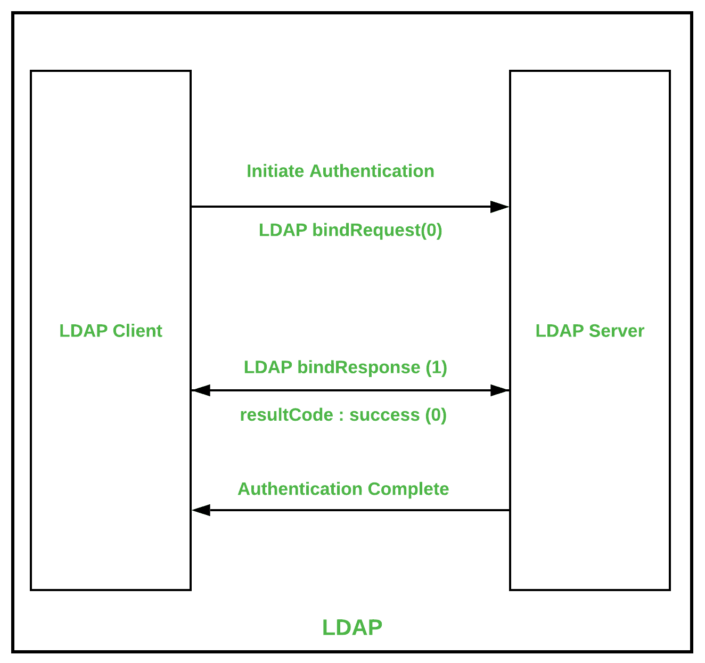
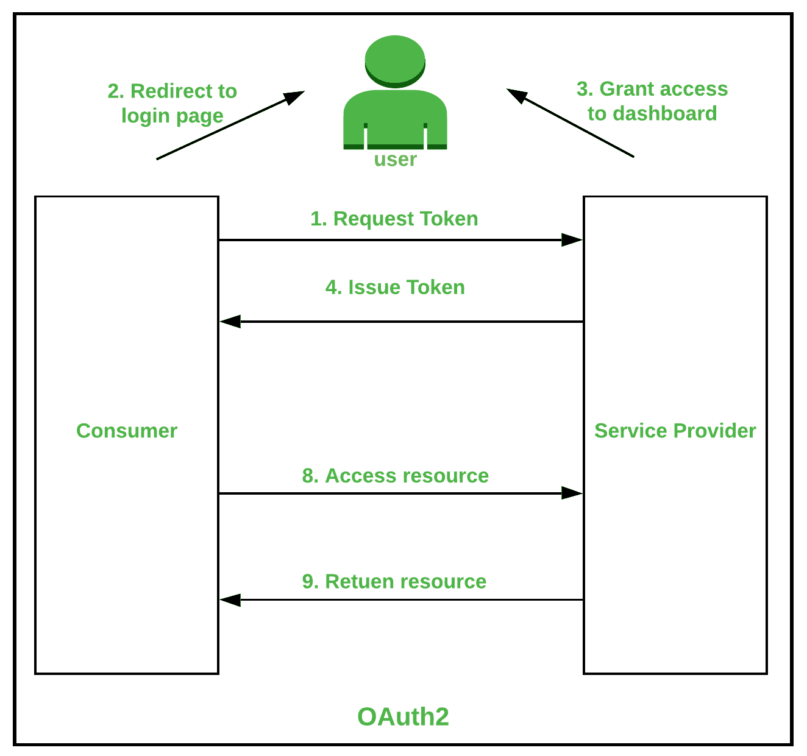
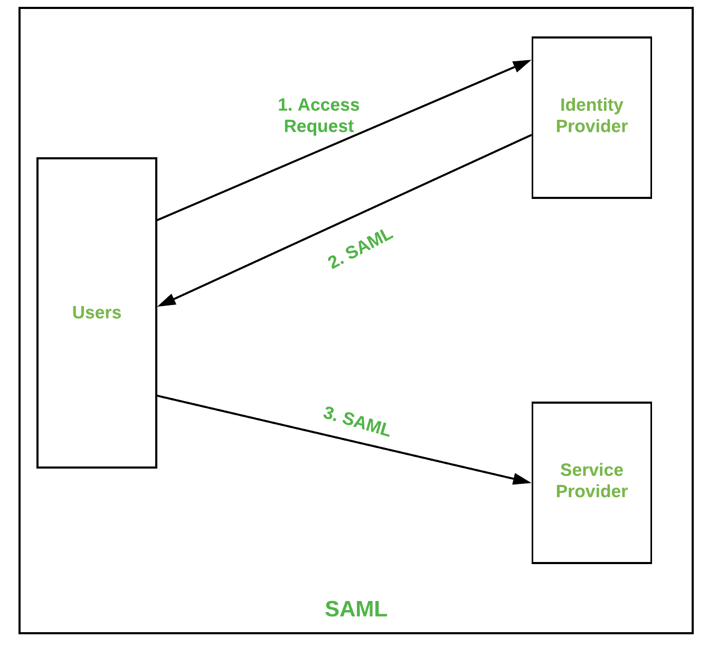
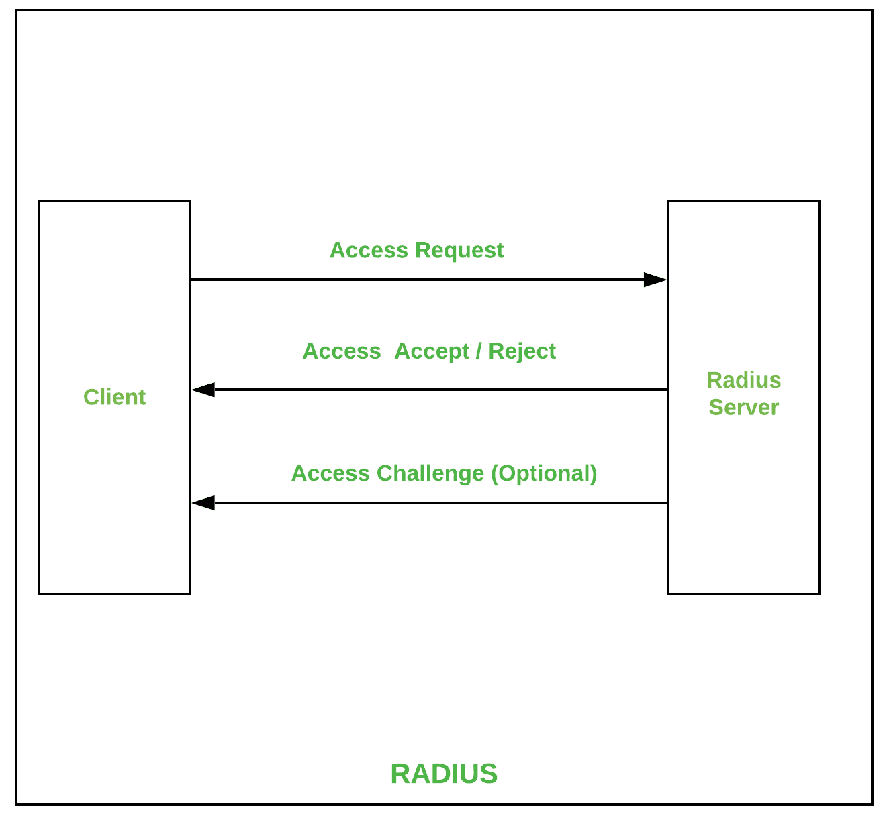

# 认证协议的类型

> 原文:[https://www . geesforgeks . org/认证协议类型/](https://www.geeksforgeeks.org/types-of-authentication-protocols/)

在响应用户向软件应用程序发出的请求时，用户身份验证是最优先的。在提供对数据的访问时，需要几种机制来验证访问。在本博客中，我们将探讨最常见的身份验证协议，并尝试探讨它们的优缺点。

### **1 .**[**Kerberos**](https://www.geeksforgeeks.org/kerberos/)**:**

Kerberos 是一种有助于网络身份验证的协议。这用于在使用加密密钥的网络期间验证客户端/服务器。它旨在向应用程序报告时执行强身份验证。麻省理工学院公开了 Kerberos 协议的整体实现，并在许多大规模生产的产品中使用。

**Kerberos 的一些优势:**

*   它支持各种操作系统。
*   身份验证密钥的共享效率比公共共享高得多。

**Kerberos 的一些缺点:**

*   它仅用于验证客户端及其使用的服务。
*   它显示了对软密码或弱密码的脆弱性。

### 

**2。** [**轻量级目录访问协议(LDAP) :**](https://www.geeksforgeeks.org/lightweight-directory-access-protocol-ldap/)

LDAP 指的是轻量级目录访问协议。它是一种协议，用于确定网络中的任何个人、组织和其他设备，无论是在公共互联网还是公司互联网上。它被实践为目录即服务，并且是微软构建活动目录的基础。

**LDAP 的一些优势:**

*   这是一个自动化协议，使现代化变得更加容易。
*   它支持现有技术，并允许多个目录。

**LDAP 的一些缺点:**

*   它需要部署的经验。
*   目录服务器需要服从 LDAP 进行部署。

### 

**3。******:****

**OAuth 顾名思义，它是一个授权框架，促进通过 HTTP 服务授予用户对其帐户的有限访问权限。当用户请求访问资源时，会进行一个应用编程接口调用，并且在身份验证令牌通过后。**

****

****oauth 2 的一些优点:****

*   **这是一个简单的协议，易于实现。**
*   **它提供服务器端的代码授权。**

****oauth 2 的一些缺点:****

*   **它很容易管理不同的代码集。**
*   **它会对连接到另一个受影响系统的站点产生严重影响。**

### 

****4 .**[**【SAML】**](https://www.geeksforgeeks.org/saml-authentication/)**:****

**SAML 代表安全声明标记语言，它基于基于 XML 的身份验证数据格式，提供身份提供者和服务提供者之间的授权。它是 OASIS 安全服务技术委员会的产品。**

****

****SAML 的一些优势:****

*   **它降低了最终用户的管理成本。**
*   **它为跨服务提供商进行身份验证提供了单一登录。**

****SAML 的一些缺点:****

*   **它依赖于身份提供者。**
*   **所有数据都以单一的 XML 格式进行管理。**

### 

****5。** [**半径**](https://www.geeksforgeeks.org/radius-protocol/) **:****

**RADIUS 代表远程身份验证拨入用户服务。它是一种网络协议，为使用和网络服务的用户提供足够的集中式身份验证、记帐和授权。当用户请求访问网络资源时，该协议开始运行，RADIUS 服务器对用户输入的凭证进行加密。此后，用户凭据通过本地数据库进行映射并提供访问。**

****

 ****RADIUS 的一些优势:****

*   **这是为管理员提供多重访问的一个很好的机制。**
*   **它为会话中的每个用户提供唯一的身份。**

****RADIUS 的一些缺点:****

*   **这种机制的初始实现很难在硬件上实现。**
*   **它有各种各样的模型，可能需要一个特殊的团队，这是成本消耗。**

**区分协议并不能使协议公平，因为这取决于应用程序的用途以及它的使用目的。**