# 计算机网络类型

> 原文:[https://www.geeksforgeeks.org/types-of-computer-networks/](https://www.geeksforgeeks.org/types-of-computer-networks/)

计算机网络是共享通信路径上的计算机集群，其工作目的是从一台计算机到另一台计算机共享由网络节点提供或位于网络节点上的资源。

计算机网络的一些用途如下:

*   使用电子邮件、视频、即时消息等进行交流。
*   共享设备，如打印机、扫描仪等。
*   共享文件
*   在远程系统上共享软件和操作程序
*   允许网络用户轻松访问和维护信息

#### 计算机网络的类型

1.  个人区域网
2.  局域网
3.  广域网
4.  无线局域网
5.  校园网
6.  城域网
7.  存储区域网络
8.  系统区域网
9.  无源光局域网
10.  企业专用网(EPN)
11.  虚拟专用网络

这些解释如下。

**1。个人区域网(PAN)** :
PAN 是最基本的计算机网络类型。这个网络仅限于一个人，也就是说，计算机设备之间的通信只集中在个人的工作空间。PAN 提供从人到提供通信的设备的 10 米网络范围。

PAN 的例子有 USB、电脑、电话、平板、打印机、PDA 等。

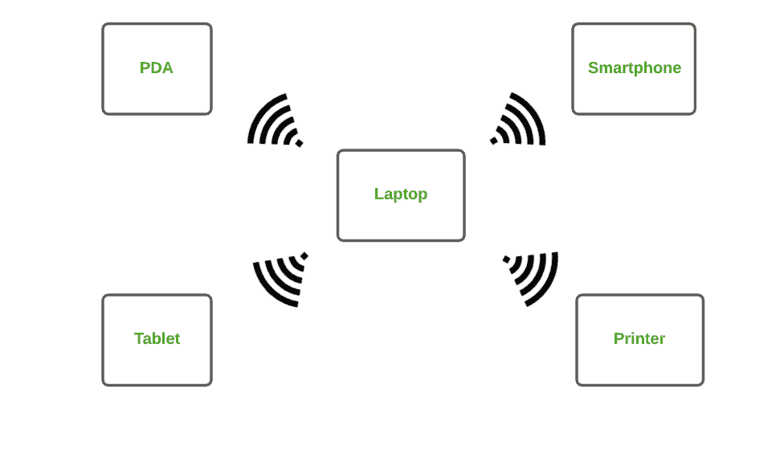

**2。局域网:**
局域网是最常用的网络。局域网是一种计算机网络，它通过公共通信路径将计算机连接在一起，包含在有限的区域内，即本地。局域网包含两台或多台通过服务器连接的计算机。这个网络涉及的两个重要技术是以太网和 Wi-fi。

局域网的例子有家庭、学校、图书馆、实验室、学院、办公室等。

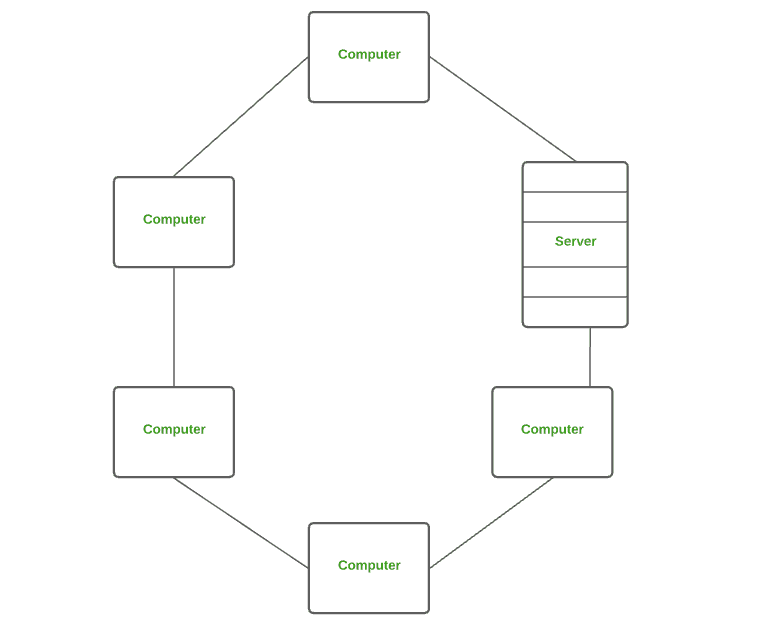

**3。广域网(WAN)** **:**
WAN 是一种计算机网络，通过共享的通信路径在很大的地理距离上连接计算机。它不局限于一个位置，而是延伸到许多位置。广域网也可以定义为一组相互通信的局域网。

广域网最常见的例子是互联网。

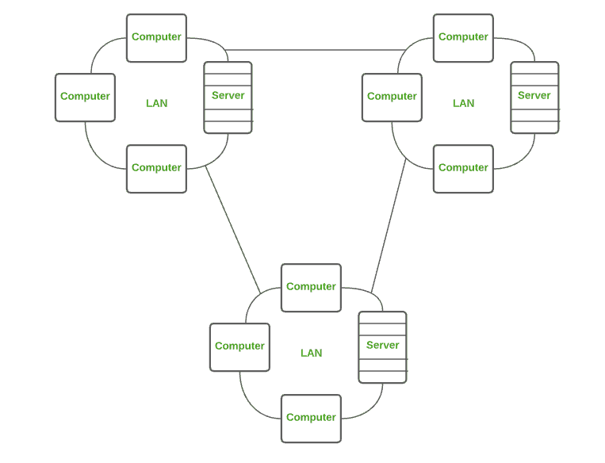

**4。无线局域网(WLAN)** **:**
WLAN 是一种计算机网络，它充当局域网，但使用无线网络技术，如 Wi-Fi。该网络不允许设备像局域网一样通过物理电缆进行通信，但允许设备进行无线通信。

无线局域网最常见的例子是无线网络。

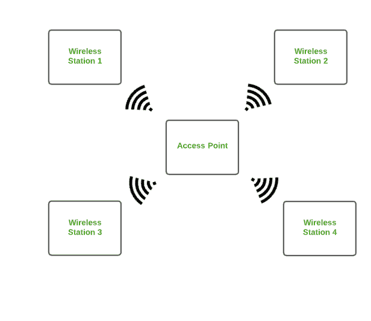

**5。校园网(CAN)** **:**
CAN 比局域网大，但比城域网小。这是一种计算机网络，通常用于学校或学院等场所。该网络覆盖有限的地理区域，也就是说，它分布在校园内的几栋建筑中。

CAN 的例子是覆盖学校、学院、建筑物等的网络。

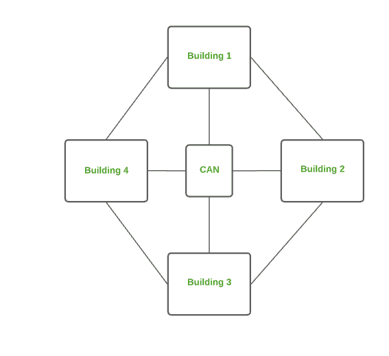

**6。城域网** **:**
城域网比局域网大，但比广域网小。这是一种计算机网络，通过城市、城镇或大都市地区的共享通信路径，将地理距离上的计算机连接起来。

城域网的例子有城镇、城市、单个大城市、多个建筑物内的大区域等。

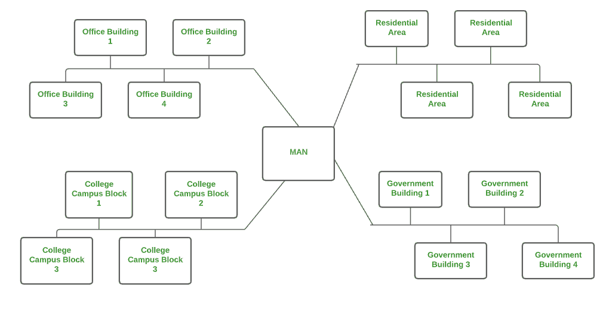

**7。存储区域网络(SAN)** **:**
SAN 是一种高速计算机网络，将多组存储设备连接到几台服务器。这个网络不依赖局域网或广域网..相反，存储区域网络将存储资源从网络移动到自己的高性能网络。存储区域网络提供对块级数据存储的访问。

存储区域网络的例子是由服务器网络访问的磁盘网络。

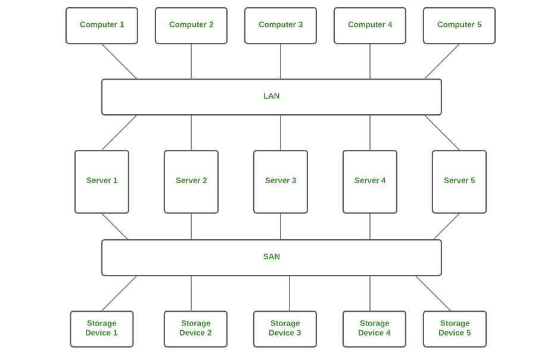

**8。系统区域网络(SAN)****:**
SAN 是一种连接高性能计算机集群的计算机网络。这是一个面向连接的高带宽网络。存储区域网络是一种在大型请求中处理大量信息的局域网。该网络对于处理要求高网络性能的应用程序非常有用。

微软 SQL Server 2005 通过虚拟接口适配器使用 SAN。

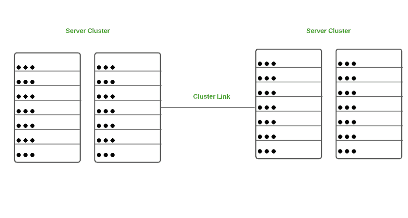

**9。无源光局域网(POLAN)****:**
POLAN 是一种计算机网络，可替代局域网。POLAN 使用分光器将单股单模光纤的光信号分成多个信号，以分配用户和设备。简而言之，POLAN 是一种点到多点的局域网架构。

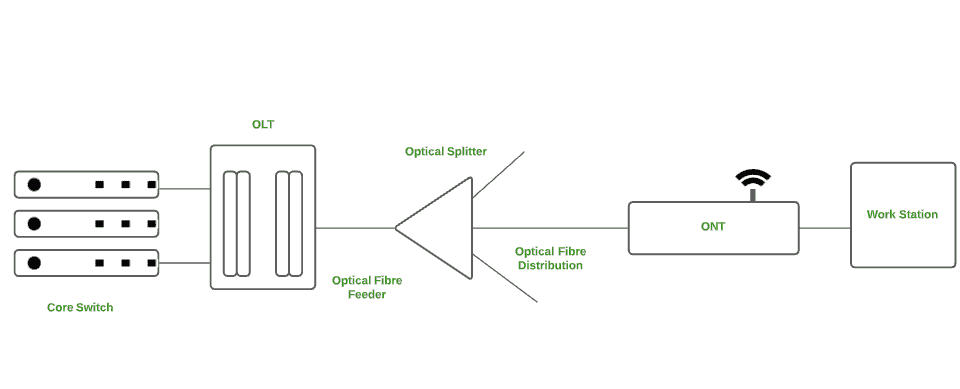

**10。企业专用网(EPN)** **:**
EPN 是一种计算机网络，主要由希望通过不同位置的安全连接来共享计算机资源的企业使用。

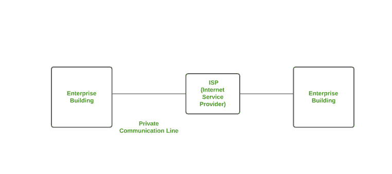

**11 时。虚拟专用网络(VPN)****:**
VPN 是一种计算机网络，它在互联网上扩展专用网络，并允许用户发送和接收数据，就像他们连接到专用网络一样，即使他们没有连接。通过虚拟点对点连接，用户可以远程访问专用网络。虚拟专用网通过作为一种介质为您提供受保护的网络连接，保护您免受恶意来源的攻击。

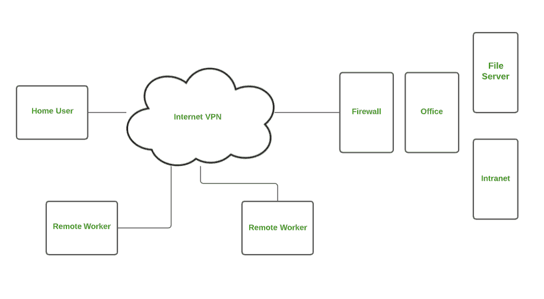