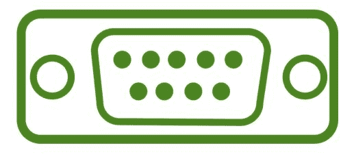
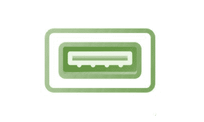
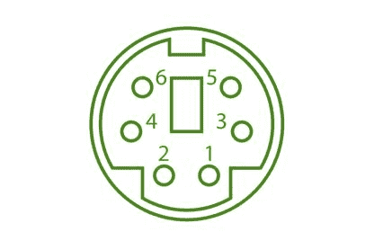
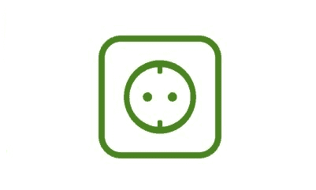
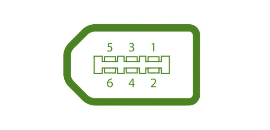
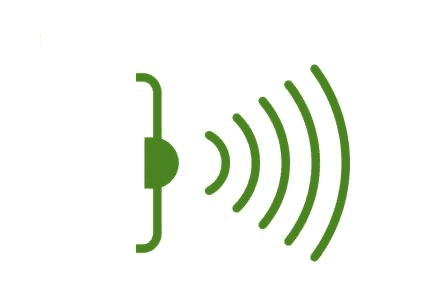
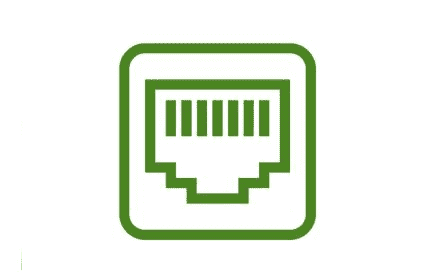

# 计算机端口类型

> 原文:[https://www.geeksforgeeks.org/types-of-computer-ports/](https://www.geeksforgeeks.org/types-of-computer-ports/)

计算机是将数据转换成有意义信息的设备。它根据用户提供给它的指令集处理输入，并给出所需的输出。众所周知，我们可以将多个外部设备与计算机系统连接起来。现在，这些设备使用端口与计算机连接。端口是计算机中的物理扩展点，外部设备通过电缆连接。或者换句话说，端口是主板和计算机外部设备之间的接口。有不同类型的端口可用:

*   串行端口
*   并行端口
*   USB 连接埠
*   PS/2 端口
*   VGA 连接埠
*   调制解调器端口
*   火线端口
*   套接字
*   红外端口
*   游戏端口
*   数字视频接口端口
*   以太网端口

现在让我们逐一讨论这些端口:

**1。串口(通讯端口):**

串行端口也称为通信端口，用于连接外部设备，如调制解调器、鼠标或键盘(基本上在旧电脑中)。与并行电缆相比，串行电缆制造成本更低，并且更容易屏蔽干扰。它有两个版本，分别是 9 针型号和 25 针型号。它以 115 千字节/秒的速度传输数据。

**2。并行端口(LPT 端口):**

并行端口通常用于连接扫描仪和打印机。它可以同时发送几个比特，因为它使用并行通信。它的数据传输速度比串口快得多。它是 25 针型号。它也称为打印机端口或行式打印机端口。

**3。通用串行总线:**

1997 年，USB 首次被引入。这可以连接各种外部 USB 设备，如外部硬盘、打印机、扫描仪、鼠标、键盘等。大多数计算机系统至少提供两个通用串行总线端口。这是一种新型串行连接端口，比旧的串行端口快得多，这些通用串行总线端口更智能、更通用，因为它允许将多达 127 个通用串行总线外围设备“菊花链”连接到一个端口。这里的数据传输速率是每秒 12 兆位。它还提供即插即用通信。

**4。PS/2 端口:**

PS/2 端口是用于连接老式电脑键盘和鼠标的专用端口。它是由 IBM 发明的。在旧计算机中，至少有两个 PS/2 端口，每个端口用于键盘和鼠标。这是一个 6 针迷你 Din 连接器。

**5。VGA 端口:**

VGA 端口也称为视频图形阵列连接器，是将显示器连接到计算机显卡的端口。VGA 端口有 15 个孔，它类似于串行端口连接器。但是 VGA 端口上有孔，串行端口连接器上有引脚。

**6。插座:**

麦克风和扬声器通过插座连接到电脑的声卡上。

**7。火线端口:**

IEEE 1394 接口，80 年代末 90 年代初由苹果作为 FireWire 开发。它可以以非常高的速度传输大量数据。它用于将摄像机和视频设备连接到计算机。它有三种变体，分别是 4 针火线 400 连接器、6 针火线 400 连接器和 9 针火线 800 连接器。

**8。红外端口:**

红外端口用于发送和接收来自其他设备的红外信号。它是一种无线类型的端口，限制范围为 5-10 英尺。

**9。游戏端口:**

这些端口以前用于将操纵杆连接到电脑。但是现在它被 USB 端口取代了。

**10。调制解调器端口:**

顾名思义，调制解调器端口用于将个人电脑的调制解调器连接到电话网络。

**11 时。数字视频接口端口:**

DVI 端口用于将 LCD(平板)显示器连接到计算机的高端视频图形卡，在显卡制造商中非常受欢迎。

**12 时。以太网端口:**

以太网端口有助于连接到网络和高速互联网(由局域网或其他来源提供)。它将网线连接到计算机，并位于以太网卡中。它提供 10 Mb 到 1000 Mb(兆位)每秒的数据传输速度。

### 示例问题

**问题 1。USB 的完整形式是什么？**

**(A)通用串行总线**

**(B)未经编辑的系统支架**

**(C)统一音条**

**(D)唯一排序总线**

**解决方案:**

> 正确的选项是 A，即通用串行总线。

**问题 2。以太网电缆用于 ________？**

**(一)音频**

**(B)联网**

**(C)互联网**

**(D)b 和 c 两者**

**解决方案:**

> 正确的选项是 B 和 C
> 
> 因为以太网端口有助于连接到网络和高速互联网(由局域网或其他来源提供)。

**问题 3。麦克风和扬声器通过 ______ 连接。**

**(一)以太网电缆**

**(B)串口**

**(C)插座**

**(D)以上都不是**

**解决方案:**

> 正确的选项是 C，即套接字
> 
> 麦克风和扬声器通过插座连接到计算机的声卡。

**问题 4。火线端口是由 _______ 在 20 世纪 80 年代末 90 年代初开发的？**

**(一)微软公司**

**(B)苹果**

**(C)谷歌**

**(D)微软和苹果双方合作**

**解决方案:**

> 正确的选项是 B，即苹果
> 
> IEEE 1394 接口，80 年代末 90 年代初由苹果作为 FireWire 开发。它可以以非常高的速度传输大量数据。它用于将摄像机和视频设备连接到计算机。

**问题 5。在旧计算机**、**中，最少有多少个 PS/2 端口可用？**

**(一)2**

**(B) 5**

**(C) 1**

**(D)不存在 PS/2 端口**。

**解决方案:**

> 正确的选项是 A，即 2
> 
> PS/2 端口是用于连接老式电脑键盘和鼠标的专用端口。在旧计算机中，至少有两个 PS/2 端口，分别用于键盘和鼠标。

**问题 6。串行端口有哪两个版本？**

**(一)15 针型号和 25 针型号**

**(B) 9 针型号和 15 针型号**

**(C) 10 针型号和 20 针型号**

**(D) 9 针型号和 25 针型号**

**解决方案:**

> 正确的选项是 D，即 9 针型号和 25 针型号。
> 
> 串行端口有两个版本，分别是 9 针型号和 25 针型号。它以 115 千字节/秒的速度传输数据。