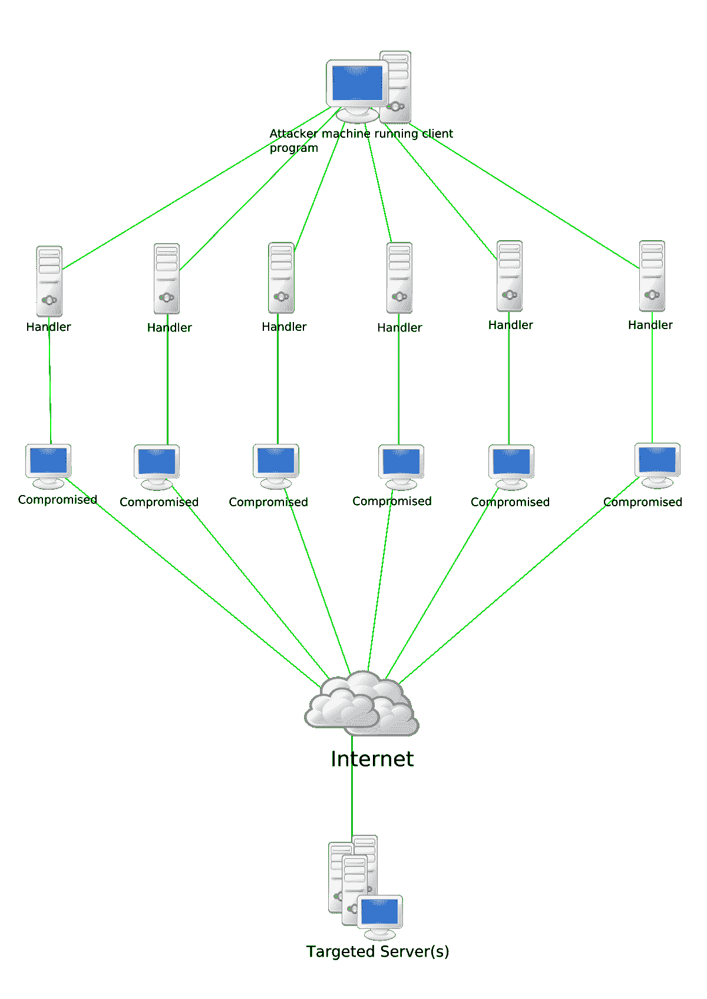

# 网络攻击类型

> 原文:[https://www.geeksforgeeks.org/types-of-cyber-attacks/](https://www.geeksforgeeks.org/types-of-cyber-attacks/)

[网络安全](https://www.geeksforgeeks.org/cyber-system-security/)是与确保敏感信息、电脑框架、系统和编程应用免受数字攻击相关的程序和策略。网络攻击是涵盖大量主题的通用措辞，然而，其中一部分著名的是:

*   改变框架和放在里面的信息
*   滥用资产
*   未经批准的访问侧重于框架和获取敏感数据
*   扰乱企业的典型运作及其程序
*   利用勒索软件攻击来扰乱信息，并从伤亡人员身上勒索现金

这些攻击目前变得越来越有创意和复杂，足以扰乱安全和黑客攻击框架。因此，每个企业和安全专家都在努力击败这一测试，并用这些攻击进行报复。

正如埃森哲 2019 年的“网络犯罪成本”研究所示，在最近五年中，安全渗透率大幅增长了 67%。在接下来的五年里，对这些数字错误带来的危险的绝对估计是 5.2 万亿美元。

流氓的思维过程可以像获取预算细节一样简单，也可以像破坏包含客户基本个人可识别数据(PII)的数据集、攻击基金会以传播恶意软件等一样致命。审查网络攻击的重要分类，以及为什么一刀切的方法无助于打击网络攻击是合适的。

一些基本的网络攻击包括:

1.  **Phishing :**
    Phishing is fraudulent action of sending spam emails by imitating to be from any legitimate source.

    在其中心，网络钓鱼通过诱人的信息或提议滥用人类的动机。攻击者通常会通过关注大型集会来实施网络钓鱼攻击，随后会增加少数目标屈服于攻击的几率。常见的网络钓鱼攻击案例包括攻击者模仿个人或基金会，并向不明目标发送消息，请求立即协助，并将连接附加到通信中。无罪客户端点击连接，将他们带到看起来像真实网站的虚假网站。个人，不知情的陷阱，落入其中，并最终提供个人的微妙之处给侵略者，在这一点上洗劫客户甚至在他们明白自己已经被攻击。

    **社会工程攻击**

    

    社交工程现在是网络犯罪分子收集用户敏感信息的常用策略。

    社会设计攻击的结构范围很广，可以在任何包含人类合作的地方进行。接下来是五种最基本的高级社交设计攻击。社会设计攻击至少发生在一个阶段。一名罪犯最初研究了拟议的伤亡，以积累基本的基础数据，例如，可能的通行目的和薄弱的安全惯例，预计将继续攻击。此时，攻击者采取行动获取伤亡人员的信任，并对破坏安全排练的活动进行升级，例如，发现敏感数据或允许进入基本资产。最受指责的一种恶意利用物理媒体散布恶意软件。例如，攻击者会将陷阱(通常是恶意软件污染的微光驱动器)留在潜在受害者肯定会看到它们的突出区域(例如，洗手间、电梯、重点组织的停车场)。Snare 对它有可信的看法，例如，将它命名为组织的财务清单。

2.  **Ransomware:**
    Ransomware 是一款文档加密编程程序，利用特殊的酣畅淋漓的加密计算，对客观框架上的记录进行加扰。

这是一种专门传播的恶意软件，旨在勒索目标的现金，是最普遍和已知的网络攻击事件之一。攻击者将恶意软件作为感染传播到目标电脑的硬盘。此时，它会对信息进行编码，并使客户无法使用电脑/信息，直到他们支付攻击者要求的分期付款。如果没有其他人，通常很难破译记录的内容。WannaCry 和 Maze ransomware 是恶意软件如何释放破坏的持续实例，促使许多企业分发比特币和现金来支付恢复其被破坏的机器和信息的费用。

6.  **Cryptocurrency Hijacking :**
    As the digital currency and mining are becoming popular, so it is among cybercriminals. They have found their evil benefit to crypto-currency mining which involves complex computing to mine virtual currency like Bitcoin, Ethereum, Monero, Litecoin so on.

    黑客有两种主要方法让受害者的计算机秘密挖掘加密货币。一种是欺骗受害者将密码挖掘代码加载到他们的计算机上。这是通过类似网络钓鱼的策略实现的:受害者收到看起来合法的电子邮件，鼓励他们点击链接。Link 运行将加密挖掘脚本放在计算机上的代码。当受害者工作时，脚本在后台运行。

    另一种方法是在网站或广告上注入脚本，然后发送到多个网站。一旦受害者访问网站或在其浏览器中弹出受感染的广告，脚本就会自动执行。受害者的电脑上没有存储任何代码。无论使用哪种方法，代码都会在受害者的计算机上运行复杂的数学问题，并将结果发送到黑客控制的服务器。

    黑客通常会使用这两种方法来最大化他们的回报。SecBI 的首席技术官兼联合创始人亚历克斯·瓦斯蒂赫(Alex Vaystikh)表示:“攻击使用旧的恶意软件技巧来(向受害者的计算机)提供更可靠和持久的软件作为后备。例如，在为黑客挖掘加密货币的 100 个设备中，10%可能从受害者机器上的代码中获得收入，而 90%是通过他们的网络浏览器获得收入的。

    一些加密挖掘脚本具有蠕虫功能，允许它们感染网络上的其他设备和服务器。这也使得查找和移除变得更加困难；在网络上保持持久性符合密码窃取者的最佳经济利益。

7.  **Botnets Attacks :**
    

    僵尸网络攻击通常是针对大范围的组织和协会完成的，因为它可以获得大量的信息。通过这种攻击，程序员可以控制无数的小工具，并以他们的精明意图讨价还价。
    僵尸网络所有者可以一次性接近几千台电脑，并可以命令它们做恶性练习。网络犯罪分子首先通过利用独特的特洛伊木马感染攻击电脑的安全框架来访问这些小工具，然后执行命令和控制程序，使他们能够进行大范围的恶意练习。这些练习可以机械化，以增强同步攻击的能力，这是谨慎的做法。各种僵尸网络攻击包括:

    *   导致即兴应用程序个人时间的 DDOS 攻击。
    *   批准导致账户接管的溢出资格安排(认证填充攻击)
    *   网络应用攻击获取信息
    *   允许攻击者进入小工具及其与组织的关联。

    在不同的情况下，网络犯罪分子会提供僵尸网络的准入权，僵尸网络不时被称为“僵尸”组织，因此不同的网络犯罪分子可以利用该组织进行他们自己的恶意活动，例如发动垃圾邮件讨伐。