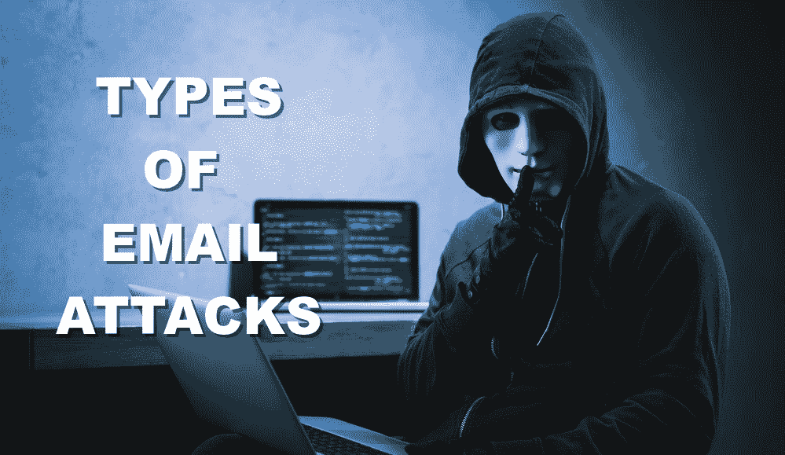

# 电子邮件攻击的类型

> 原文:[https://www.geeksforgeeks.org/types-of-email-attacks/](https://www.geeksforgeeks.org/types-of-email-attacks/)

[由 Freepik 设计](https://www.freepik.com/free-photo/hacker-with-laptop_3361105.htm)

许多人依靠互联网进行许多专业、社交和个人活动。但是也有人试图破坏我们连接互联网的计算机，侵犯我们的隐私，使互联网服务无法运行。

电子邮件是全球超过 10 亿人使用的通用服务。作为最受欢迎的服务之一，电子邮件已经成为用户和组织的主要弱点。

以下是一些最常见的攻击类型:

*   **Phishing:** Phishing is a form of fraud. Cyber criminals use email, instant messaging, or other social media to try to gather information such as login credentials by masquerading as a reputable person. Phishing occurs when a malicious party sends a fraudulent email disguised as being from an authorized, trusted source. The message intent is to trick the recipient into installing malware on his or her device or into sharing personal or financial information.

    鱼叉式网络钓鱼是一种针对性很强的网络钓鱼攻击。虽然网络钓鱼和鱼叉式网络钓鱼都使用电子邮件来联系受害者，但鱼叉式网络钓鱼会向特定的人发送定制的电子邮件。罪犯在发送电子邮件之前会研究目标的兴趣。

*   **Vishing:** Vishing 是利用语音通信技术进行的网络钓鱼。犯罪分子可以使用 IP 语音技术欺骗授权来源的电话。受害者可能还会收到一条看似授权的录音信息。犯罪分子想通过获取信用卡号或其他信息来窃取受害者的身份。可视化利用了人们信任电话网络的事实。
*   **Smishing:** Smishing 是在手机上使用短信进行钓鱼。犯罪分子冒充合法来源，试图获得受害者的信任。例如，恶意攻击可能会向受害者发送网站链接。当受害者访问网站时，手机上安装了恶意软件。
*   **捕鲸:**捕鲸是一种网络钓鱼攻击，目标是组织内的高级管理人员等高调目标。其他目标包括政治家或名人。
*   **域名欺诈:**域名欺诈是假冒授权网站，试图欺骗用户输入他们的凭据。域名欺诈将用户误导到一个看似官方的假网站。受害者然后输入他们的个人信息，认为他们连接到一个合法的网站。
*   **间谍软件:**间谍软件是使犯罪分子能够获得用户计算机活动信息的软件。间谍软件通常包括活动跟踪器、击键收集和数据捕获。为了克服安全措施，间谍软件经常修改安全设置。间谍软件通常与合法软件或特洛伊木马捆绑在一起。许多共享软件网站充满了间谍软件。
*   **Scareware:** Scareware 说服用户基于恐惧采取特定的行动。Scareware 伪造了类似操作系统对话窗口的弹出窗口。这些窗口传递伪造的消息，表明系统有风险或需要执行特定的程序才能恢复正常运行。实际上，不存在任何问题，如果用户同意并允许上述程序执行，恶意软件就会感染他或她的系统。
*   **广告软件:**广告软件通常会显示恼人的弹出窗口，为其作者创造收入。恶意软件可以通过跟踪访问的网站来分析用户兴趣。然后，它可以发送与这些网站相关的弹出广告。某些版本的软件会自动安装广告软件。
*   **垃圾邮件:**垃圾邮件(也称为垃圾邮件)是未经请求的电子邮件。在大多数情况下，垃圾邮件是一种广告方法。但是，垃圾邮件会发送有害的链接、恶意软件或欺骗性内容。最终目标是获取敏感信息，如社会安全号码或银行账户信息。大多数垃圾邮件来自网络上被病毒或蠕虫感染的多台计算机。这些受损的计算机会发送尽可能多的大量电子邮件。