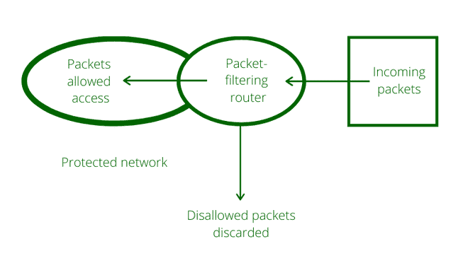
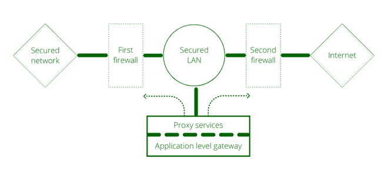

# 包过滤防火墙和应用层网关

> 原文:[https://www . geeksforgeeks . org/防火墙类型和可能的攻击/](https://www.geeksforgeeks.org/types-of-firewall-and-possible-attacks/)

没有人能否认互联网的蓬勃兴起让世界变得更近了。但与此同时，它也给我们留下了不同类型的安全威胁。为了确保公司网络有价值信息的机密性和完整性免受外部攻击，我们必须有一些强大的机制。这就是**防火墙**进入画面的地方。

它可以和站在部长家门口的保安相提并论。他盯着每一个人，对每一个想进屋的人进行身体检查。如果一个人携带了刀、枪等有害物品，就不允许他/她进入。同样，即使此人没有任何违禁物品，但看起来可疑，警卫仍然可以阻止此人进入。

防火墙起到了保护的作用。它守护着一个公司网络，充当着内部网络和外部世界之间的屏障。任何方向的所有流量都必须通过防火墙。然后，它决定是否允许流量流动。防火墙可以实现为硬件和软件，或者两者的组合。

### 数据包过滤器–

包过滤防火墙

*   它在现场视察模型的网络层工作。它对每个数据包应用一组规则(基于 IP 和传输报头字段的内容)，并根据结果决定是转发还是丢弃数据包。
*   包过滤防火墙根据数据包的源地址和目的地址或特定的传输协议类型来控制对数据包的访问。它是在开放系统互连(OSI)数据链路、网络和传输层完成的。包过滤防火墙在现场视察模型的网络层工作。
*   包过滤器只考虑每个包的最基本属性，它们不需要记住任何关于流量的信息，因为每个包都是独立检查的。因此，他们可以非常快速地决定数据包流。
*   示例:可以设置过滤器来阻止所有 UDP 段和所有远程登录连接。这种类型的配置可防止外部人员使用远程登录登录内部主机，防止内部人员使用远程登录连接登录外部主机。

### 应用网关–

应用层网关

*   应用层网关也称为堡垒主机。它在应用程序级别运行。多个应用程序网关可以在同一台主机上运行，但每个网关都是一个独立的服务器，有自己的进程。
*   这些防火墙也称为应用程序代理，提供最安全的数据连接类型，因为它们可以检查通信的每一层，包括应用程序数据。
*   例如:考虑 FTP 服务。FTP 命令包括获取文件、放置文件、列出文件以及将进程定位在目录树中的特定点。一些系统管理员阻止 put 命令，但允许 get 命令，只列出某些文件，或禁止从特定目录中更改。代理服务器将模拟这个协议交换的双方。例如，代理可能接受 get 命令并拒绝 put 命令。

它的工作原理如下:

步骤 1:用户使用诸如 HTTP 之类的 TCP/IP 应用程序联系应用程序网关。

步骤 2:应用程序网关询问用户想要与之建立连接的远程主机。它还会询问访问应用程序网关服务所需的用户 id 和密码。

步骤 3:在验证用户的真实性后，应用网关代表用户访问远程主机来传递数据包。

### 差异:

<figure class="table">

| 分组过滤器 | 应用级 |
| --- | --- |
| 简单的 | 甚至更复杂 |
| 基于连接规则的屏幕 | 基于行为或代理的屏幕 |
| 审计很难 | 活动可以审核 |
| 对网络性能的影响较小 | 对网络性能影响很大 |
| 网络拓扑无法隐藏 | 网络拓扑可以对攻击者隐藏 |
| 对用户透明 | 对用户不透明 |
| 仅查看地址和服务协议类型 | 查看数据包的完整数据部分 |

</figure>