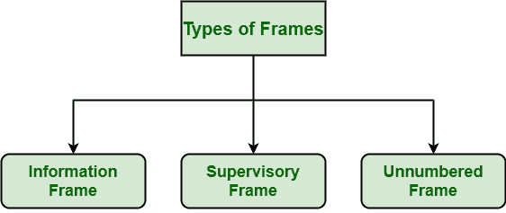
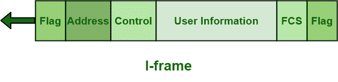
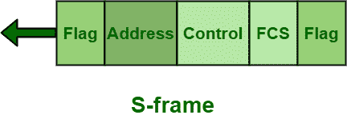
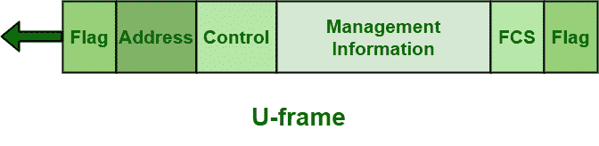

# HDLC 车架类型

> 原文:[https://www.geeksforgeeks.org/types-of-hdlc-frames/](https://www.geeksforgeeks.org/types-of-hdlc-frames/)

[高级数据链路控制(HDLC)](https://www.geeksforgeeks.org/difference-between-high-level-data-link-control-hdlc-and-point-to-point-protocol-ppp/) 通常提供灵活性，以简单地支持各种数据传输模式和配置中可能的所有选项。为了提供灵活性，HDLC 基本上使用并解释了三种不同类型的框架。

帧的类型基本上由帧的控制域决定。每种类型的帧通常用作传输各种类型消息的信封。HDLC 使用的这三种不同类型的框架如下。

**1。工字框:**
工字框代表信息框。该帧通常用于从网络层传输用户数据。这些帧实际上携带上层的实际数据或信息以及一些控制信息。

该帧携带数据以及发送序列号和确认号。在 ABM(异步平衡模式)的情况下，它也可以用来捎带确认信息。该控制字段帧的第一位是 0。

**2。**
S 型框架代表监督框架。这些帧基本上是错误控制和流量控制所必需的。它们还提供控制信息。它包含或仅包含一个确认号。

这个控制字段帧的前两位是 10。s 帧没有任何信息字段。该帧包含发送和接收序列号。

**示例–**

*   接收就绪
*   接收未就绪(RNR)
*   在第 N(R)帧拒绝(REJ)
*   N(R) (SREJ)上的选择性剔除等。

**3。**
U 型框架代表无编号框架。在各种功能中，如链路建立和断开，也需要这些帧。这些帧基本上支持控制目的，并且没有排序。这个控制字段帧的前两位是 11。某些 U 形框架根据类型包含一个信息字段。

这些帧还与链路管理一起用于不同的用途。管理链接本身需要 u 形框架。该帧不包括任何类型的确认信息，即它依次包括或包含在序列号中。这些帧通常是为系统管理保留的。

**示例–**

*   设置正常响应模式(SNRM)
*   设置异步响应模式
*   设置异步平衡模式(SABM)
*   无编号轮询(向上)
*   无编号确认等。