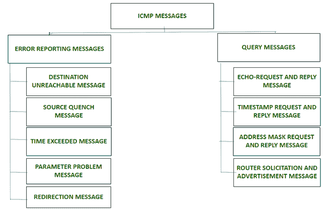

# ICMP(互联网控制消息协议)消息的类型

> 原文:[https://www . geesforgeks . org/type-of-icmp-internet-control-message-protocol-messages/](https://www.geeksforgeeks.org/types-of-icmp-internet-control-message-protocol-messages/)

[互联网控制消息协议(ICMP)](https://www.geeksforgeeks.org/internet-control-message-protocol-icmp/) 是网络层用于错误处理和调试的协议。主要用于路由器等网络设备。

ICMP 消息主要分为两类:

*   错误报告消息
*   查询消息

**1。错误报告消息:**
错误报告消息用于报告路由器/主机在处理 IP 数据包时遇到的问题。这些消息总是发送到源，因为数据报只包含源和目标 IP 地址。

以下是错误报告消息的类型:

*   **目的地不可达消息–**
    如果主机/路由器无法将 IP 数据包路由到其目的地，则发送此消息。
    *例如*、发送方 A 想要将数据报发送给接收方 B，但是没有被接收方 B 接收到，那么中间路由器将丢弃该数据报并将目的地不可达消息发送给 A。

*   **源抑制消息–**
    如果网络拥塞或源以路由器无法处理的更高速率发送数据包，主机/路由器会发送此消息。
    *例如，* 如果发送方 A 以路由器无法处理的高数据速率发送数据包，那么它将丢弃该数据包，并向 A 发送源抑制消息，告诉它以较低的速率发送数据包。现在，收到消息后，A 将停止或减慢数据包的发送。

*   **超时消息–**
    如果主机/路由器将数据报的生存时间值递减为零，或者目的地址在指定的时间间隔内没有接收到所有数据包，则主机/路由器会发送此消息。
    *例如，* 一个包从一个有 1000 个单元的层发送到有 200 个单元的层，然后这个包被分成 5 个片段。如果所有的片段没有在设定的时间内到达目的地，所有的片段将被丢弃，超过时间的消息将被发送到原始源。

*   **参数问题消息–**
    如果数据报中的某些参数设置不正确，主机/路由器会发送此消息。它用于指示数据报报头字段中的错误。

*   **重定向消息–**
    主机/路由器发送此消息更新主机的路由表。
    *例如，* 发送方 A 想将消息发送给接收方 B，两者之间有路由器。然后，A 将数据发送到路由器，路由器将消息发送到 B，并将重定向消息发送到 A，这样 A 就可以更新其路由表。

**2。查询消息:**
查询消息用于错误处理和调试网络问题。这些消息有助于主机获取有关另一台主机或路由器的特定信息。

以下是查询消息的类型:

*   **回应-请求和回复消息–**
    网络管理员使用它来检查 IP 协议的操作和主机的可达性。主机/路由器发送回显请求消息，而回显回复消息由接收回显请求消息的主机/路由器发送。
    *例如*，主机 A 想要检查它是否可以与另一个主机 B 通信，因此它将向 B 发送回显请求，并且如果 A 和 B and B 之间的链路是活动的，那么它将在接收到请求时向 A 发送回显回复。

*   **时间戳请求和回复消息–**
    它用于确定每个 ip 数据报从一台主机传输到另一台主机所需的往返时间。如果传输时间已知，它还可以同步主机之间的时钟。
    *例如*，主机 A 想要与 B 同步其时钟，那么它将通过发送时间戳请求来询问 B 时钟上的时间，B 将向 A 回复时间戳。然后 A 将添加时间和传播延迟来同步其系统上的时间。

*   **地址掩码请求和回复消息–**
    用于确定本地网络中使用的子网掩码。
    *例如*，主机 A 想要知道对应路由器的掩码，那么如果知道路由器的地址，它将向路由器发送地址掩码请求，否则它将广播该请求。接收请求的路由器以地址掩码应答进行响应，并将掩码提供给 A.

*   **路由器征集和广告消息–**
    用于确认局域网上是否存在路由器。这是通过广播路由器请求消息来完成的，接收该消息的路由器使用路由器通告消息来广播路由信息。
    *例如*，如果主机 A 想要获取网络上存在的路由器的信息。它将广播路由器请求消息，请求路由器通告其存在，作为响应，网络上的路由器将通过通告消息通告其可用于路由的 IP 地址。