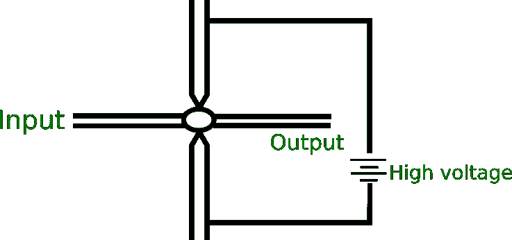
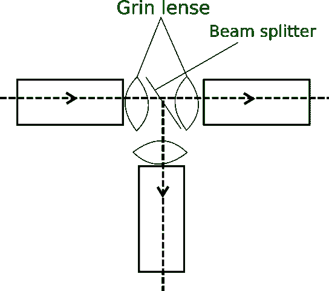
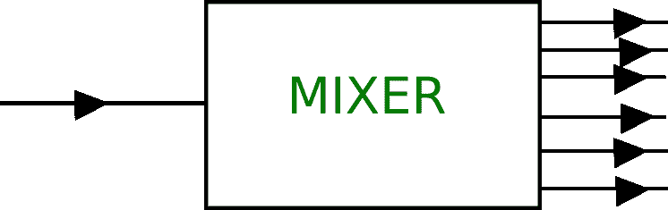

# 光纤中接头的类型

> 原文:[https://www . geesforgeks . org/光纤接头类型/](https://www.geeksforgeeks.org/types-of-joints-in-optical-fiber/)

纳林德·卡潘尼博士被称为光纤之父，是一位出生于印度的美国物理学家。光纤这个术语是他在 1956 年创造的。他因在光纤方面的开创性工作而闻名。如今，光缆广泛用于网络通信，与普通的电线接头不同，光纤有一些特殊的接头，分类如下:

**光纤中接头的类型:**

1.  **拼接:**
    是永久性或半永久性的接头，只能使用一次。拼接可以有以下两种类型:
    *   **(i)机械拼接–**
        这些是机械固定光纤两端的接头，只是一个对准装置，使光线能够从一端传到另一端。

*   **(i) Fusion Splice –**
    It is a process in which two fiber ends are fused together using an electric arc. Generally monochromatic light is passed through one fiber end (input) and the other fiber end is adjusted in such a way that the output signal is maximum. At this point, high voltage is passed in an electric arc causing fusion of the two fiber ends.

    

    *   **接头:**
    是一个临时的接头，可以反复使用，即可以重复使用。一些类型的连接器有:
    *   **DNP 连接器–**
        干式无抛光连接器。
    *   **形状记忆合金连接器–**
        表面贴装适配器连接器。*   **耦合器:**
    它是一种用于信号复用和解复用的设备。当耦合器用于解复用信号时，它被称为组合器。耦合器有多种类型，例如:
    *   **T- Coupler –**
        It splits the incoming signal into two parts.

        

    *   **Star –**
        It splits the incoming signal into many parts.

        

    *   **Three Port Coupler –**
        It splits the incoming signal into two parts. Here, grin lenses or beam splitter is not used.

        