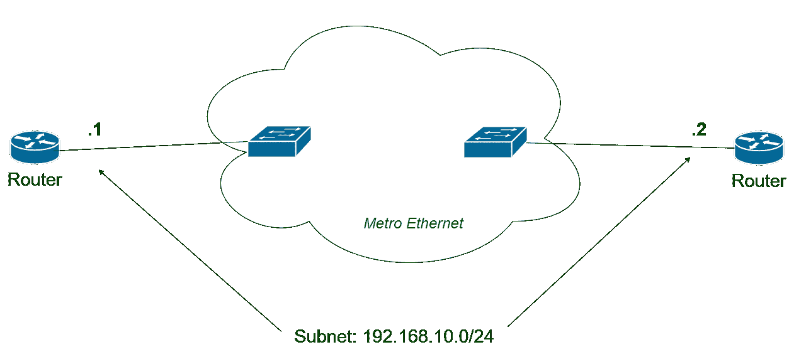
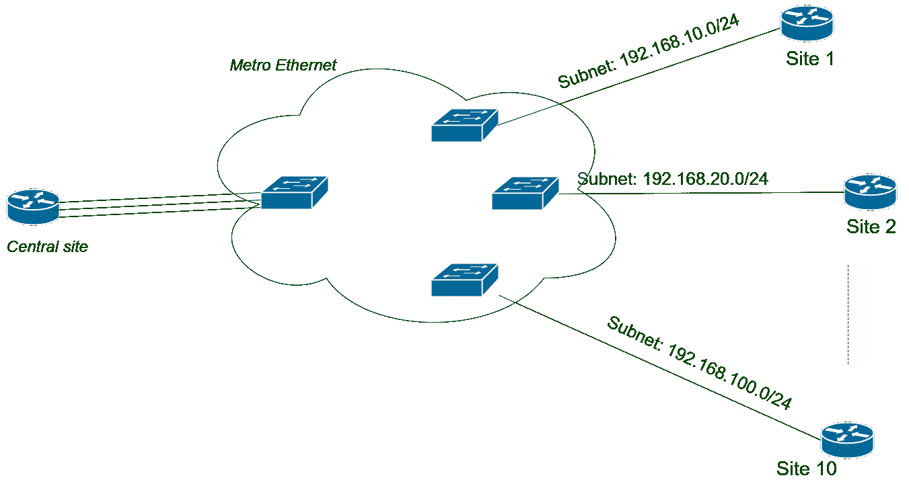
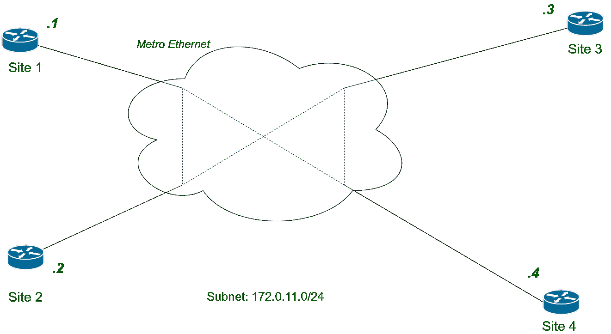
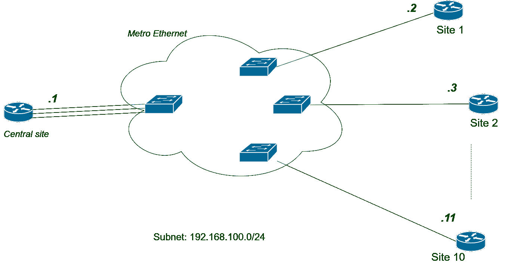

# 城域以太网服务类型

> 原文:[https://www . geesforgeks . org/metro-Ethernet-services 类型/](https://www.geeksforgeeks.org/types-of-metro-ethernet-services/)

先决条件–[城域以太网(Metro)](https://www.geeksforgeeks.org/metro-ethernet-metroe/)
在使用服务提供商的城域以太网服务之前，企业必须选择可用的可能变体城域以太网服务。城域以太网论坛(MEF)成立于 2001 年，管理和定义城域以太网的标准。

**城域以太网服务类型:**

| 服务名称 | 简称 | 拓扑学 | 描述 |
| --- | --- | --- | --- |
| 以太网线路服务 | 电子线路 | 点对点 | 两台客户设备相互交换帧，就像它们之间连接了长以太网电缆一样。 |
| 以太网局域网服务 | 电子局域网 | 全网状 | 像 [LAN](https://www.geeksforgeeks.org/local-area-network-lan-technologies/) ，所有设备可以互相交换帧。 |
| 以太网树服务 | 电子树 | 部分网格，点到多点 | 有一个中心站点，它接收来自所有站点的所有帧，然后在它们之间转发。 |

1.  **Ethernet Line Service (E-Line) :**
    This service is suitable for enterprises that need to connect two sites for frame transfer or we can say for communication. It can be visualized as there is long Ethernet cable present between two sites and they are exchanging frames between them. Link between two devices will be in the same subnet.

    

    
**Figure –** Ethernet line service

    电子线路服务也有变化。假设一个企业有一个中心站点和 10 个远程站点。如果企业想要使用电子线路服务，那么在 10 个远程站点和中心站点之间需要 10 条不同的电子线路。这听起来类似于 E-tree 服务，但有所不同。在 E-tree 实施中，所有这些链路都位于同一子网中，但在 E-line 实施中，这 10 条链路位于 10 个子网中。

    

    
**Figure –** Multi Ethernet line service

2.  **Ethernet LAN Service (E-LAN) :**
    Suppose an enterprise having several sites and connections between each and every site is needed, then E-LAN service is implemented. All traffic does not need to pass through central site. Each and every site can individually exchange frames with each other. That is why it is full mesh topology. One important thing to note here that all the links lie in same subnet.

    

    
**Figure –** Ethernet LAN Service

3.  **Ethernet Tree Service (E-Tree) :**
    Suppose an enterprise want to monitor all frames exchanging between all sites, the implementation of the E-Tree service will be best. In this, all frame passes through central site. No other two sites can communicate directly with each other. In this service, unlike E-line service all connections lie in same subnet.

    

    
**Figure –** Ethernet Tree Service
