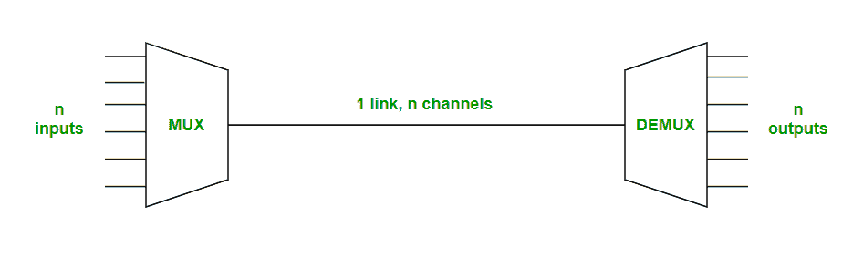
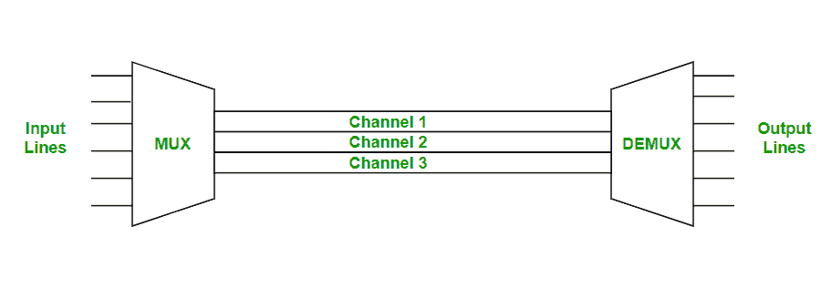
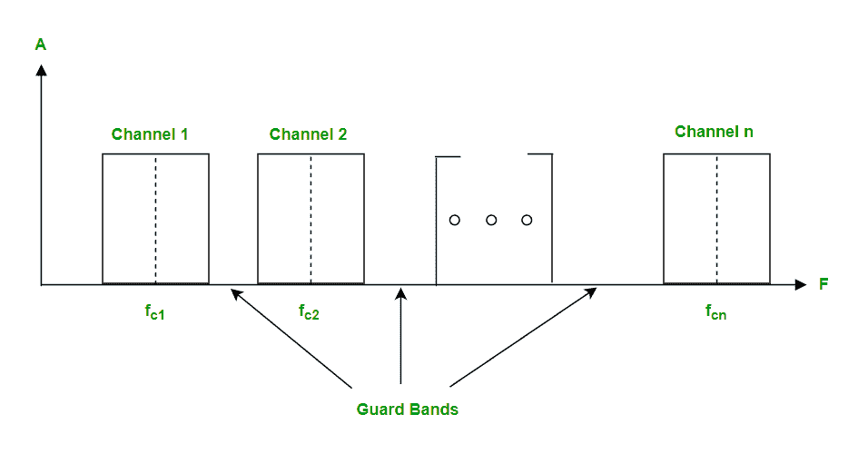
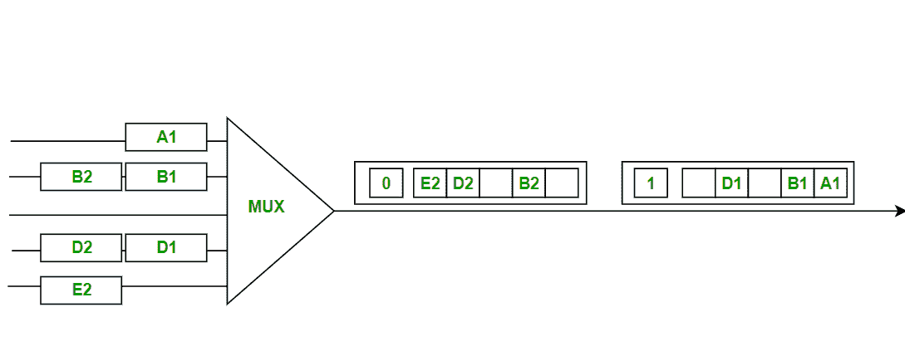
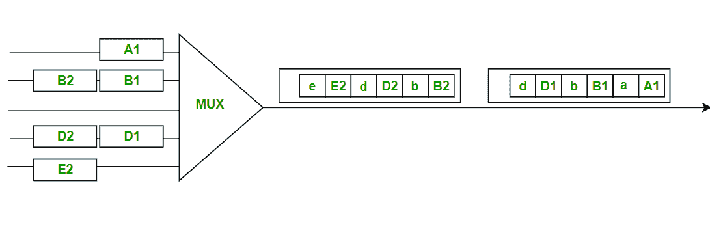

# 数据通信中复用的类型

> 原文:[https://www . geeksforgeeks . org/数据通信中多路复用的类型/](https://www.geeksforgeeks.org/types-of-multiplexing-in-data-communications/)

**什么是复用？**
[**复用**](https://www.geeksforgeeks.org/multiplexing-channel-sharing-in-computer-network/) 就是共享一个介质或者带宽。它是将来自多个信号源的多个信号组合在一起，并通过一条通信/物理线路传输的过程。

**复用类型**
复用有两种类型:

1.  频分复用(FDM)
2.  时分复用

**1。频分复用:**

频分复用被定义为一种复用类型，其中单个物理介质的带宽被分成多个较小的独立频道。

频分复用用于无线电和电视传输。

在 FDM，我们可以观察到大量的信道间串扰，因为在这种类型的复用中，带宽被划分为频率信道。为了防止通道间串扰，必须在每个通道之间放置未使用的带宽条。每个通道之间这些未使用的条带称为保护带。

**2。时分复用:**

时分复用被定义为一种复用类型，在 FDM，时分复用不是以信道的形式共享一部分带宽，而是共享时间。每个连接都占用链接中的一部分时间。

在时分复用中，所有信号在不同的时间以相同的频率(带宽)工作。

时分复用有两种类型:

1.  同步时分复用
2.  统计(或异步)时分复用

**同步时分复用:**

同步时分复用是时分复用的一种，其中输入帧在输出帧中已经有一个时隙。时隙被分组为帧。一帧由一个时隙周期组成。

同步时分复用效率不高，因为如果输入帧没有数据要发送，输出帧中的一个时隙将保持为空。

在同步 TDM 中，我们需要在每个帧的开头提到同步位..

**统计 TDM :**

统计时分复用是时分复用的一种，其中输出帧从输入帧收集数据，直到它被填满，而不是像同步时分复用那样留下一个空时隙。

在统计 TDM 中，我们需要在发送到输出帧的时隙中包含每个特定数据的地址。

统计时分复用是一种更有效的时分复用类型，因为信道容量被充分利用并提高了带宽效率。