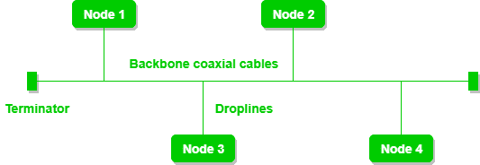
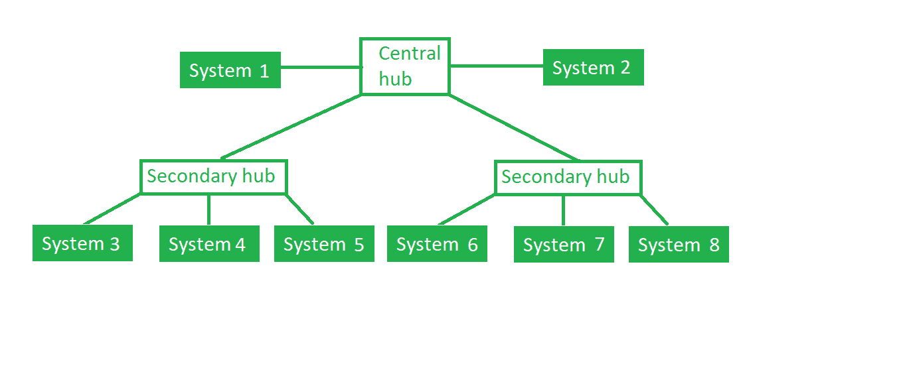

# 网络拓扑类型

> 原文:[https://www.geeksforgeeks.org/types-of-network-topology/](https://www.geeksforgeeks.org/types-of-network-topology/)

通过发送方和接收方包含节点和连接线的网络布局称为网络拓扑。各种网络拓扑包括:

## a)网状拓扑:

在网状拓扑中，每个设备都通过特定的通道连接到另一个设备。

**图 1** :每个设备通过专用通道相互连接。这些通道被称为链接。

*   假设网状拓扑中有 N 个设备相互连接，每个设备所需的端口总数为 N-1。在图 1 中，有 5 个设备相互连接，因此每个设备所需的端口总数为 4 个。所需端口总数=N*(N-1)。
*   假设 N 个设备在网状拓扑中相互连接，那么连接它们所需的专用链路总数为 N C 2 ，即 N(N-1)/2。在图 1 中，有 5 个设备相互连接，因此所需的链路总数为 5*4/2 = 10。

**该拓扑的优势:**

*   它是健壮的。
*   故障很容易诊断。数据是可靠的，因为数据是通过专用通道或链路在设备之间传输的。
*   提供安全性和隐私。

**该拓扑的问题:**

*   安装和配置很困难。
*   由于需要大量布线，电缆的成本很高，因此适用于较少数量的设备。
*   维护成本高。

## b)星型拓扑:

在星型拓扑中，所有设备都通过电缆连接到单个集线器。该集线器是中心节点，所有其他节点都连接到该中心节点。集线器本质上可以是被动的，即不是智能集线器，例如广播设备，同时该集线器可以是智能的，被称为主动集线器。主动集线器中有中继器。

**图 2** :星型拓扑，四个系统连接到一个连接点，即集线器。

a **该拓扑的优势:**

*   如果 N 个设备以星形拓扑相互连接，则连接它们所需的电缆数量为 N。因此，很容易设置。
*   每个设备只需要 1 个端口，即连接到集线器，因此所需的端口总数为 n

**该拓扑的问题:**

*   如果整个拓扑所依赖的集中器(集线器)出现故障，整个系统就会崩溃。
*   安装成本高。
*   性能基于单个集中器，即集线器。

## c)总线拓扑:

总线拓扑是一种网络类型，其中每台计算机和网络设备都连接到一根电缆。它将数据从一端单向传输到另一端。总线拓扑中没有双向功能。这是一种多点连接和不稳定的拓扑，因为如果主干发生故障，拓扑就会崩溃。

**图 3** :共享主干电缆的总线拓扑。节点通过引入线连接到信道。

**该拓扑的优势:**

*   如果 N 个设备在总线拓扑中相互连接，则连接它们所需的电缆数量为 1，这称为主干电缆，并且需要 N 条引入线。
*   与其他拓扑相比，电缆的成本更低，但它用于构建小型网络。

**该拓扑的问题:**

*   如果公共电缆出现故障，整个系统就会崩溃。
*   如果网络流量很大，会增加网络中的冲突。为了避免这种情况，在媒体访问控制层使用了各种协议，如纯 Aloha、时隙 Aloha、CSMA/光盘等。
*   安全性很低。

## d)环形拓扑:

在这种拓扑中，它形成一个环，将设备与其两个相邻的设备连接起来。

大量中继器用于具有大量节点的环形拓扑，因为如果有人想要将一些数据发送到具有 100 个节点的环形拓扑中的最后一个节点，那么数据将必须通过 99 个节点才能到达第 100 个节点。因此，为了防止数据丢失，网络中使用中继器。

传输是单向的，但是可以通过在每个网络节点之间有 2 个连接来实现双向传输，这被称为双环拓扑。

**图 4** :环形拓扑包括 4 个站点，每个站点连接形成一个环。

在环形拓扑中发生的以下操作是:

1.  一个站被称为**监视器**站，它承担执行操作的所有责任。
2.  为了传输数据，站必须持有令牌。传输完成后，令牌将被释放给其他站点使用。
3.  当没有站点传输数据时，令牌将在环中循环。
4.  有两种类型的令牌释放技术:**早期令牌释放**在传输数据后立即释放令牌，**延迟令牌释放**在接收方收到确认后释放令牌。

**该拓扑的优势:**

*   在这种拓扑中，冲突的可能性最小。
*   安装和扩展成本低廉。

**该拓扑的问题:**

*   在这种拓扑中，故障排除很困难。
*   在两个站点之间添加站点或移除站点会扰乱整个拓扑。
*   不太安全。

## e)树形拓扑:

这种拓扑是星型拓扑的变体。这种拓扑结构有一个分层的数据流。

**图 5** :在这种情况下，各种次级集线器连接到包含中继器的中央集线器。在这种情况下，数据从顶部流向底部，即从中央集线器流向辅助集线器，然后流向设备，或者从底部流向顶部，即设备流向辅助集线器，然后流向中央集线器。这是一种多点连接和不稳定的拓扑，因为如果主干发生故障，拓扑就会崩溃。

**该拓扑的优势:**

*   它允许更多的设备连接到一个中心集线器，从而减少信号到达设备的距离。
*   它允许网络与不同的计算机隔离并区分优先级。

**该拓扑的问题:**

*   如果中央枢纽出现故障，整个系统都会出现故障。
*   由于布线，成本很高。