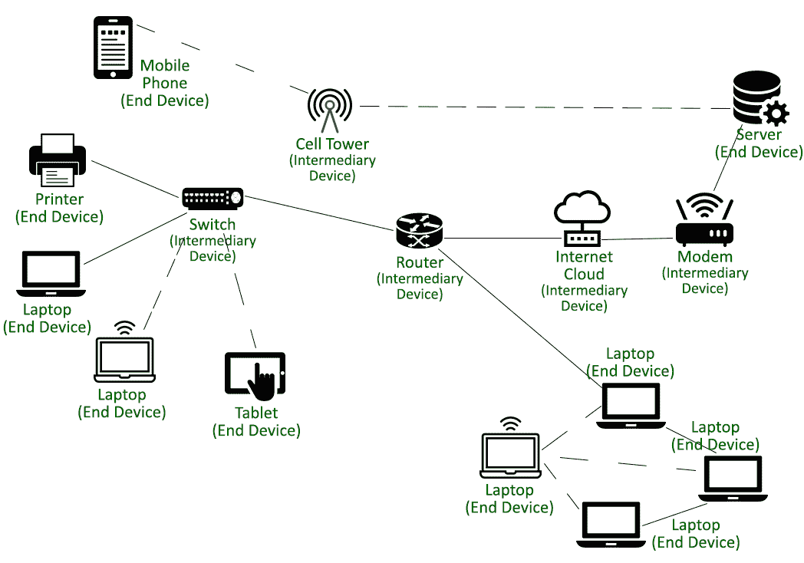

# 计算机网络中节点设备的类型:终端设备和中间设备

> 原文:[https://www . geesforgeks . org/计算机网络中的节点设备类型-终端设备和中间设备/](https://www.geeksforgeeks.org/types-of-node-devices-in-a-computer-network-end-devices-and-intermediary-devices/)

我们知道，计算机网络是一个术语，用来指任何一组(或系统)互连的节点(计算机、打印机或任何其他设备)，这些节点通过被称为传输介质(或信道)的通信链路连接，通常用于信息交换和资源共享。在计算机网络中，节点是能够安全可靠地以确定和期望的流量向其他节点发送数据或从其他节点接收数据的任何设备。

根据功能和用途，节点设备可大致分为以下类型

1.  终端设备
2.  中间设备

**终端设备:**

终端设备是在计算机网络上发生的通信中充当源点或目的点的节点设备。随着计算机网络系统的发展，我们有了可以充当客户机、服务器或两者的节点。网络的其余部分围绕这些终端设备构建，以在它们之间建立通信链路。安装在节点设备上的软件决定了它们在计算机网络中扮演的角色。根据用途，终端设备可以大致分为以下几类–

*   **作为客户端的终端设备–**
    执行请求数据、显示接收到的数据等任务。通常用于终端客户。
*   **作为服务器的终端设备–**
    配备有向网络上的其他节点(或主机)提供信息和服务(如网页或电子邮件)的程序。

**终端设备的功能:**

1.  他们是流经网络的数据或信息的创造者。
2.  充当终端用户(人)和具有多个节点设备的通信网络之间的接口。

**终端设备示例:**

工作站、笔记本电脑、台式电脑、打印机和扫描仪、服务器(文件服务器、网络服务器)、手机、平板电脑、智能手机等。

**中间设备:**

中间设备是设计用于在计算机网络中将数据从一端转发到另一端的节点设备。这些中间设备充当其他节点的连接介质(以及提供的其他服务)，并在后台处理任务，确保数据在整个计算机网络上以所需的流率有效地流动。

用于管理流经它们的数据的中间设备使用各种寻址系统，例如 IP 地址、MAC 地址和端口号(或端口地址)以及关于网络互连的信息。此外，计算机网络中各种类型的交换决定了消息在通信期间通过网络的路径。

**中间设备的功能:**

*   信号衰减是一种常见现象，可以通过这些设备对数据信号进行再生和重传来克服。
*   为了确保成功传输，这些设备会记录源地址、目的地址或网络中存在的不同路径的信息，具体取决于所采用的交换技术。
*   它们还利用冗余位等有效地检测故障和错误。并且通知设备通过在计算机网络中传输数据时执行校正来进一步确保容错。
*   在整个通信过程中保持明确的期望流量控制和响应超时。
*   根据消息(或数据包)的优先级对其进行设置、分组和定向是由这些设备完成的。
*   根据安全设置，通过允许或拒绝数据流来提供网络安全。

**中间设备示例:**

集线器、交换机、无线接入点和其他用于访问网络的设备、文件服务器、网络服务器、打印服务器、调制解调器、用于互联的设备，如路由器、网桥、中继器和安全防火墙等。