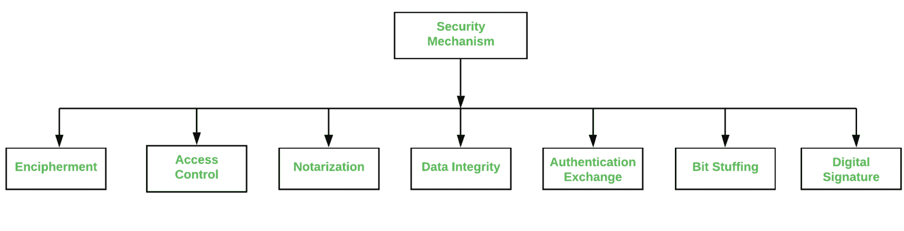

# 安全机制类型

> 原文:[https://www.geeksforgeeks.org/types-of-security-mechanism/](https://www.geeksforgeeks.org/types-of-security-mechanism/)

[网络安全](https://www.geeksforgeeks.org/network-security/)是计算机技术中涉及确保计算机网络基础设施安全的领域。因为无论是在硬件级别(如打印机、扫描仪)还是在软件级别，网络对于信息共享都是非常必要的。因此，安全机制也可以称为处理从安全攻击中恢复的一组过程。各种机制被设计成在各种协议层从这些特定攻击中恢复。

**安全机制的类型有:**

1.  **加密:**
    这种安全机制处理数据的隐藏和覆盖，这有助于数据变得保密。这是通过应用数学计算或算法将信息重构为不可读的形式来实现的。它是通过两种著名的技术实现的，即密码学和加密技术。数据加密的级别取决于用于加密的算法。

*   **访问控制:**
    该机制用于停止无人值守地访问您正在发送的数据。它可以通过各种技术来实现，例如应用密码、使用防火墙或仅通过向数据添加个人识别码。*   **公证:**
    该安全机制涉及在通信中使用可信第三方。它充当发送方和接收方之间的调解人，以便减少任何冲突的机会。该中介记录发送方对接收方的请求，以备日后被拒绝。*   **数据完整性:**
    这种安全机制是通过向由数据本身创建的数据附加值来使用的。这类似于发送方和接收方都知道并在接收数据之前和之后检查的信息包的发送。当该附加的分组或数据被检查并且在发送和接收数据时是相同的时，保持数据完整性。*   **认证交换:**
    这个安全机制处理通信中要知道的身份。这是在 TCP/IP 层实现的，这里使用双向握手机制来确保数据是否被发送*   **比特填充:**
    这个安全机制是用来给正在传输的数据增加一些额外的比特。它有助于在接收端检查数据，并通过奇偶校验或奇偶校验来实现。*   **数字签名:**
    这个安全机制是通过添加肉眼不可见的数字数据来实现的。它是由发送者添加的电子签名的形式，并由接收者进行电子检查。这种机制用于保存不太机密的数据，但要通知发送者的身份。