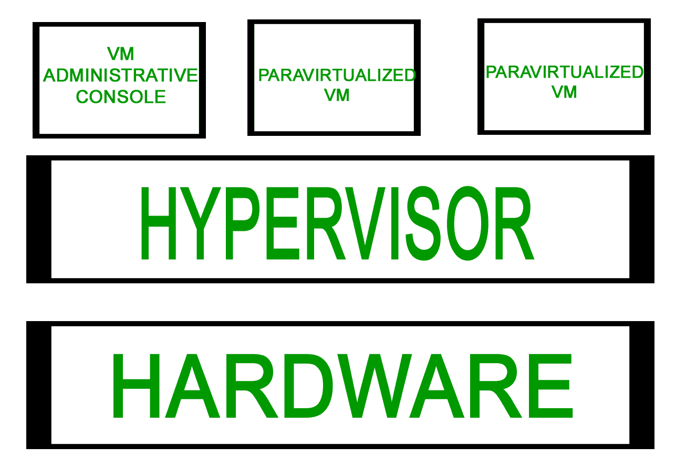
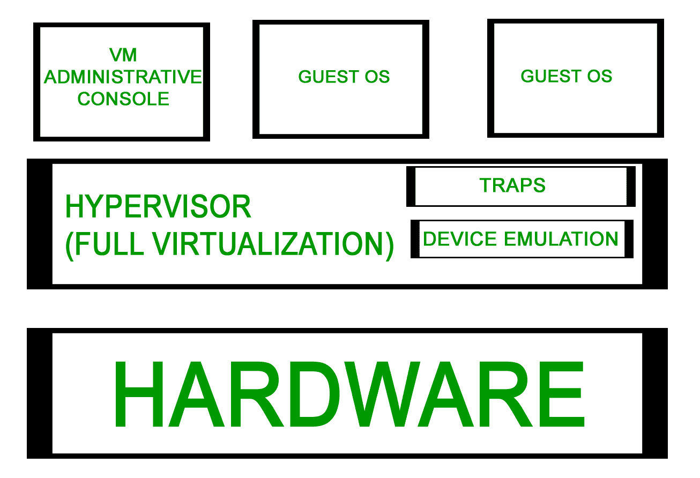
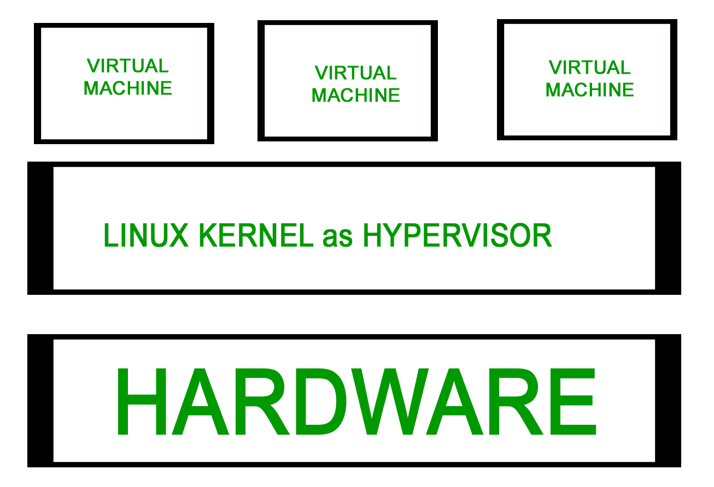
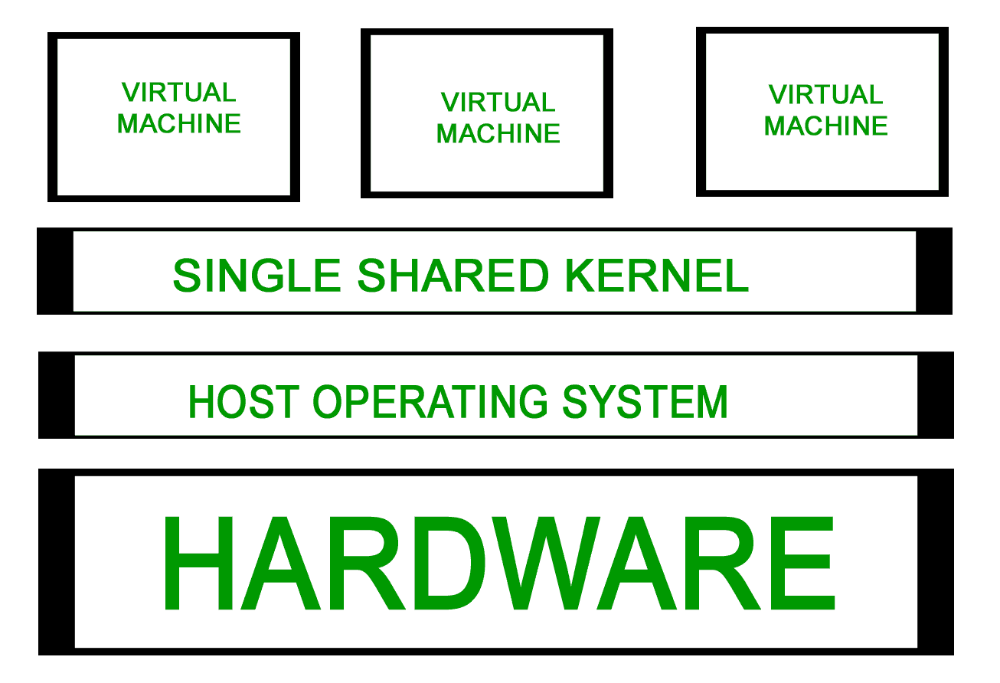

# 计算机网络中服务器虚拟化的类型

> 原文:[https://www . geesforgeks . org/计算机网络中服务器虚拟化的类型/](https://www.geeksforgeeks.org/types-of-server-virtualization-in-computer-network/)

**服务器虚拟化**是将一台物理服务器划分为多个小型虚拟服务器，每个服务器运行自己的操作系统。这些操作系统被称为客户操作系统。它们运行在另一个称为主机操作系统的操作系统上。以这种方式运行的每个来宾都不知道在同一台主机上运行的任何其他来宾。采用不同的虚拟化技术来实现这种透明性。

**服务器虚拟化的类型:**

**1。** [**虚拟机管理程序**](https://www.geeksforgeeks.org/hypervisor/)**–**

虚拟机管理程序或 VMM(虚拟机监视器)是存在于操作系统和硬件之间的一层。它为多个操作系统的平稳运行提供了必要的服务和功能。

它识别陷阱，响应特权 CPU 指令，并处理排队、调度和返回硬件请求。主机操作系统也运行在虚拟机管理程序之上，以管理虚拟机。

**2。准虚拟化–**

它基于 Hypervisor。软件实现的虚拟化中的大部分仿真和捕获开销都是在这个模型中处理的。客户操作系统在安装到虚拟机之前会被修改和重新编译。
由于来宾操作系统中的修改，性能得到了增强，因为修改后的来宾操作系统直接与虚拟机管理程序通信，并且消除了仿真开销。

示例:Xen 主要使用半虚拟化，其中使用定制的 Linux 环境来支持称为域 0 的管理环境。

***优势:***

*   更容易的
*   增强的性能
*   没有仿真开销

***限制:***

*   需要修改客户操作系统

**3。完全虚拟化–**

这与半虚拟化非常相似。必要时，它可以模拟底层硬件。虚拟机管理程序捕获操作系统用来执行输入/输出或修改系统状态的机器操作。在捕获之后，这些操作在软件中被模拟，返回的状态代码与真实硬件提供的非常一致。这就是未修改的操作系统能够在虚拟机管理程序之上运行的原因。

示例:VMWare ESX 服务器使用此方法。被称为服务控制台的定制 Linux 版本被用作管理操作系统。它不如半虚拟化快。

***优势:***

*   不需要修改来宾操作系统。

***限制:***

*   复杂的
*   由于仿真，速度较慢
*   安装新的设备驱动程序很困难。

**4。硬件辅助虚拟化–**

除了需要硬件支持之外，它在操作方面类似于完全虚拟化和半虚拟化。由于捕获和模拟来宾操作系统中执行的输入/输出操作和状态指令而导致的大部分虚拟机管理程序开销都是通过依赖 x86 体系结构的硬件扩展来解决的。

未修改的操作系统可以运行，因为对虚拟化的硬件支持将用于处理硬件访问请求、特权和受保护的操作，以及与虚拟机通信。

例如:AMD–V Pacifica 和英特尔 VT Vanderpool 为虚拟化提供硬件支持。

***优势:***

*   不需要修改客户操作系统。
*   非常少的虚拟机管理程序开销

***限制:***

*   需要硬件支持

**5。内核级虚拟化–**

它不使用虚拟机管理程序，而是运行独立版本的 Linux 内核，并将关联的虚拟机视为物理主机上的用户空间进程。这使得在单个主机上运行多个虚拟机变得容易。设备驱动程序用于主 Linux 内核和虚拟机之间的通信。
虚拟化需要处理器支持(英特尔 VT 或 AMD–v)。稍微修改的 QEMU 进程被用作虚拟机的显示和执行容器。在许多方面，内核级虚拟化是服务器虚拟化的一种特殊形式。

示例:用户模式 Linux 和内核虚拟机

***优势:***

*   不需要特殊的管理软件。
*   开销非常小

***限制:***

*   需要硬件支持

**6。系统级或操作系统虚拟化–**

在操作系统内核的单个实例上运行多个逻辑上不同的环境。也称为共享内核方法，因为所有虚拟机共享主机操作系统的公共内核。基于改变根概念“chroot”。
chroot 在启动期间启动。内核使用根文件系统加载驱动程序并执行其他早期系统初始化任务。然后，它使用 chroot 命令切换到另一个根文件系统，将磁盘上的文件系统装载为其最终根文件系统，并在该文件系统中继续系统初始化和配置。
系统级虚拟化的 chroot 机制就是这个概念的延伸。它使系统能够用它们自己的一组进程启动虚拟服务器，这些进程相对于它们自己的文件系统根目录执行。
系统级和服务器虚拟化的主要区别在于不同的操作系统是否可以在不同的虚拟系统上运行。如果所有虚拟服务器必须共享相同的操作系统副本，这就是系统级虚拟化；如果不同的服务器可以有不同的操作系统(包括单个操作系统的不同版本)，这就是服务器虚拟化。

例子:FreeVPS、Linux Vserver 和 OpenVZ 就是一些例子。

***优势:***

*   比完整的机器(包括内核)轻得多
*   可以托管更多虚拟服务器
*   增强的安全性和隔离性

***限制:***

*   内核或驱动程序问题会导致所有虚拟服务器瘫痪。

**参考:**
[服务器虚拟化类型](http://www.geeks-hub.com/types-of-server-virtualization/)