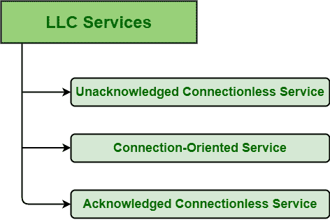

# 有限责任公司提供的服务类型

> 原文:[https://www . geesforgeks . org/服务类型-由-llc 提供/](https://www.geeksforgeeks.org/types-of-services-provided-by-llc/)

**先决条件–**[数据链路层提供的服务](https://www.geeksforgeeks.org/services-provided-by-data-link-layer/)

[逻辑链路控制(LLC)](https://practice.geeksforgeeks.org/problems/what-is-logical-link-control) 是 IEEE 802 协议参考模型的最上层之一。LLC 基本上提供数据链路的寻址和控制。可选地，它可以提供流量控制、确认或错误恢复。有限责任公司位于媒体访问控制层和第 3 层协议之间的数据链路层，也是 802.2 规范的重要组成部分。LLC 通常负责网络上计算机或设备之间的数据传输。

**LLC 提供的服务:**
LLC 基本上使用 lsap(LLC 服务接入点)向用户提供各种服务。这些服务通常根据服务原语来指定。有限责任公司标准通常规定和定义三种不同形式的服务，如下所示

*   **Unacknowledged Connectionless Service (LLC 1) :**
    Unacknowledged Connectionless Service, as the name suggests, is a service in which data frames are sent or transmitted from destination to source machine without any acknowledgment and without connection established among source and destination machine. In this, Unacknowledged Connection service comprises two words i.e. unacknowledged and connectionless service.

    源机器向目标机器发送或传输数据帧。但是作为回报，目标机器不向源机器提供任何确认，因此这种服务被称为未确认服务。与此同时，源机器和目标机器之间没有建立连接，因此称为无连接服务。所以，组合起来就是所谓的未确认无连接服务。

    它还负责在下一个更高层和 LLC 之间的接口上只提供两个服务原语。该服务提供以下功能–

    1.  无确认的数据报服务。
    2.  错误控制
    3.  流控制
*   **Connection-Oriented Service (LLC 2) :**
    Connection-Oriented Service, as the name suggests, is a service in which data frames are sent or transmitted from destination to source machine with acknowledgment and connection established among source and destination machine before any transmission of data. In this, Connection-Oriented Service comprises two words i.e. Acknowledged and connection service.

    源机器向目标机器发送或传输数据帧，作为回报，目标机器向源机器提供确认，因此这种服务称为确认服务。与此同时，在任何数据传输之前，源机器和目标机器之间都会建立一个连接，因此它被称为面向连接的服务。所以，结合起来就是公认的无连接服务。

    它不支持任何多播或广播寻址。它只支持单独寻址。它还在 LSAP(链路服务接入点)之间提供点对点链路连接。它还在 LSAP(链路服务接入点)之间提供点对点链路连接。该服务提供以下功能–

    1.  流控制
    2.  数据排序
    3.  错误指示和恢复
*   **Acknowledged Connectionless Service (LLC 3) :**
    Acknowledged Connectionless Service, as the name suggests, is a service in which data frames are sent or transmitted from destination to source machine with acknowledgment and without connection established among source and destination machine. In this, Acknowledged Connection service comprises two words i.e., Acknowledged and connectionless service.

    源机器向目标机器发送或传输数据帧，作为回报，目标机器向源机器提供确认，因此这种服务称为确认服务。与此同时，源机器和目标机器之间没有建立连接，因此称为无连接服务。所以，结合起来就是公认的无连接服务。它不支持任何多播或广播寻址。这是一项很少使用的服务。