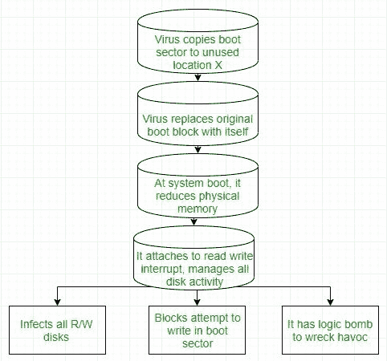

# 病毒类型

> 原文:[https://www.geeksforgeeks.org/types-of-virus/](https://www.geeksforgeeks.org/types-of-virus/)

病毒是嵌入合法程序中的代码片段。病毒是自我复制的，旨在感染其他程序。它们可以通过修改或销毁文件造成系统崩溃和程序故障，从而对系统造成严重破坏。到达目标机器后，病毒删除程序(通常是特洛伊木马)会将病毒插入系统。
详见[本](https://www.geeksforgeeks.org/worms-viruses-and-beyond/)。

### **各种类型的病毒:**

*   **文件病毒:**
    这种类型的病毒通过将自身附加到文件的末尾来感染系统。它改变程序的开始，以便控件跳转到它的代码。执行完代码后，控件返回主程序。它的执行甚至没有被注意到。它也被称为**寄生病毒**，因为它不会让文件完好无损，但也会让宿主发挥作用。

*   **启动扇区病毒:**
    它会感染系统的启动扇区，每次系统启动和加载操作系统之前都会执行。它会感染软盘等其他可引导介质。这些也称为**内存病毒**，因为它们不会感染文件系统。

*   **宏病毒:**
    与大多数用低级语言(如 C 或汇编语言)编写的病毒不同，这些病毒是用高级语言(如 Visual Basic)编写的。这些病毒是在能够执行宏的程序运行时触发的。例如，宏病毒可能包含在电子表格文件中。

*   **源代码病毒:**
    它寻找源代码并对其进行修改，以包含病毒并帮助传播病毒。

*   **多态病毒:**
    A **病毒特征**是一种可以识别病毒(组成病毒代码的一系列字节)的模式。因此，为了避免被反病毒检测到，多态病毒会在每次安装时发生变化。病毒的功能保持不变，但其特征发生了变化。

*   **加密病毒:**
    为了避免被杀毒软件检测到，这类病毒以加密形式存在。它带有解密算法。所以病毒首先解密，然后执行。

*   **隐形病毒:**
    这是一种非常棘手的病毒，因为它会改变可用于检测它的代码。因此，检测病毒变得非常困难。例如，它可以更改 read 系统调用，以便每当用户要求读取被病毒修改的代码时，显示代码的原始形式，而不是受感染的代码。

*   **隧道病毒:**
    该病毒试图通过将其自身安装在中断处理程序链中来绕过防病毒扫描程序的检测。保留在操作系统后台并捕获病毒的拦截程序在隧道病毒传播过程中被禁用。类似的病毒安装在设备驱动程序中。

*   **多部分病毒:**
    这种类型的病毒能够感染系统的多个部分，包括引导扇区、内存和文件。这使得检测和遏制变得困难。

*   **装甲病毒:**
    一种装甲病毒被编码，使得杀毒软件难以破解和理解。它使用各种各样的技术来做到这一点，比如欺骗防病毒软件相信它位于其真实位置之外的某个地方，或者使用压缩来使其代码复杂化。

*   **浏览器劫持者:**
    顾名思义，这种病毒的编码目标是用户的浏览器，可以改变浏览器设置。它也被称为浏览器重定向病毒，因为它会将您的浏览器重定向到其他可能会损害您的计算机系统的恶意站点。
*   **常驻病毒:**

常驻病毒安装存储在你的内存中，干扰你的设备操作。他们如此偷偷摸摸，甚至可以连接到你的反病毒软件程序文件。