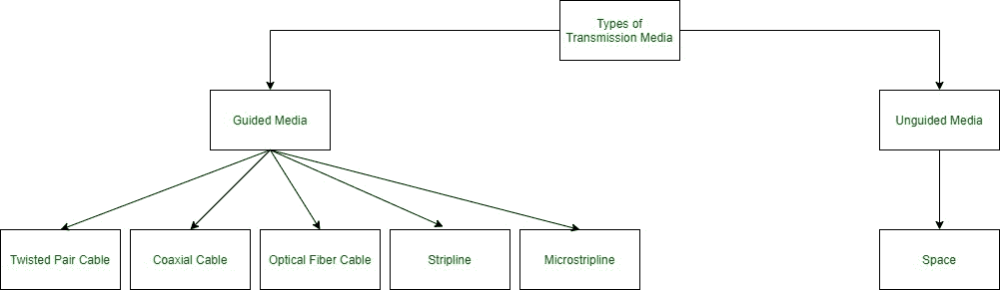
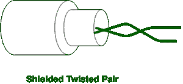
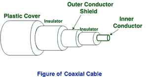
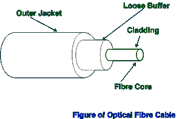
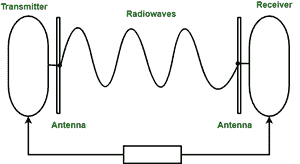
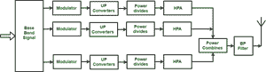
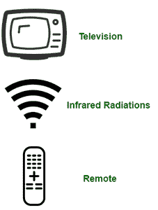

# 传输媒体类型

> 原文:[https://www.geeksforgeeks.org/types-transmission-media/](https://www.geeksforgeeks.org/types-transmission-media/)

在数据通信术语中，传输介质是发送器和接收器之间的物理路径，即数据从一个地方发送到另一个地方的通道。传输媒体大致分为以下类型:

**1。引导媒体:**
它也被称为有线或有界传输媒体。正在传输的信号通过使用物理链路被引导和限制在狭窄的路径中。
特点:

*   高速
*   安全的
*   用于相对较短的距离

有 3 种主要类型的引导式媒体:

**(i)双绞线电缆–**
它由两根相互缠绕的独立绝缘导线组成。通常，几对这样的线捆在一起形成一个保护套。它们是使用最广泛的传输媒体。双绞线有两种类型:

*   **非屏蔽双绞线(UTP):**
    UTP 由两根相互缠绕的绝缘铜线组成。这种类型的电缆具有阻挡干扰的能力，并且不依赖于用于此目的的物理屏蔽。它用于电话应用。

**优势:**

⇢最便宜

⇢易于安装

⇢高速能力

⇢易受外部干扰

与 STP 相比，⇢的容量和性能较低

衰减引起的⇢短距离传输

*   **屏蔽双绞线(STP):**
    这种类型的电缆由一个特殊的护套(铜编织层或箔屏蔽)组成，以阻挡外部干扰。它用于快速数据速率以太网以及电话线的语音和数据通道。

**优势:**

与 UTP 相比，⇢在更高的数据速率下具有更好的性能

⇢消除相声

⇢相对较快

⇢相对难以安装和制造

⇢更贵

⇢笨重

**(ii)同轴电缆–**
它有一个外部塑料覆盖层，包含一个由聚氯乙烯或聚四氟乙烯制成的绝缘层和两个平行导体，每个导体都有一个单独的绝缘保护盖。同轴电缆以两种模式传输信息:基带模式(专用电缆带宽)和宽带模式(电缆带宽分成不同的范围)。有线电视和模拟电视网络广泛使用同轴电缆。

优点:

*   高带宽
*   更好的抗噪声能力
*   易于安装和扩展
*   便宜的

缺点:

*   单根电缆故障可能会中断整个网络

**(iii)光纤电缆–**
它利用光通过玻璃或塑料制成的纤芯反射的概念。纤芯被称为包层的密度较低的玻璃或塑料覆盖层所包围。它用于传输大量数据。

电缆可以是单向的或双向的。WDM(波分复用器)支持两种模式，即单向和双向模式。

优点:

*   增加容量和带宽
*   轻量级选手
*   信号衰减更小
*   抗电磁干扰
*   抗腐蚀性材料

缺点:

*   难以安装和维护
*   高成本
*   脆的

**(iv)带状线**

带状线是美国空军剑桥研究中心的罗伯特·m·巴雷特于 20 世纪 50 年代发明的一种横向电磁(TEM)传输线介质。带状线是平面传输线的最早形式。它使用导电材料来传输高频波，也称为波导。这种导电材料夹在接地层的两层之间，接地层通常被短路以提供抗电磁干扰能力。

**(v)微带线**

在这种情况下，导电材料通过一层电介质与接地层隔开。

**2。无导向媒体:**
它也被称为无线或无边界传输媒体。电磁信号的传输不需要物理介质。

特点:

*   这个信号是通过无线电广播的
*   不太安全
*   用于更大的距离

通过非导向介质传输的信号有三种类型:

**(i)无线电波–**
这些很容易产生，可以穿透建筑物。发送和接收天线不需要对齐。频率范围:3 千赫–1 千兆赫。调幅和调频收音机和无绳电话使用无线电波进行传输。

进一步分为(一)地面和(二)卫星。

**(ii)微波–**
这是一种视线传输，即发送天线和接收天线需要正确对齐。信号覆盖的距离与天线的高度成正比。频率范围:1 千兆赫–300 千兆赫。这些主要用于手机通讯和电视发行。

**(iii)红外–**
红外波用于非常短的距离通信。他们无法穿过障碍物。这防止了系统之间的干扰。频率范围:300 千兆赫–400 千赫。用于电视遥控器、无线鼠标、键盘、打印机等。

