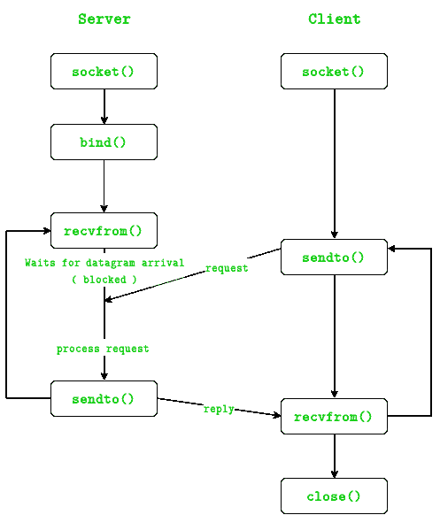

# UDP 服务器-客户端在 C 中的实现

> 原文:[https://www . geesforgeks . org/UDP-server-client-implementation-c/](https://www.geeksforgeeks.org/udp-server-client-implementation-c/)

主机之间的通信有两种主要的传输层协议: [**TCP**](https://en.wikipedia.org/wiki/Transmission_Control_Protocol) 和 [**UDP**](https://en.wikipedia.org/wiki/User_Datagram_Protocol) 。在前一篇文章中讨论了创建 TCP 服务器/客户端[。](https://www.geeksforgeeks.org/socket-programming-cc/)

先决条件:[创建 TCP 服务器/客户端](https://www.geeksforgeeks.org/socket-programming-cc/)

**理论**
在 UDP 中，客户端不像在 TCP 中那样与服务器形成连接，而只是发送一个数据报。同样，服务器不需要接受连接，只需要等待数据报到达。数据报到达时包含发送方的地址，服务器使用该地址向正确的客户端发送数据。



整个过程可以分为以下几个步骤:

**UDP 服务器:**

1.  创建一个 UDP 套接字。
2.  将套接字绑定到服务器地址。
3.  等待数据报数据包从客户端到达。
4.  处理数据报数据包并向客户端发送回复。
5.  回到步骤 3。

UDP 客户端:

1.  创建一个 UDP 套接字。
2.  向服务器发送消息。
3.  等待，直到收到服务器的响应。
4.  如有必要，处理回复并返回步骤 2。
5.  关闭套接字描述符并退出。

**必要功能:**

```
int socket(int domain, int type, int protocol)
Creates an unbound socket in the specified domain.
Returns socket file descriptor.
```

**参数:**
**域–**指定通信
域(对于 IPv4 为 AF _ INET/对于 IPv6 为 AF _ INET 6)
**类型–**要创建的套接字类型
(对于 TCP 为 SOCK _ STREAM 对于 UDP 为 SOCK _ DGRAM)
**协议–**套接字要使用的协议。
0 表示地址族使用默认协议。

```
int bind(int sockfd, const struct sockaddr *addr, socklen_t addrlen)
Assigns address to the unbound socket.
```

**参数:**
**sockfd–**要绑定的套接字的文件描述符
**addr–**结构，其中指定了要绑定的地址
**addr len–**结构的大小 *addr*

```
ssize_t sendto(int sockfd, const void *buf, size_t len, int flags,
               const struct sockaddr *dest_addr, socklen_t addrlen)
Send a message on the socket
```

**参数:**
**sockfd–**套接字的文件描述符
**buf–**包含要发送的数据的应用程序缓冲区
**len–**大小 *buf* 应用程序缓冲区
**标志–**标志的按位“或”来修改套接字行为
**dest _ addr–**结构包含目的地的地址
**addr len–**

```
ssize_t recvfrom(int sockfd, void *buf, size_t len, int flags,
                 struct sockaddr *src_addr, socklen_t *addrlen)
Receive a message from the socket.
```

****参数:**
**sockfd–**套接字的文件描述符
**buf–**应用程序缓冲区，在其中接收数据
**len–**大小 *buf* 应用程序缓冲区
**标志–**标志的按位“或”修改套接字行为
**src _ addr–**返回包含源地址的结构
**addrlen–【T21****

```
int close(int fd)
Close a file descriptor
```

****论据:****

****FD–**文件描述符**

**在下面的代码中，显示了服务器和客户端之间一条 hello 消息的交换，以演示该模型。**

****文件名:UDPServer.c****

## **C**

```
// Server side implementation of UDP client-server model
#include <stdio.h>
#include <stdlib.h>
#include <unistd.h>
#include <string.h>
#include <sys/types.h>
#include <sys/socket.h>
#include <arpa/inet.h>
#include <netinet/in.h>

#define PORT     8080
#define MAXLINE 1024

// Driver code
int main() {
    int sockfd;
    char buffer[MAXLINE];
    char *hello = "Hello from server";
    struct sockaddr_in servaddr, cliaddr;

    // Creating socket file descriptor
    if ( (sockfd = socket(AF_INET, SOCK_DGRAM, 0)) < 0 ) {
        perror("socket creation failed");
        exit(EXIT_FAILURE);
    }

    memset(&servaddr, 0, sizeof(servaddr));
    memset(&cliaddr, 0, sizeof(cliaddr));

    // Filling server information
    servaddr.sin_family    = AF_INET; // IPv4
    servaddr.sin_addr.s_addr = INADDR_ANY;
    servaddr.sin_port = htons(PORT);

    // Bind the socket with the server address
    if ( bind(sockfd, (const struct sockaddr *)&servaddr, 
            sizeof(servaddr)) < 0 )
    {
        perror("bind failed");
        exit(EXIT_FAILURE);
    }

    int len, n;

    len = sizeof(cliaddr);  //len is value/resuslt

    n = recvfrom(sockfd, (char *)buffer, MAXLINE, 
                MSG_WAITALL, ( struct sockaddr *) &cliaddr,
                &len);
    buffer[n] = '\0';
    printf("Client : %s\n", buffer);
    sendto(sockfd, (const char *)hello, strlen(hello), 
        MSG_CONFIRM, (const struct sockaddr *) &cliaddr,
            len);
    printf("Hello message sent.\n"); 

    return 0;
}
```

****文件名:UDPClient.c****

## **C**

```
// Client side implementation of UDP client-server model
#include <stdio.h>
#include <stdlib.h>
#include <unistd.h>
#include <string.h>
#include <sys/types.h>
#include <sys/socket.h>
#include <arpa/inet.h>
#include <netinet/in.h>

#define PORT     8080
#define MAXLINE 1024

// Driver code
int main() {
    int sockfd;
    char buffer[MAXLINE];
    char *hello = "Hello from client";
    struct sockaddr_in     servaddr;

    // Creating socket file descriptor
    if ( (sockfd = socket(AF_INET, SOCK_DGRAM, 0)) < 0 ) {
        perror("socket creation failed");
        exit(EXIT_FAILURE);
    }

    memset(&servaddr, 0, sizeof(servaddr));

    // Filling server information
    servaddr.sin_family = AF_INET;
    servaddr.sin_port = htons(PORT);
    servaddr.sin_addr.s_addr = INADDR_ANY;

    int n, len;

    sendto(sockfd, (const char *)hello, strlen(hello),
        MSG_CONFIRM, (const struct sockaddr *) &servaddr, 
            sizeof(servaddr));
    printf("Hello message sent.\n");

    n = recvfrom(sockfd, (char *)buffer, MAXLINE, 
                MSG_WAITALL, (struct sockaddr *) &servaddr,
                &len);
    buffer[n] = '\0';
    printf("Server : %s\n", buffer);

    close(sockfd);
    return 0;
}
```

****输出:****

```
$ ./server
Client : Hello from client
Hello message sent.
```

```
$ ./client
Hello message sent.
Server : Hello from server
```