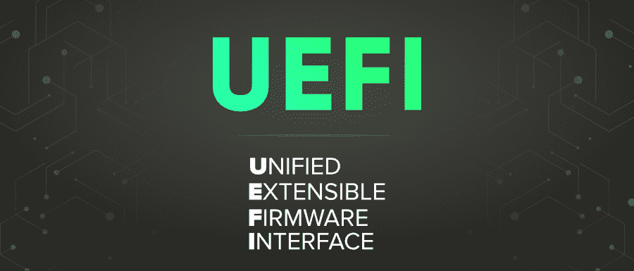

# UEFI 完整形式

> 原文:[https://www.geeksforgeeks.org/uefi-full-form/](https://www.geeksforgeeks.org/uefi-full-form/)

**UEFI** 代表**统一可扩展固件接口**。它将计算机的固件连接到其操作系统，或者我们可以说它是计算机固件和操作系统之间的接口。

#### UEFI 的历史

1990 年中期，第一个电喷出现在第一个英特尔-惠普安腾系统的早期开发阶段。英特尔在 2005 年 7 月 1.10 版本之后停止了 EFI 的开发，并将其交给了统一 EFI 论坛，该论坛被开发为统一可扩展固件接口。2007 年 1 月 7 日，2.1 版本发布，它具有加密、网络认证和用户界面架构。2019 年 3 月，最新的 UEFI 版本获批。

#### 特征

UEFI 变量提供了一种存储数据的方法，尤其是非易失性数据，这些数据在操作系统和平台固件之间或在 UEFI 应用程序中共享。变量名称空间被标识为 GUIDs，变量是值对。例如，它们可用于在操作系统崩溃后将崩溃消息保存在 NVRAM 中，以便在重新启动后检索。

#### 优势

*   它是一个独立于中央处理器的架构
*   它是一个独立于中央处理器的驱动程序
*   它还具有灵活的预操作系统环境，包括网络功能
*   它采用模块化设计
*   它还提供了向后和向前的兼容性

#### 不足之处

*   UEFI 最大的问题是硬件和软件程序支持
*   需要 UEFI 系统的软件程序会阻止旧系统升级到现代操作系统。
*   许多超频计算机结构的超级用户可能会面临一些问题。
*   它更复杂。