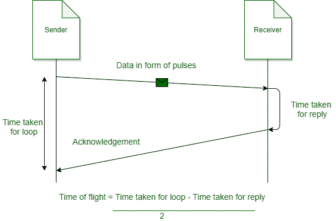
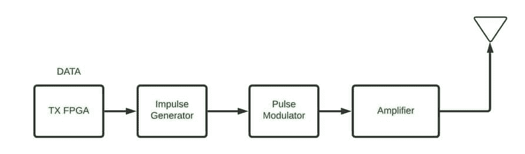
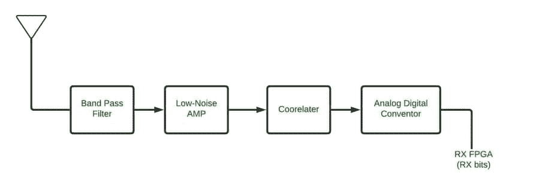

# 超宽带组网

> 原文:[https://www.geeksforgeeks.org/ultra-wide-band-networking/](https://www.geeksforgeeks.org/ultra-wide-band-networking/)

从名称[我们可以清楚的看到超宽带](https://www.geeksforgeeks.org/difference-between-bluetooth-and-uwb/)是一种用于宽频段信道，低能量短距离的无线电技术。它用于短程无线通信协议，如[蓝牙](https://www.geeksforgeeks.org/difference-between-bluetooth-and-wi-fi/)和[无线网络](https://www.geeksforgeeks.org/what-is-wi-fiwireless-fidelity/)。它可以在很宽的频率范围内工作，在这个频率范围内，我们可以一次发送短脉冲信息。它用于在大约 500 兆赫兹的大带宽范围内发送信息。它通过在大带宽上产生一段时间的无线电能量来传输信息。较低的能耗允许传输大量数据。

如今，像苹果、三星和华为这样受欢迎的公司正在研发超宽带芯片和天线。[苹果](https://www.geeksforgeeks.org/how-to-add-apples-new-san-francisco-font-on-a-webpage-using-css/)成为第一家将 UWB 纳入智能手机的公司。

**UWB 的特点:**
以下是 UWB 的一些特点-

1.  使用超宽带的设备需要高数据速率。
2.  通过 UWB 通信具有安全通信。
3.  使用超宽带的设备具有强大的通信能力，并且通常具有较大的处理增益。
4.  超宽带需要 500 兆赫的大带宽，这使得它更加精确和快速，每两纳秒传输一个脉冲。
5.  超宽带设备具有潜在的高密度用途。

**UWB 如何工作:**

1.  一旦两台启用了超宽带的设备相互靠近并开始测距。
2.  测距也可以被认为是计算两个设备之间的飞行时间。
3.  UWB 在早期也被称为脉冲无线电。在超宽带中，数据以脉冲形式在很宽的频谱范围内传输，然后由接收器转换成实际数据。
4.  脉冲的传输速率是每两纳秒一个脉冲。
5.  由于这个过程，超宽带的实时性非常高。
6.  超宽带功率非常低，但带宽高达 500 兆赫兹，是将数据从主机传输到大约 30 英尺外的接收器的理想选择。

超宽带的工作原理

超宽带传输

超宽带接收机

**超宽带的应用:**

1.  可以作为实时系统使用，因为它最适合像医院这样的射频敏感区域。
2.  超宽带在移动技术中的使用已经领先。手机对 UWB 的需求增加，苹果推出了搭载 UWB 的 iPhone 11。
3.  超宽带的一个很好的例子是像车钥匙或门钥匙这样的数字钥匙。我们可以在一定距离内用钥匙打开汽车或大门，这是一个很大的优势。
4.  使用超宽带进行数据传输有很多优势，因为短程设备的数据传输速率很高。

**超宽带的优势:**

1.  要求低功率水平。
2.  可以通过任何物质。
3.  可以轻松传输更多数据，或者我们可以说是电阻干扰。
    1.  通道容量大。
4.  它可以在低信噪比下工作。

**UWB 的缺点:**

1.  某些领域的成本更高。
2.  它需要较大的频率，因此在相同的频率标准下，干扰的可能性会增加。
3.  UWB 的采用率较慢。
4.  信号采集时间长。

**UWB 的未来:**
由于 UWB 是一种新技术，各公司都在努力采用这项技术，其中一些公司已经开始使用这项技术，例如，苹果推出了搭载 UWB 的 iPhone 11。但这对市场来说是一项伟大的技术。三星已经开发了一些产品，比如附近的共享应用程序，它可以使用超宽带传输文件，提高了设备间的传输速率。将设备指向列表顶部后，“邻近共享”会自动固定设备。三星还在创建一些智能应用程序，如 Galaxy SmartTag+，安装后可以轻松定位我们的设备，这有助于找到我们的归属。