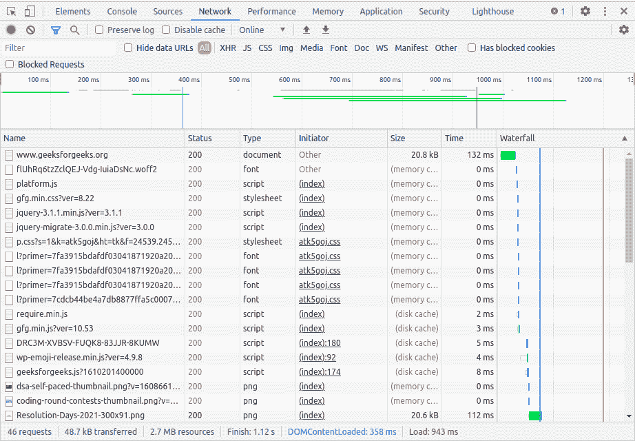

# 使用浏览器理解 HTTP】

> 原文:[https://www . geesforgeks . org/understanding-http-using-browsers/](https://www.geeksforgeeks.org/understanding-http-using-browsers/)

为了理解什么是 HTTP 以及它是如何工作的，我们需要首先了解网络服务器是如何工作的，请求是如何到达服务器的，服务器是如何响应请求的，之后我们就能够理解什么是 HTTP 了。

[**HTTP**](https://www.geeksforgeeks.org/difference-between-http-and-https/)T4:

HTTP 是一个 [**客户端-服务器**](https://www.geeksforgeeks.org/client-server-model/) [**协议**](https://www.geeksforgeeks.org/protocols-application-layer/) 这意味着当一个请求被任何客户端实体发送时，那么用户代理(这意味着代表用户的代理号)或者一般大多数时候用户代理可以是一个 Web 浏览器，但是我们可以说它可以是任何东西(也许是一个浏览器或者另一个发送请求的应用程序抛出的 API)，在我们的例子中它可以是一个**机器人****爬行**

在这里，每个单独的请求将被发送到一个服务器，服务器将处理它并提供一个答案或返回响应。这里所有正在发生的过程都由客户端和服务器发起，有许多实体，统称为代理，它们将执行不同的操作，并在整个过程中充当网关或缓存。

**使用浏览器理解 HTTP 的步骤:**

*   首先，在你的电脑上打开谷歌浏览器的一个新窗口，在隐名模式下导航到**https://www.geeksforgeeks.org/**(为了避免由于缓存所有进程而导致的不一致)。
*   然后你将打开 Chrome 开发者工具或检查页面是否相同，在浏览器窗口中按下 **Ctrl + Shift + i 或 Cmd + Shift + i** 键，然后选择网络选项卡。
*   现在按 **F5** 刷新页面，从 Chrome 开始记录网络活动，观察加载网站的 HTTP 请求。
*   当你刷新页面后，网站之前的各种活动将被移除，新的活动将被重新加载。
*   现在轮到你检查你的浏览器发出了多少个 **HTTP** 请求
*   检查通过网络传输了多少数据，以及服务器如何响应您的请求。

**注–**

现在您会注意到，网站上用于发出所需 HTTP 请求的每个图像、CSS 和 JavaScript 文件或任何其他资源，每个请求总是为我们提供等效的共鸣，

**使用** [**浏览器**](https://www.geeksforgeeks.org/difference-between-search-engine-and-web-browser/) **理解 HTTP 的示例:**

现在，在本文的待办部分，我们将使用极客为极客网站进行我们关于 HTTP 请求和响应过程的活动，如下所示。

*   现在在浏览器的新标签中搜索 geeks forgeek，进入[geeks forgeek](https://www.geeksforgeeks.org/)主页，然后按 ctrl +shift+i。完成此操作后，您将进入站点的检查部分，然后按照下面给出的过程刷新站点
*   现在滚动到网络活动的顶部，点击第一个请求打开其详细信息。(在“名称”选项卡中找到条目，您应该会看到 www.geeksforgeeks.org 将“类型”作为文档//这是必需的)。
*   现在，您将在“常规”部分看到这个 HTTP 请求的以下详细信息，它将强制提供所有详细信息。
*   现在您将请求[网址](https://www.geeksforgeeks.org/url-class-java-examples/)–获取的资源的网址
*   请求方法表示要执行的操作。它是“GET”，用于获取与该文档相关的一些资源或细节。
*   状态代码表示服务器如何响应请求。例如，“200 OK”表示请求成功，由于这是一个“GET”请求，服务器会将数据发回，例如网站的 HTML 内容
*   现在检查“常规”部分中的“远程地址”值-使用的端口号是 443。这是一个特殊的端口号吗？使用的端口号和请求网址之间是否有任何关系？你可以考虑一个例子，在你的浏览器地址栏中有一个锁定图标？
*   现在查看一些响应头，看看你是否能发现它们的意思。一个例子是共同内容类型，服务器
*   找出浏览器发送到 GeeksforGeeks 服务器的 HTTP 请求行(提示:点击请求标题旁边的查看来源)
*   现在转到 https://www.geeksforgeeks/practice 的一个新标签。你认为 HTTP 请求行会有什么变化？通过检查为检索新的 HTML 页面而发送的请求行来进行验证，就像您在上一步中所做的那样。
*   当您访问 https://www.geeksforgeeks/.时，您会发现请求行将会在/practice 处请求资源，而不是在根(/)处请求资源。主机请求头告诉您从哪里获取此资源。