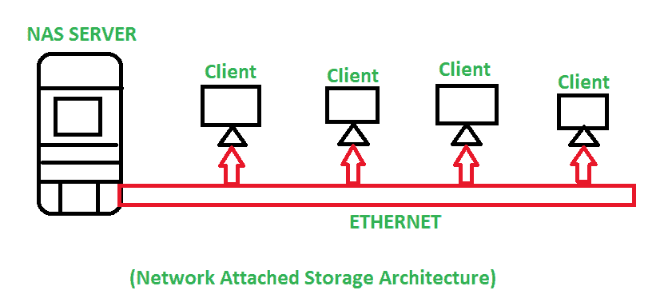

# 了解网络连接存储

> 原文:[https://www . geesforgeks . org/understanding-network-attached-storage/](https://www.geeksforgeeks.org/understanding-network-attached-storage/)

**网络连接存储(NAS)** 是一种基于文件的存储体系结构，它使网络设备更容易访问存储的数据，这意味着多个用户或客户端设备可以从单个存储系统中检索数据。由于通过局域网连接的多个客户端或用户通过[以太网](https://www.geeksforgeeks.org/local-area-network-lan-technologies/)从集中的磁盘容量访问数据，这就是为什么它被称为网络连接存储。网络连接存储(NAS)为网络中所有连接的设备提供了一个单一的存储访问点，称为 NAS 存储服务器。

下图展示了网络连接存储的体系结构:

这是一个简单的网络连接存储体系结构，显示存在一个中央存储系统，即网络连接存储服务器，多个客户端/用户连接到该网络连接存储服务器并从中访问数据。NAS 包含非结构化数据，如音频、视频、网站、文本文件等。

*   **网络连接存储硬件–**
    网络连接存储硬件包括网络连接存储盒、网络连接存储单元、网络连接存储服务器或网络连接存储头，本质上只是一个包含存储磁盘或驱动器、处理器和随机存取存储器(RAM)的服务器。这些是构建网络连接存储硬件结构的基本硬件系统。

*   **NAS 软件–**
    存储软件安装在 NAS 硬件系统的专用硬件中。网络连接存储软件部署在轻量级操作系统上。

*   **网络连接存储协议–**
    数据传输协议用于发送和接收交换机访问的数据。互联网协议和传输控制协议是最基本的数据传输协议，大多数客户端/用户通过它们传输数据。网络文件系统(NFS)、服务器消息块(SMB)是协议中文件传输的格式。

**网络连接存储的未来–**

*   开始支持虚拟化技术。
*   支持千兆以太网(GigE)以加快数据传输。
*   可扩展的存储容量。
*   提供从小到大的商业服务。

**NAS 的优势:**

*   **性能–**在服务文件方面提供更好的性能。
*   **高端数据功能–**提供存储管理和安全性。
*   **纵向扩展–**支持可扩展存储系统。
*   **可访问性–**网络中的每个客户端/用户都可以轻松访问 NAS。
*   **易于设置–**NAS 架构易于设置。