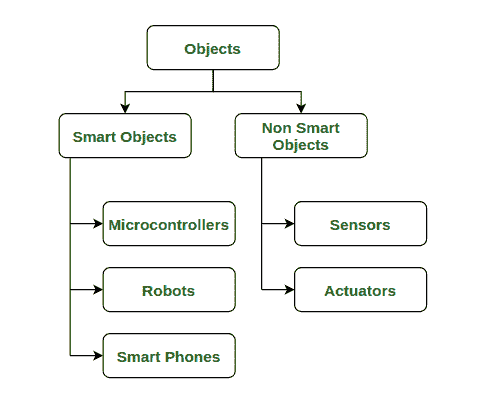
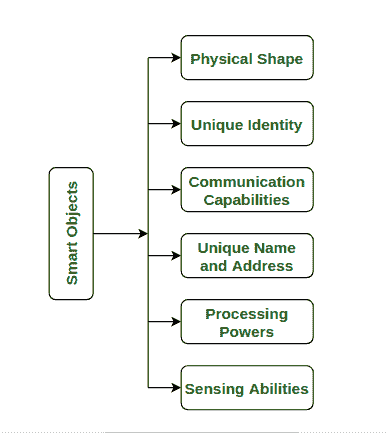

# 理解物联网

中的“物”

> 原文:[https://www . geeksforgeeks . org/物联网理解/](https://www.geeksforgeeks.org/understanding-things-in-internet-of-things/)

如今，[物联网(IoT)](https://www.geeksforgeeks.org/introduction-to-internet-of-things-iot-set-1/) 已经成为以互联网为骨干的现代最强大的技术之一。物联网或物联网是用于与物理对象通信的东西。用通俗易懂的话来说，我们可以说“物联网是一种利用互联网实现人与机器或者机器与机器之间的通信的技术”。

这里的“东西”指的是这些机器或物理物体，所以了解什么样的物体可以通过互联网连接变得很重要。我们可以将这些对象分类

1.  有智能的物体或**智能物体。**
2.  无智能物体或**非智能物体。**

物体分类

**[智能物体](https://www.geeksforgeeks.org/classification-of-smart-objects/) :**
顾名思义智能物体就是具有某种智能的物体。现在世界已经发生了足够的变化，可以将我们的日常物品变成智能物品，可以根据环境进行交流、反应和识别其他物品。物联网的关键概念是减少任何框架中的人类交互，智能对象在很大程度上满足了这一要求。这就是为什么智能对象被称为物联网的构建模块。智能物体和物联网就像一辆车的两个轮子，它们一起移动来加速我们现代基础设施的车辆。

**智能物体的定义:**
“智能物体是能够被识别的物理和数字物体，具有传感/驱动能力、处理和计算能力，还具有存储和联网能力。”

**智能对象的特征:**
智能对象具有一些特定的特征，这些特征是将物理对象称为智能对象所必需的。我们将在下面讨论这些特性–

1.  **物理形状:**
    由于对象一词指的是具有某种物理形状或大小的东西，因此任何智能对象都应该具有这些物理特征，以便可以部署在基础设施的某个地方。
2.  **唯一标识符:**
    智能对象应该具有唯一的标识，以便在基础架构中可以轻松识别。它是特定物体区别于其他物体的东西。这种物理身份被人类用于推理目的。
3.  **通信能力:**
    它必须具备通信能力，以便能够通过互联网或其他网络技术发送或接收数据。
4.  **唯一名称和地址:**
    这里的单词、名称和地址指的是对象的网络地址，例如用于通信目的的 IP 地址。该地址在整个互联网基础设施中应该是唯一的。虽然这个名字是人类用来推理的。
5.  **处理能力:**
    智能物体具有一些基本的计算和处理能力，可以根据环境做出相应的决策。
6.  **感知能力:**
    它应该有一些感知能力来了解周围环境(压力、有毒气体、温度。等等)。

智能对象的特征

**例子:**
我们在日常生活中被智能物体包围。例如，我们口袋里都有智能手机。智能冰箱、智能电视、Alexa 语音助手都是我们日常生活中使用的一些现代智能物品的例子。像 Arduino 这样的微控制器很容易看到。

**非智能物体:**
非智能物体一般是指不具备智能和处理能力的物体。传感器和执行器是非智能设备。

1.  **传感器:**
    传感器是由敏感细胞制成的电子设备，具有测量或感知一些物理或科学量的能力，如温度、压力、任何有毒气体的测量等。
2.  **执行器:**
    执行器是通过传感器或类似传感器在互联网上收集信息来执行特定任务的电子设备。我们可以将致动器分为两部分–
    *   **机械执行器–**
        这些执行器在自身或任何其他物体上执行任务。
    *   **动作–**
        动作是由对象执行的。比如发邮件震动。

通过这种分析，我们可以很容易地对物联网中的对象进行分类。现在，我们可以看到智能对象和物联网一起可以制作复杂的应用程序，因为在它们的帮助下，我们可以在没有人类交互的情况下进行通信。这在那些不能一直有人在场的应用中变得更加重要。