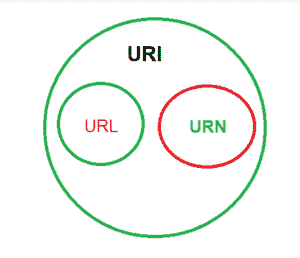

# URI 完整版

> 原文:[https://www.geeksforgeeks.org/uri-full-form/](https://www.geeksforgeeks.org/uri-full-form/)

**URI** 代表统一资源标识符。这是一个技术术语，用于连接到万维网的所有资源的名称。URIs 通过互联网建立了协议，在资源之间进行连接。

**统一资源标识符(URI)** 是识别逻辑(抽象)或物理资源的序列字符，通常但不总是连接到互联网。URI 用于区分一种资源和另一种资源。URIs 允许互联网协议促进这些资源之间交互。包含在 URI 中的字符串用作标识符，例如方案名和文件路径。

**统一资源标识符是如何工作的:**
URI 基本上习惯用可扩展的方式来识别互联网资源。可能有不同类型的资源标识符可以用于相同的上下文，而不考虑用于访问这些资源的机制。

URI 过去常常识别不同类型的资源，例如:

*   电子文档
*   网页
*   形象
*   具有一致目的的信息源

每个网址都是 URI，但每个 URI 不是网址。骨灰盒是网址，但不是反之亦然

**URI 类型:**URI 有两种类型:

1.  **片段 URI(URN)–**
    URN 代表通用资源名称。它使用锚点标识符来表示内容的位置。骨灰盒是网址，但不是反之亦然。所有的 URN 都有一个前缀 URN。当你指定“访问机制，位置”和 URI 成为网址。
2.  **相对 URI(URL)****—**
    URL 代表统一资源定位器。URI 是超级网址集。它可能包含 URN 或片段 URI，用于定义内容中的文档。网址有关于如何从其位置获取资源的信息。网址总是以一个协议开始(最明显的，HTTP)。它将包含有关主机名的详细信息以及路径。当客户端向服务器发出服务请求时，将使用 URL