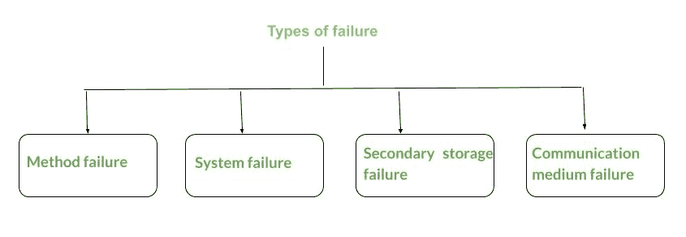

# 分布式系统中的各种故障

> 原文:[https://www . geesforgeks . org/各种-分布式系统故障/](https://www.geeksforgeeks.org/various-failures-in-distributed-system/)

帝斯曼在一个极度分布式的系统中实现了**分布式系统**共享内存模型，这个系统没有任何物理共享内存。共享模型提供了在任意数量的节点之间共享的虚拟地址空间。需求侧管理系统对设备作者隐藏了远程通信机制，保护了共享内存系统典型的编程简易性和质量。

这些解释如下。

**1。<u>方法故障</u> :**
在这种类型的故障中，分布式系统通常会暂停，无法执行。有时它会导致最终的执行，导致相关的错误结果。方法失败会导致系统状态偏离规格，方法也可能无法继续进行。

*   **行为–**
    可以理解为，如果执行了不正确的计算，如违反保护、死锁、超时、用户输入等，则该方法停止执行。
*   **恢复–**
    可以通过中止方法或从其先前状态重新启动方法来防止方法失败。

**2。<u>系统故障</u> :**
系统故障时，与分布式系统关联的处理器无法执行执行。这是由计算机代码错误和硬件问题引起的。硬件问题可能涉及中央处理器/内存/总线故障。假设每当系统由于某种故障停止执行时，内部状态就会丢失。

*   **行为–**
    它与处理器的物理和逻辑单元有关。系统可能会冻结、重新启动，并且不执行任何功能，导致系统进入空闲状态。
*   **恢复–**
    这可以通过尽快重启系统并配置故障点和错误状态来治愈。

**3。<u>二级存储设备故障</u> :**
一旦无法访问 keep 信息，就声称发生了存储设备故障。这种故障有时是由奇偶校验错误、磁头崩溃或介质上的灰尘颗粒引起的。

*   **行为–**
    无法访问存储的信息。
*   **造成失败的错误–**
    奇偶错误、头部碰撞等。
*   **恢复/设计策略–**
    从归档和活动日志中重建内容，风格反映磁盘系统。系统故障将另外分类如下。
    *   联想认知状态失败
    *   部分认知状态失败
    *   中断失败
    *   暂时的失败

**4。<u>通信介质故障</u> :**
一旦一个网站无法与网络中的另一个运营站点通信，就会发生通信介质故障。它通常是由轮班节点和/或人类活动系统的链接故障引起的。

*   **行为–**
    一个网站无法与另一个运营网站进行通信。
*   **错误/故障–**
    移位节点或通信链路故障。
*   **恢复/设计策略–**
    重路由、抗错通信协议。