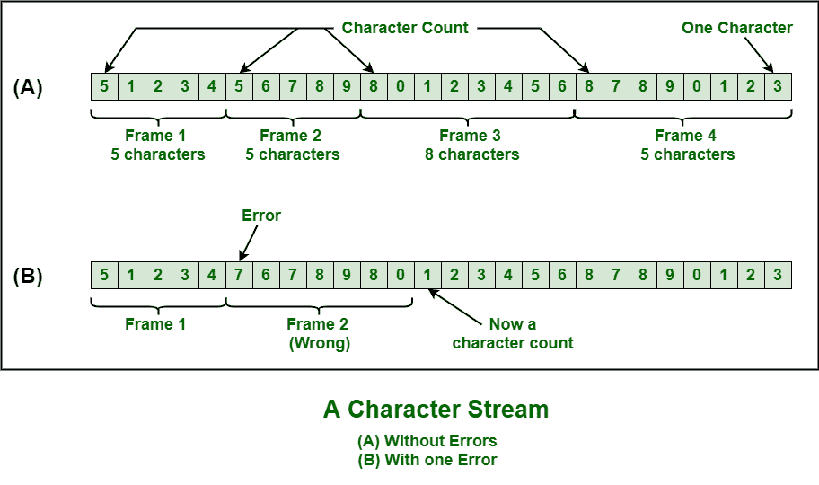

# 数据链路层的各种成帧方式

> 原文:[https://www . geesforgeks . org/各种数据链路层框架/](https://www.geeksforgeeks.org/various-kind-of-framing-in-data-link-layer/)

[成帧](https://www.geeksforgeeks.org/framing-in-data-link-layer/)是数据链路层的功能，用于将消息从源或发送者分离到目的地或接收者，或者仅通过添加发送者地址和目的地地址，将消息从所有其他消息分离到所有其他目的地。目的地或接收方地址仅用于表示消息或数据包的去向，发送方或源地址仅用于帮助接收方确认收到。

帧通常是数据链路层的数据单元，在不同的网络点之间传输。它包括完整的寻址、必要的协议和受控的信息。物理层只接受和传输比特流，不考虑任何意义或结构。因此，简单地开发和识别帧边界取决于数据链路层。

这可以通过在帧的开头和结尾附加特殊类型的位模式来实现。如果所有这些位模式都可能意外出现在数据中，则需要特别小心，以确保这些位模式不会被错误地解释为帧分隔符。

成帧只是两台计算机或设备之间的点对点连接，包括以比特流形式传输数据的线路。然而，所有这些位都应该被组织成可识别的信息块。

**取景方法:**
基本上有以下四种取景方法–

```
1. Character Count
2. Flag Byte with Character Stuffing
3. Starting and Ending Flags, with Bit Stuffing
4. Encoding Violations 
```

这些解释如下。

1.  **Character Count :**
    This method is rarely used and is generally required to count total number of characters that are present in frame. This is be done by using field in header. Character count method ensures data link layer at the receiver or destination about total number of characters that follow, and about where the frame ends.

    使用这种方法也有缺点，即如果字符计数由于传输过程中出现的错误而受到干扰或失真，那么目的地或接收器可能会失去同步。目的地或接收器也可能无法定位或识别下一帧的开始。

    

2.  **[Character Stuffing](https://www.geeksforgeeks.org/difference-between-byte-stuffing-and-bit-stuffing/) :**
    Character stuffing is also known as byte stuffing or character-oriented framing and is same as that of bit stuffing but byte stuffing actually operates on bytes whereas bit stuffing operates on bits. In byte stuffing, special byte that is basically known as ESC (Escape Character) that has predefined pattern is generally added to data section of the data stream or frame when there is message or character that has same pattern as that of flag byte.

    但是接收器删除了这个电子稳定控制，保留了导致一些问题的数据部分。简而言之，如果文本中存在 ESC 或标志，我们可以说字符填充是增加 1 个额外的字节。

    

3.  **[Bit Stuffing](https://www.geeksforgeeks.org/bit-stuffing-in-computer-network/) :**
    Bit stuffing is also known as bit-oriented framing or bit-oriented approach. In bit stuffing, extra bits are being added by network protocol designers to data streams. It is generally insertion or addition of extra bits into transmission unit or message to be transmitted as simple way to provide and give signaling information and data to receiver and to avoid or ignore appearance of unintended or unnecessary control sequences.

    这是一种简单的协议管理，用于分解导致传输不同步的位模式。比特填充是网络和通信协议传输过程中非常重要的一部分。USB 中也需要。

4.  **物理层编码违规:**
    编码违规是仅用于网络的方法，其中物理介质上的编码包括某种冗余，即使用一个以上的图形或视觉结构来简单编码或表示数据的一个变量。