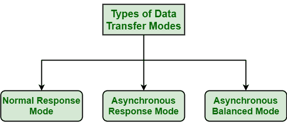

# HDLC 各类换乘方式

> 原文:[https://www . geeksforgeeks . org/各种类型的传输模式 in-hdlc/](https://www.geeksforgeeks.org/various-types-of-transfer-modes-in-hdlc/)

[高级数据链路控制(HDLC)](https://www.geeksforgeeks.org/difference-between-high-level-data-link-control-hdlc-and-point-to-point-protocol-ppp/) 基本上是数据链路控制协议，能够支持各种型号的操作或数据传输。HDLC 模式通常代表参与交换的两个设备之间的关系。

一种模式基本上描述了谁实际控制数据链路。HDLC 通信会话使用几种数据传输或通信模式来简单地确定或识别主站和次站实际上是如何相互作用的。HDLC 基本上提供了三种不同的运营模式。

这些操作或数据传输模式如下所示:

**1。正常响应模式(NRM) :**
NRM 通常是一种不平衡配置，其中只有主终端或站可以发起或开始向次站传输数据。辅助终端或站只有在主站命令时才响应传输数据。我们通常只有一个主站和各种次站。NRM 也用于点对点和多点传输或链路。

简而言之，在不平衡通信或配置环境中运行的次站只能在被主站命令或发信号通知时进行通信。换句话说，从站必须从主站接收命令或许可来传送或发送响应。从次站到主站的传输不仅仅是对数据帧的确认。在 NRM，主站控制整个数据链路管理。它还允许在半双工通信链路上操作，只要主站知道当它已经命令到次站时它可能不传送。

**2。异步响应模式(ARM) :**
ARM 是一种非平衡配置，其中主站可以启动或开始数据传输，而从站也可以启动或开始数据传输，而无需主站的任何明确许可或命令来传输数据。我们通常只有一个主站和多个副站。

简而言之，在不平衡配置环境中，从站可以随意传输，但是主站仍然有责任进行初始化、纠错或恢复、控制数据流和逻辑断开。此外，ARM 的纪律性不如 NRM。如果它允许在全双工通信链路上操作，辅助站可以随时传输或传送数据帧。如果副站允许在半双工通信链路上操作，它必须等到检测到空闲信道后才能传输任何数据帧。在这方面，二级站更加独立。

**3。异步平衡模式(ABM) :**
ABM 是一种平衡配置，在这种配置中，次站可以启动数据传输，而无需主站的任何明确许可或命令。ABM 还提供可靠的点对点链路服务。它还用于提供支持数据报或可靠网络协议的服务，既可以作为主协议，也可以作为辅助协议。

简而言之，在平衡配置环境中，组合站可以发起或开始传输。该模式是 X.25 中的 LAP-B、ISDN 中的 LAP-D 等的基础。在 ABM 中，错误恢复(如检查点或回退)基本上用于简单地确保数据帧的有序和可靠流动。这是现在最常用的模式。它通常用于点对点通信或链路，用于组合站之间的通信。在 ABM 中，数据帧可以以全双工方式传输。