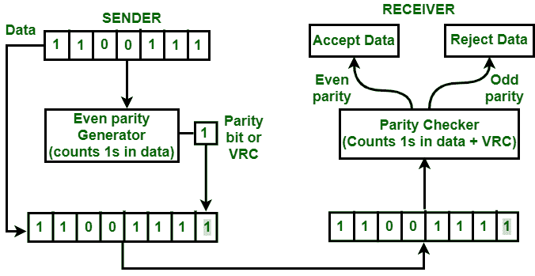
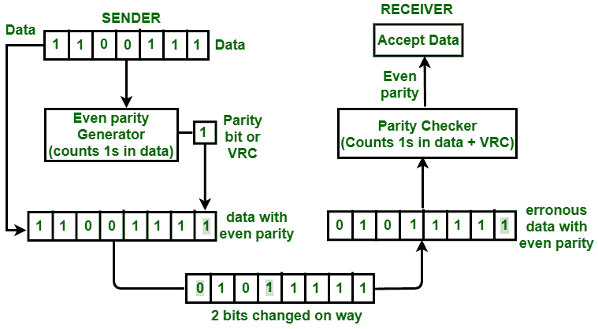

# 垂直冗余校验(VRC)或奇偶校验

> 原文:[https://www . geesforgeks . org/垂直-冗余校验-vrc-or-奇偶校验/](https://www.geeksforgeeks.org/vertical-redundancy-check-vrc-or-parity-check/)

**垂直冗余校验**也称为奇偶校验。在这种方法中，一个冗余位也被称为奇偶校验位被添加到每个数据单元。这种方法包括偶数奇偶校验和奇数奇偶校验。偶数奇偶校验意味着数据中的 1 总数是偶数，奇数奇偶校验意味着数据中的 1 总数是奇数。

**示例–**
如果源想要使用偶数奇偶校验向目的地传输数据单元 1100111。源必须通过偶校验生成器。

偶数 VRC

奇偶校验发生器将对数据单元中的 1 进行计数，并添加奇偶校验位。在上面的例子中，数据单元中的 1 的数量是 5，奇偶校验生成器向该数据单元附加奇偶校验位 1，使得 1 的总数为偶数，即 6，从上图中可以清楚地看出。

数据和奇偶校验位随后通过网络传输。在这种情况下，将传输 11001111。在目的地，该数据被传递到目的地的奇偶校验器。数据中 1 的数量由奇偶校验器计数。

如果 1 的数量被计算为奇数，例如 5 或 7，那么目的地将知道数据中有一些错误。然后，接收器拒绝这种错误的数据单元。

**优势:**

*   VRC 可以检测所有单比特错误。
*   它还可以检测突发错误，但仅在位数为奇数的情况下，即 1、3、5、7、……等。

**缺点:**
使用这种方法进行错误检测的主要缺点是，如果改变的位数是偶数，即 2、4、6、8、……等，则无法检测到突发错误。

**例–**
如果原始数据是 1100111。添加 VRC 后，将要传输的数据单元为 11001111。假设途中 2 位为 0 10 1 1111。当这些数据到达目的地时，奇偶校验器将计算数据中的 1 数，结果是偶数，即 8。所以，在这种情况下，奇偶性没有改变，它仍然是均匀的。目的地将假设数据没有错误，即使数据是错误的。

接收器接受的错误数据，位数已更改