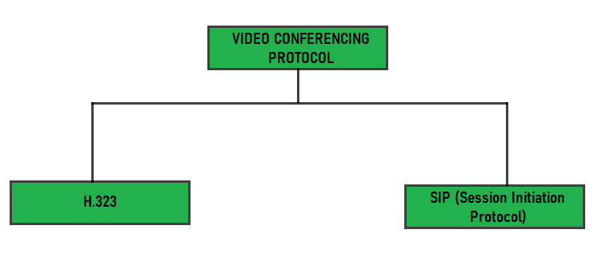

# 视频会议协议

> 原文:[https://www.geeksforgeeks.org/video-conferencing-protocols/](https://www.geeksforgeeks.org/video-conferencing-protocols/)

互联网通信简单来说就是两个或多个用户通过互联网或 [WWW(万维网)](https://www.geeksforgeeks.org/world-wide-web-www/)进行通信。交流的形式可以是发短信、分享信息、视频、音频、想法、视频聊天等。

**<u>视频会议</u> :**
视频电话/视频聊天/视频会议是互联网通信的一种。视频意味着视觉，会议意味着交流。因此，视频会议通常是全球互联网上两个或多个用户之间的视觉交流。视频会议是指在网上交谈或面对面交流时互相见面。如果你可以上网&有带摄像头的智能手机或 PC，或者笔记本电脑或平板电脑，那么只需打个电话，就能在通话时看到对方。

视频会议的一些协议如下:

**1。视频会议协议 H.323 :**

*   由国际电信联盟设计。
*   使用的计算机语言是二进制。
*   通过各种网络提供多媒体通信。
*   这是相当复杂的，有延迟的可能。
*   多点控制单元(MCU)、网关、看门人(可选)和终端是一些功能组件。

**2。会话发起协议:**

*   由 IETF(互联网工程任务组)设计。
*   使用的计算机语言是 ASCII。
*   高度灵活和简单。
*   用户代理和网络服务器是两个主要的功能组件。
*   用于建立、修改和终止多媒体会话或呼叫。
*   类似于 HTTP 协议。
*   适用于 IPv4 和 IPv6。