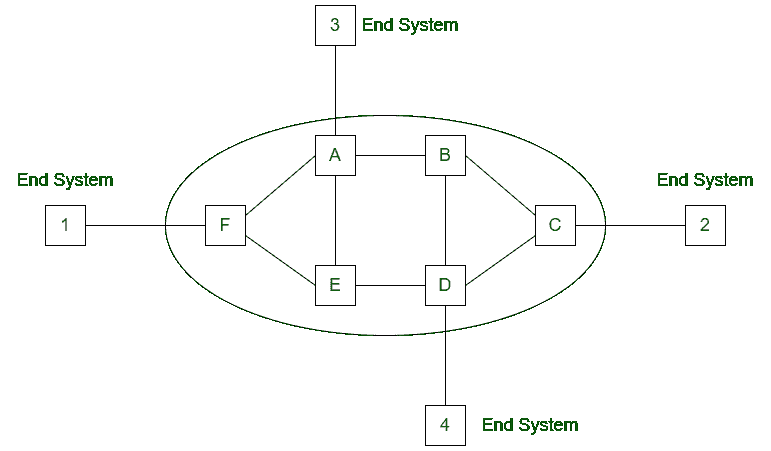

# 计算机网络中的虚拟电路

> 原文:[https://www . geesforgeks . org/计算机网络中的虚拟电路/](https://www.geeksforgeeks.org/virtual-circuit-in-computer-network/)

**虚电路**是提供面向连接服务的计算机网络。这是一个面向连接的网络。在虚电路中，为两个节点之间数据传输的时间间隔预留资源。这个网络是一个高度可靠的传输媒介。虚拟电路的实现成本很高。

**虚电路工作:**

*   在第一步中，在两个端节点之间建立介质。
*   资源被保留用于包的传输。
*   然后向发送方发送一个信号，告知媒体已建立，可以开始传输。
*   它确保所有数据包的传输。
*   在连接的第一个数据包中使用全局报头。
*   每当要传输数据时，就建立一个新的连接。

**虚拟电路中的拥塞控制:**
一旦在虚拟电路网络中检测到拥塞，就使用闭环技术。这种技术有不同的方法:

*   **无新连接–**
    检测到拥塞时，不会建立新连接。这种方法用于电话网络，当交换机过载时，不会建立新的呼叫。
*   **拥塞路由器的参与无效–**
    控制拥塞的另一种方法是允许所有新连接，但以拥塞路由器不属于此路由的方式路由这些新连接。
*   **协商–**
    在建立连接时，在网络的发送方和接收方之间协商不同的参数。在设置期间，主机指定流量的形状和数量、服务质量和其他参数。

**虚电路优势:**

1.  数据包以发送方发送的相同顺序传递给接收方。
2.  虚电路是一种可靠的网络电路。
3.  每个数据包都不需要额外开销。
4.  虚电路使用单个全局包开销。

**虚电路的缺点:**

1.  虚拟电路的实现成本很高。
2.  它只提供面向连接的服务。
3.  传输总是需要建立新的连接。