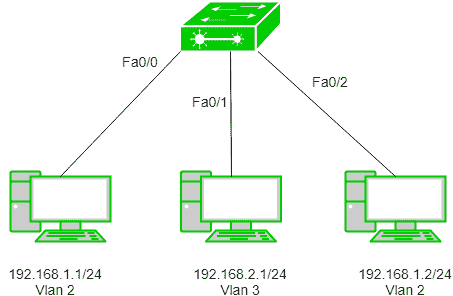

# 虚拟局域网(VLAN)

> 原文:[https://www.geeksforgeeks.org/virtual-lan-vlan/](https://www.geeksforgeeks.org/virtual-lan-vlan/)

*虚拟局域网(VLAN)* 是一个我们可以在第 2 层(数据链路层)对设备进行逻辑划分的概念。通常，第 3 层设备划分广播域，但广播域可以使用 VLAN 的概念由交换机划分。

广播域是一个网段，在这个网段中，如果一个设备广播了一个数据包，那么同一广播域中的所有设备都会收到它。同一广播域中的设备将接收所有广播数据包，但仅限于交换机，因为路由器不会转发广播数据包。要将数据包转发到不同的 VLAN(从一个 VLAN 到另一个)或广播域，需要 Vlan 间路由。通过 VLAN，创建了不同的小型子网，这些子网相对容易处理。

**VLAN 山脉–**

*   **VLAN 0，4095:** 这些是 VLAN 保留的，看不到也用不到。
*   **VLAN 1:** 是交换机的默认 VLAN。默认情况下，所有交换机端口都在 VLAN。此 VLAN 不能删除或编辑，但可以使用。
*   **VLAN 2-1001:** 这是正常的 VLAN 范围。我们可以创建、编辑和删除这些 VLAN。
*   **VLAN 1002-1005:** 这些是 fddi 和令牌环的 CISCO 默认值。这些 VLAN 不能删除。
*   **Vlan 1006-4094:** 这是 Vlan 的扩展范围。

**配置–**
我们可以通过简单地分配 vlan-id 和 vlan 名称来简单地创建 Vlan。

```
#switch1(config)#vlan 2
#switch1(config-vlan)#vlan accounts
```

这里，2 是我想要的 Vlan，accounts 是 Vlan 名称。现在，我们将 Vlan 分配给交换机端口，例如-

```
Switch(config)#int fa0/0
Switch(config-if)#switchport mode access
Switch(config-if)#switchport access Vlan 2
```

此外，交换机端口范围可以分配给所需的 vlans。

```
Switch(config)#int range fa0/0-2
Switch(config-if)#switchport mode access
Switch(config-if) #switchport access Vlan 2
```

这样，交换机端口 fa0/0、fa0/1、fa0-2 将被分配 Vlan 2。

**示例–**



将 IP 地址 192.168.1.1/24、192.168.1.2/24 和 192.168.2.1/24 分配给电脑。现在，我们将在交换机上创建 Vlan 2 和 3。

```
Switch(config)#vlan 2
Switch(config)#vlan 3
```

我们已经制作了虚拟局域网，但最重要的部分是为虚拟局域网分配交换机端口。

```
Switch(config)#int fa0/0
Switch(config-if)#switchport mode access
Switch(config-if) #switchport access Vlan 2

Switch(config)#int fa0/1
Switch(config-if)#switchport mode access
Switch(config-if) #switchport access Vlan 3

Switch(config)#int fa0/2
Switch(config-if)#switchport mode access
Switch(config-if) #switchport access Vlan 2 
```

如图所示，我们将 Vlan 2 分配给 fa0/0、fa0/2，将 Vlan 3 分配给 fa0/1。

**VLAN 的连接类型–**

在 VLAN 有三种连接设备的方式，连接的类型基于连接的设备，即它们是否了解 VLAN(了解 VLAN 格式和 VLAN 成员资格的设备)或不了解 VLAN(不了解 VLAN 格式和 VLAN 成员资格的设备)。

1.  **中继链路–**
    中继链路的所有连接设备必须能够识别 VLAN。上面的所有帧都应该有一个特殊的头，称为标记帧。
2.  **接入链路–**
    它将 VLAN 感知设备连接到 VLAN 感知桥。接入链路上的所有帧都必须取消标记。
3.  **混合链路–**
    它是中继链路和接入链路的组合。这里连接了不知道 VLAN 和知道 VLAN 的设备，它可以有标记和未标记的帧。

**优势–**

*   **性能–**
    网络流量充斥着广播和组播。VLAN 减少了将此类流量发送到不必要目的地的需求。例如，如果流量是针对 2 个用户的，但是由于在同一个广播域中存在 10 个设备，因此，所有设备都将接收流量，即浪费带宽，但是如果我们制作虚拟局域网，则广播或多播分组将仅去往预期用户。
*   **虚拟团队的形成–**
    因为每个组织都有不同的部门，即销售、财务等。，虚拟局域网对于按照部门对设备进行逻辑分组非常有用。
*   **安全–**
    在同一个网络中，敏感数据可以广播，外人可以访问，但是通过创建 VLAN，我们可以控制广播域，设置防火墙，限制访问。此外，虚拟局域网还可以用来通知网络管理员有入侵。因此，虚拟局域网极大地增强了网络安全性。
*   **灵活性–**
    VLAN 提供添加、移除我们想要的主机数量的灵活性。
*   **降低成本–**
    虚拟局域网可用于创建广播域，从而消除对昂贵路由器的需求。
    通过使用 Vlan，与更大的广播域相比，更容易处理的小规模广播域的数量可以增加。