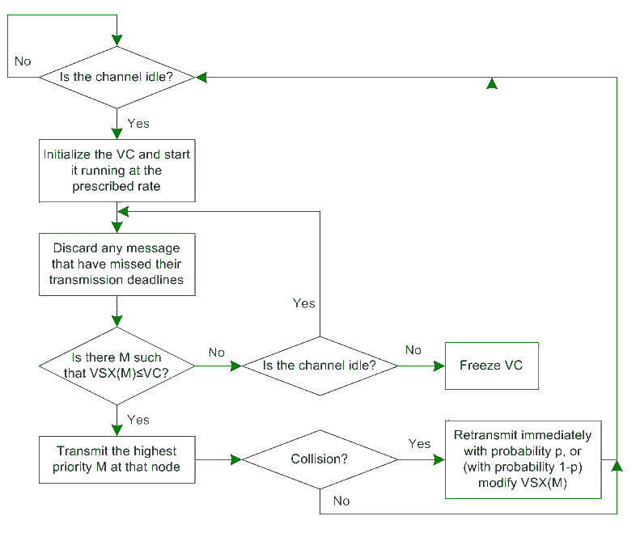

# 虚拟时间载波侦听多路访问(VT-CSMA)

> 原文:[https://www . geesforgeks . org/virtual-time-carrier-sented-multiple-access-vt-csma/](https://www.geeksforgeeks.org/virtual-time-carrier-sensed-multiple-access-vt-csma/)

**虚拟时间载波侦听多路访问(VTCSMA)** 主要用于硬实时系统。它用于在实时系统中同时有效地传输信号，以避免冲突。在实时系统中，不能使用 CSMA，但可以使用虚拟时间 CSMA 进行信号传输。

VTCSMA 中的每个节点都使用 **2 种时钟:**

1.  **虚拟时钟称为 VC:** RC 显示所有节点同步的实时时间。
2.  **实钟称为 RC:** 系统中不同节点的 VC 不同。

VC 的比率大于 RC。

*   如果一个节点感觉到通信信道繁忙，那么虚拟时钟或虚电路冻结并停止。
*   如果一个节点检测到通信信道空闲，虚电路的虚拟时钟被重置。

系统中的每个节点决定一个时间， *VSX(M)(开始传输消息 M 的虚拟时间)*用于传输消息 M，如果 VSX(m) < = VC，则传输信号由节点发送，否则不传输。

如果多个节点同时传输消息信号，则可能发生冲突。如果在传输信号时发生冲突，则在信道空闲后，使用 **p** 或 **(1-p)** 的概率传输下一个信号。

**虚拟载波侦听多路访问流程图:**

使用虚拟时间 CSMA 代替 [CSMA](https://www.geeksforgeeks.org/carrier-sense-multiple-access-csma/) 的基本思想是将优先级合并到实时系统中的节点或设备。可以使用当前时间 RC 和 VC 的优先级函数以及一些其他参数来实现优先级的全局排序，这使得虚拟时间 CSMA 比 CSMA 更好和更有效。

VTCSMA 通常用于广播网络。