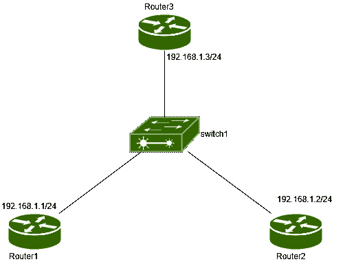

# VLAN ACL (VACL)

> 原文:[https://www.geeksforgeeks.org/vlan-acl-vacl/](https://www.geeksforgeeks.org/vlan-acl-vacl/)

先决条件–[虚拟局域网(VLAN)](https://www.geeksforgeeks.org/virtual-lan-vlan/) 、[访问列表(ACL)](https://www.geeksforgeeks.org/computer-network-access-lists-acl/) 、
VLAN(虚拟局域网)是一个概念，在这个概念中，我们在第 2 层逻辑上将广播域划分为更小的广播域。如果我们创建不同的虚拟局域网，那么默认情况下，来自一个 VLAN 的主机可以与位于同一 VLAN 的所有主机通信。如果我们希望某些主机无法到达同一 VLAN 内的其他主机，则可以使用 VLAN 访问列表或私有 VLAN 的概念。(访问列表是一组不同的允许或拒绝条件，用于包过滤)

**VLAN ACL(VACL)–**
VLAN ACL 用于过滤 VLAN 的流量(VLAN 内的流量，即驻留在同一 VLAN 的目的主机的流量)。所有进入 VLAN 的包裹都要对照 VACL 进行检查。与路由器 ACL 不同，VACL 不是在一个方向上定义的，但是可以通过结合虚拟局域网和专用 VLAN 功能，根据流量的方向过滤流量。

**程序–**

1.  **定义要在 VACL 使用的标准或扩展访问列表–**
    应定义访问列表，以识别流量类型及其应用的主机。
2.  **定义 VLAN 访问图–**
    定义 VLAN 访问图，其中将匹配主机 IP 地址(使用定义的访问列表)
3.  **在 VLAN 接入图序列中配置一个操作子句–**
    这将告诉您应该对流量(在 VLAN 接入图中定义)采取什么操作(转发或丢弃)
4.  **将 VLAN 访问图应用于指定的 VLAN–**
    VACL 配置的最后一步是创建一个过滤器列表，指定访问图应用于哪个 VLAN。
5.  **显示 VLAN 访问地图信息–**
    我们可以使用命令验证信息。

**配置–**



如图所示，有一台名为 switch1 的交换机连接到 3 台名为 Router1 (IP 地址-192.168.1.1/24)、Router2 (IP 地址-192.168.1.2/24)和 Router3 (IP 地址-192.168.1.3/24)的路由器。
在路由器 1 上配置 IP 地址。

```
Router1(config)#int fa0/0
Router1(config-if)#ip address 192.168.1.1 255.255.255.0
Router1(config-if)#no shut
```

在路由器 2 上配置 IP 地址。

```
Router2(config)#int fa0/0
Router2(config-if)#ip address 192.168.1.2 255.255.255.0
Router2(config-if)#no shut
```

在路由器 3 上配置 IP 地址。

```
Router3(config)#int fa0/0
Router3(config-if)#ip address 192.168.1.3 255.255.255.0
Router3(config-if)#no shut
```

在本任务中，我们将使用 VACL 拒绝路由器 1 到路由器 3 的流量。

在交换机 1 上配置访问列表，说明应该允许从主机 192.168.1.1 到 192.168.1.3 的所有 IP 流量

```
switch1(config)#ip access-list extended My_access_list
switch1(config-ext-nacl)#permit ip host 192.168.1.1 host 192.168.1.3 
```

现在，配置与访问列表中定义的 IP 地址匹配的 VLAN 访问映射，并采取丢弃操作(这意味着 192.168.1.1 到 192.168.1.3 之间的流量不允许)。

```
switch1(config)#vlan access-map Mapping 10
switch1(config-access-map)#match ip address My_access_list
switch1(config-access-map)#action drop 
switch1(config-access-map)#exit
```

在第一个命令中，10 是访问图的序列号。如果我们没有定义任何序列号，那么它将自动采用 10 作为序列号。
现在，对于从路由器 1 (192.168.1.1)到路由器 3 (192.168.1.3)的流量，流量将被丢弃，但是从路由器 2 到路由器 3 的流量呢？

从路由器 2 到路由器 3 的流量也将被丢弃，因为没有为此流量定义任何操作(隐式拒绝)。因此，我们必须定义另一个规则，说明应该允许其他流量。

```
switch1(config)#vlan access-map Mapping 20
switch1(config-access-map)#action forward 
switch1(config-access-map)#exit
```

在第一个命令中，20 是序列号，这意味着将在序列号为 10 的第一个规则之后检查该规则。

最后，我们将把这个名为我的访问列表的访问映射分配给一个 VLAN(这里是 VLAN 1)

```
switch1(config)#vlan filter Mapping vlan-list 1
```

要验证配置，请使用命令。

```
switch1#show vlan access-map
```

该命令将显示访问图。这将显示访问映射的名称、规则的序列号和访问列表名称(已使用)。

```
switch1#show vlan filter
```

这将显示由 VLAN 访问图过滤的虚拟局域网。