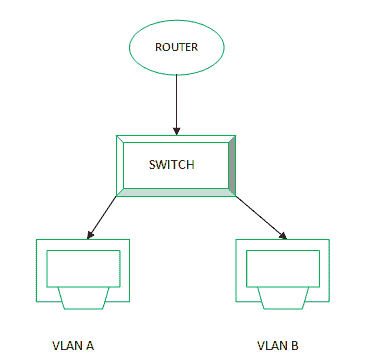

# VLAN 完整版

> 原文:[https://www.geeksforgeeks.org/vlan-full-form/](https://www.geeksforgeeks.org/vlan-full-form/)

[虚拟局域网](https://www.geeksforgeeks.org/virtual-lan-vlan/)，通常缩写为 **VLAN** ，用于为当今世界越来越多的网络提供结构。通过这种方式，网络管理器可以以逻辑方式将局域网细分为不同的广播域。

**IEEE 802.1D-2004** 标准在以太网局域网向虚拟局域网的演进中发挥了作用，以跟上不断增长的传输需求。这是通过将一个物理局域网分成两个或多个虚拟局域网的桥接概念实现的。在此之前，不可能有两个系统在同一个物理网络上有相同的 IP 地址。

**VLAN 特色:**

*   每个 VLAN 都充当一个独立的局域网。这通过在虚拟局域网之间共享流量来减少拥塞。
*   虚拟局域网可以跨越多个交换机。
*   虚拟局域网使重新定位终端变得更加容易。

**VLAN 优势:**

*   与局域网相比，虚拟局域网使用带宽的效率更高。
*   由于它们局限于各自的广播域，因此在很大程度上减少了网络流量。
*   每个组被分配一个不同的广播域，因此增加了安全性，以防止机密信息被其他组看到。
*   它减少了对昂贵路由器的需求，因此降低了整体成本。

**VLAN 的劣势:**

*   管理更大的网络可能相当复杂。
*   当您需要添加新的 VLAN 时，您需要配置所有交换机以适应它。
*   VLAN 的互操作性也可能很复杂。