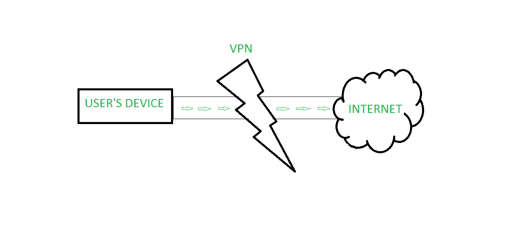

# 虚拟专用网完整版

> 原文:[https://www.geeksforgeeks.org/vpn-full-form/](https://www.geeksforgeeks.org/vpn-full-form/)

**VPN** 代表**虚拟专用网**。
它基本上是对连接进行加密，通过使用各种隧道协议来隐藏用户的 IP 地址。它用于绕过地理区块并出于安全目的。这是一种安全和私密的方式，用于文件共享、通信和远程访问数据，没有任何被黑客攻击的风险。

虚拟专用网隧道确保用户端的加密和接收端的解密，为此，设备应该连接到虚拟专用网客户端软件应用程序。虚拟专用网作为用户和互联网连接之间的媒介。它隐藏用户的 IP 地址，并通过虚拟专用网络而不是用户的互联网服务提供商进行连接。

#### 虚拟专用网的历史

1996 年，微软的一名员工开始研究点对点隧道协议(PPTP)，虚拟专用网的想法就是从这里开始的。1999 年，第一个虚拟专用网发表。

#### 虚拟专用网的特点

*   它维护用户数据的机密性。
*   它保持了用户数据的完整性，即数据在两次传输之间不能改变。
*   它确保不重复，即发送者不能否认他/她没有发送数据。
*   数据认证也由虚拟专用网保证，它验证源和目的地的身份。

**VPN 的工作原理**

当您注册虚拟专用网络提供商时，您首先要登录该服务，然后才能连接到互联网。一旦你被连接，其他人就看不到你的活动。您的虚拟专用网提供商将加密您的数据，对其进行加扰，以便黑客、政府机构和企业无法看到您访问的网站、发送的消息、使用的社交媒体网站或下载的文件。

#### 虚拟专用网的优势

*   虚拟专用网在隐藏用户身份方面非常有帮助，因为它隐藏了 IP 地址，并通过虚拟专用网的专用网络进行连接。
*   它提高了安全性，因为虚拟专用网保护用户的数据免受黑客和监视。
*   它允许远程访问信息，这将提高组织的生产力，因为可以远程访问大数据。
*   与它们提供的功能相比，虚拟专用网服务包的成本更低。

#### 虚拟专用网的缺点

*   当通过虚拟专用网获取数据时，获取数据所需的时间有时会增加，因此可能会出现时间方面的性能问题。
*   虚拟专用网允许您隐藏身份，但有时您的虚拟专用网提供商公司本身会窃取您的数据，这可能会导致安全问题。
*   每当发生虚拟专用网断开时，都有可能向建立连接的网络泄露 IP 地址。
*   使用虚拟专用网络总是无法绕过网站施加的限制。

**虚拟专用网的类型**

VPN 主要有两种类型。他们是–

1.  基于客户端的虚拟专用网:基于客户端的虚拟专用网是在单个用户和远程网络之间创建的虚拟专用网。通常需要一个应用程序来建立虚拟专用网连接。
2.  基于网络的虚拟专用网络:基于网络的虚拟专用网络是通过不可信网络将两个网络安全地连接在一起的虚拟专用网络。

**VPN 隐私**

虚拟专用网络可以隐藏许多信息，这会危及您的隐私。这里有五个。

1.  您的浏览历史记录
2.  您的流媒体位置
3.  您的 IP 地址和位置
4.  您的设备
5.  您的网络活动——维护互联网自由