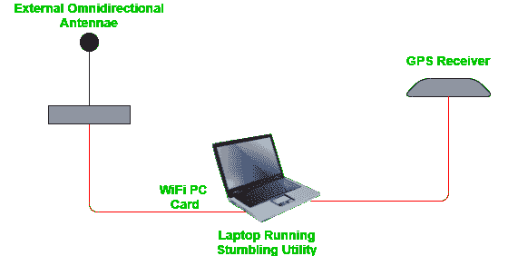

# 视频–简介

> 原文:[https://www.geeksforgeeks.org/wardriving-introduction/](https://www.geeksforgeeks.org/wardriving-introduction/)

无线网络给我们的生活带来了很多便利，让我们几乎可以在任何地方工作或冲浪——家里、剧院、机场、全球的酒店。不幸的是，无线网络也给黑客带来了便利，因为它提供了通过空中捕捉我们在计算机或任何连接设备中输入的所有数据的机会，他们甚至可以获得对这些数据的控制。我们将这种在不安全的无线网络中巡航的行为称为“战争驾驶”。

### **什么是战争驾驶？**

战争驾驶起源于*警戒*，一种从电影*战争游戏*中推广的方法，并以该电影命名。术语“战争驾驶”是由计算机安全顾问彼得·希普利创造的。监听包括按特定顺序拨打每一个电话号码来搜索调制解调器。被称为“T4”接入点映射的“监控”是使用智能手机或笔记本电脑在行驶的车辆中搜索无线网络的行为。
成功进入您的网络的 Wardrivers 可能会对窃取您的凭据、银行信息或任何其他敏感信息感兴趣。他们可能只是使用进入您网络的入口来安装恶意软件，这些恶意软件可以将您的设备用于不受您控制的目的。

### **用于监控的硬件和软件工具**

驱动时使用的所有硬件和软件组件统称为**钻机**。友好的 wardriver 邻居使用什么类型的设备或软件没有硬性规定。但是为了进行成功的无线驾驶，你需要使用一些专门的硬件和软件。让我们来看看一些工具:

**1。用于监控的硬件工具:**

有几个硬件工具需要执行“监控”。

*   **移动设备:**这是执行监听的基本前提。您需要一个移动计算平台，如笔记本电脑、平板电脑、智能手机或任何其他设备，如树莓皮。这些被用来颠覆加密和管理整个过程。
*   **无线网卡天线:**这是驱动设置中最关键的组件。沃德里弗斯可能会选择使用内置天线和卡，或者他们可以购买额外的硬件来提高设备的扫描能力。
*   **GPS 系统:**GPS 系统用于确定已经定位的 Wi-Fi 路由器的确切位置。许多监控设备都有内置的全球定位系统功能。

**2。监控软件工具:**

wardriving 中使用的主要软件是一个用于破解 WEP 和 WPA 加密网络密码的应用程序。还有一类应用程序用于生成网络邻居的地图。根据您喜欢的操作系统，有许多这样的软件应用程序可供使用。这当然不是可以用来入侵无线网络的所有软件应用程序的详尽列表，但它肯定会让你了解可用的工具类型。

**下面是沃德里弗斯使用的几个热门应用程序:**

**生成地图的应用程序:**

这些网站用于根据上传到网站的数据生成网络社区地图。

*   **WiGLE:** WiGLE 是无线地理日志引擎，是一个网站，用户可以上传热点数据，如全球定位系统坐标、SSID、媒体访问控制地址，以发现热点上使用的加密类型。
*   **openBmap:** 这是一个免费开放的无线通信对象的地图，如蓝牙、Wi-Fi、蜂窝天线。它提供了工具来共享数据，创建和访问这个地图。
*   **geomana:**这是一个开放的 Wi-Fi 接入点地理数据库，旨在用于地理定位。该应用编程接口提供了一种以编程方式添加数据的方法。

**破解 WEP 和 WPA 密钥的工具:**

以下是一些流行工具的列表:

*   **MacStumbler:** MacStumbler 是 Mac OS X 的一款突出使用的无线网络扫描仪，由以下功能组成:
    *   主动扫描无线接入点。
    *   将访问点的详细信息记录到纯文本文件中
*   **NetStumbler:** 它是 Windows 平台上最容易设置也是最受欢迎的扫描仪。它发射 802.11b 探头，询问无线接入点是否在附近。它具有以下特点:
    *   主动扫描无线接入点。
    *   全球定位系统支持。
    *   记录对 NS1 的访问点、扩展和摘要 Wi-Fi 扫描以及纯文本文件。
*   **KisMAC:** 这仅适用于 MAC 平台。该工具被动扫描网络，使用暴力攻击破解 WEP 和 WPA 密钥。
*   **Aircrack:** 这是一个非常流行的无线密码破解工具，在全球范围内使用。它有以下特点:

    *   它可以在不同的平台上运行，如 OS X、视窗、Linux。
    *   它针对 WEP 密码攻击进行了优化。
    *   它捕获并分析数据包，试图恢复密码。
*   **CoWPatty:** 该工具仅在 Linux 平台上运行，是执行字典攻击破解 WPS 加密密码的自动化工具。它只提供命令行界面，速度比市场上其他工具慢。
*   **wifi fisher:**该工具适用于 Windows、Linux 和 Mac。顾名思义，该工具在无线网络上执行快速自动网络钓鱼攻击，试图窃取密码。
*   **Cain & Able:** 它的工作原理是拦截网络流量，然后使用暴力攻击来发现密码。

### **保护您的网络免受攻击**

使无线网络对 wardriver 有吸引力的首要因素是缺乏足够的安全性。受到安全保护的网络将不会受到这些类型的攻击，或者至少很难被攻击者找到另一个更容易受到攻击的目标。

*   **更改路由器的管理密码:**许多路由器的默认密码在互联网上很容易获得。因此，建议在开始使用路由器之前更改凭据，使其不易受到攻击。
*   **使用防火墙:**防火墙负责监控对您的网络的访问，并且只允许从批准的来源进行访问。因此，这将在一定程度上有助于阻止未经授权的用户访问您的网络。
*   **启用加密:**建议使用能够设置 WPA 和 WPA2 加密的路由器。最好避免 WEP 加密，因为使用上述工具很容易破解。
*   **不使用时关闭无线路由器:**如果您外出或长时间不使用网络，只需将其关闭。
*   **不要广播你的 SSID:** 如果你把路由器配置成不广播你的 SSID，那么就很难检测到。即使你没有广播你的 SSID，也可以猜到。因此，请记住将您的 SSID 从出厂默认设置更改为。

这些是最佳实践，可以帮助您保护网络免受任何类型的未经授权的攻击。加密应该是重中之重，它是第一道防线。使用路由器和所用设备上可用的最高级别加密来保护您的网络和设备。